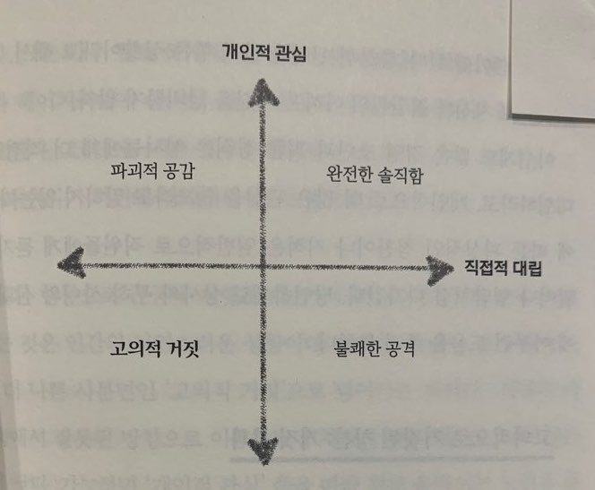

일을 핑계로 그동안 책리뷰를 너무 소홀히 했다.
그래도 간간히 짬을 내서 노력했는데
직업 특성상 풀리지 않는 문제에 몰두하는 부분이 있어
책을 읽는데 계획적이지 못했던 것 같다.
최근에는 토스라는 회사에 입사해 새로운 조직문화를 경험하고 있었다. 여기는 가식적인 수평문화를 배재하기 위해 모두가 보는 슬랙방에서 적극적으로 상대방에게 챌린지를 걸 수 있다. 꼰대가 살아남기 힘든 조직문화다. 여기서 침묵은 오히려 무능력이다. 적극적으로 자신의 영역에 신뢰감을 뿜어내고 결과물을 공유하며 증명해야한다.
“your work is shit”으로 시작하는 표지 타이틀이 눈길을 사로잡았다.
혁신의 본고장, 실리콘밸리는 조직문화를 어떻게 효율화 하고 있는지 기대하며 읽어보았다.
Radical Candor
완전한 솔직함이라는 원제이다. Candor… 처음보는 단어인데 저자가 솔직함의 표현에 honesty를 사용하지 않고 candor라는 단어를 사용한 이유는 candor가 좀더 상대방을 이해하고 말하는 솔직함(?)이라는 느낌이 있다고한다. 솔직함 + 인간적인 관심 정도의 개념이겠다.
책에선 강력하게 좋은 중간 관리자의 자질로 이 Candor를 이야기한다.

이 책은 직접적 대립(Directly Challenge)의 중요성을 이야기한다.
솔직한 것이 조직문화를 멀리 보았을 때 좋다는 것이다.
4분면에서 완전한 솔직함을 발휘할 상황이 아닌 경우, 차선택으로
불쾌한 공격이 낫다는 내용이 분명히 적혀있다.
그만큼 솔직함, 일관성의 가치를 높게 이야기한다.
글의 중후반부에는 요즘 핫한 성평등 이슈, 워라벨 이슈 등을 다룬다.
남자들은 여성에 대한 배려를 학습되어 왔다. ‘여자를 울려선 안돼’
저자는 이러한 심리로 중간관리자들이 일관성을 일어버리는 순간 혼란이 가속화 된다고 주장한다.
여성들이 오히려 적극적으로 나서서 자신에 대한 솔직한 피드백을 상사에게 요구할 때,
신뢰관계는 더욱 단단해진다고한다.
워라벨에 대해서는 제로섬 게임을 경계해야한다고 말한다.
삶에 대한 관심이 일에 대한 소홀로, 일에대한 관심이 삶에 대한 소홀로 이어지면 안된다. 세계 1위 기업가치 아마존 수장, 제프 베조스는 work& life harmony를 주장했다.
일과 삶을 하나로 통합해야 행복한 삶을 영위할 수 있다는 내용에 공감한다.
비단 이 내용이 적용되는게 조직문화에만 국한되는 것 같지는 않다.
