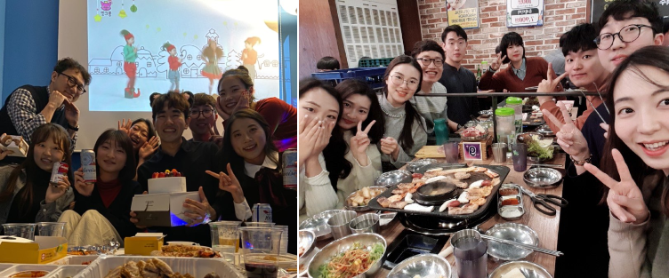

2019년 이번 한해는 정말 다양한 일들이 많았다. 20대 마지막이라고 핑계없이 더 과감하게 많은 것을 했던 것 같다. 작년 초 내가 상상했던 내가 되어있었고, 전체적으로 만족스러웠다.

작년의 목표들을 천천히 꺼내서 하나하나 돌아보았다.  
이룬것도, 눈앞에서 놓친 것도 있었다. 이룬 것 중엔 목표에 없었던 것도 있었다.
올해는 내가 살아온 삶 중 가장 편안한 상승곡선이었다.
마음이 편했고 설계한만큼, 기대한만큼 결과가 따라와주었다.  
사랑했고 이직도 성공했고, 내 차를 처음으로 샀고, 좋아하는 사람과 여행을 다녔고
이직한 곳의 3month review에서 동료들에게 능력을 인정받았다.

일이 좀 잘안풀리면 헬스장에가서 메이슨이랑 쇠질하고 샤워하면 뇌가 맑아진다.(진짜 맑아진다)  
인간관계상 스트레스도 적고 일에 동기부여도 잘되고 있다.  

이제 계란한판이라고 동기들은 hello 2020보다 goodbye my twenties 우울함이 있다. (진짜 우울하면 카톡도안하겠지만..)
이번 겨울은 30대 초반을 어떻게 멋지게 보내야할지 생각을 많이했다.
목표를 짜보긴했는데 작년보단 도전적인 목표는 좀 줄어든 것 같다. 일에 대한 프레셔가 좀 커서 그런지도..?

### 오사카 여행

올해 초
내 퇴사여행 나보다 동안인 두형님을 모시고ㅎㅎ 오사카여행
편안했고 재밌었다.  
이때 갔던 곳들을 데이트에 써먹게될지 몰랐다.

### 오사카 여행

토스 입사전에 오사카 한번더~ 너 덕분에 웃을 일 많았던 오사카  

맥주랑 꼬치먹고 신난분

머리가 개털, 유니버셜 스튜디오 구석에서

정말 맛있었던 닭꼬치집이랑 츠케멘집

---
### New Start

카겜에서 어른들에게 한소리하고 나온걸 장점으로 봐주는 신기한 회사다.  
토스의 문화도 정답을 찾아가는 과정에 있다.  
강한 신뢰, 수평 조직구조, 최고의 퍼포먼스, 업계 최고의 대우, 멋진 동료   
"좀더 즐겁게 일할수 있는 개발문화를 증권팀에 심어보자."

  

"price is what you pay, value is what you get"  
혜성님 자리에 있던 글귀, 금융회사라그런지 워렌버핏의 투자와 관련된 멘트인데...  
 난 저 글귀를 보고 차를 사게 되었다. 29년 삶 중  가장 큰 지출

서프라이즈 선물 키케이스에 감동먹은날. 긴 인생동안 사랑하는 누군가를 위해 선물을 주고 마음을 담은 글귀를 주고 받는건 결코 흔치 않은 멋진 일이다. 아마 광교 책발전소 놀러갔을때 받았던 걸로 기억한다. Aidan.Bae를 새겨주었다. 차 덕분에 바쁜와중에도 이곳저곳 여행을 다녔던거같다. 속초여행부터 즐거웠던 기억이 가득한 한해.

입사 후 메이슨과 세차. 빛이난다 G70 우리 도자기~ BMW는 쫌 누렇네요

내 첫 사고, 서현역 우회전하다가 택시랑 꿍, 당시 옆에 타있던 여자친구랑 둘다 'ㅈ댔다..'며 난리도 아니었던게 다 블랙박스에 남아있었다. 보험사 아저씨가 돌려보며 뭔생각을 했을까

지금은 돈을 잘버는 사람보다, 집을 수채 가진 사람보다 자기자신을 잘 표현할 줄 아는 사람이 훨씬 더 멋있고 부럽다. 올해 서울 일러스트레이션 페어의 래빗 라이브드로잉, 애드가 이제 나 대신 서포팅,
마무리를 도와드리는데 레빗 " 우울한 아이단의 모습이 그립다. 변했네 아이단 " 나도 많이 변했나보다.

올해 겨울 SOPT 동아리 멘토링. 올해는 기술발표를 할 시간적 여유가 없었는데 대신  
재현이라는 동생에게 멘토링요청을 받아서 가볍게 발표할 기회가 생겼다. 30여명이나 신청해주어서 장소를 빌리는데 고생했을 운영진에게 고맙다.
나도 대학생시절에시절에 SOPT에서 쿠팡개발자분 김학성님, 카카오 ios개발자, 조규태님(카카오뱅크), 카카오 플레인기획자 윤현주님 등
총 4분에게 멘토링을 받고 꿈을 키웠었는데 누군가에게 꿈을 품을 수 있도록 한다는게 얼마나 멋진일(기술 발표보다)인지 알기때문에 열심히 준비하게되었다.  보통 이런 멘토링을 하면 서로의 인생으로 다시 멀어지기 마련인데 인상깊게 보았다며 유동현이라는 친구가 정리한 글을 공유해줬다. 나보다 훨씬 대단한 친구... https://blog.naver.com/netking77/221720839218

10학번 동기 첫 결혼식(정연주)에 모인 10도시사회학과 시간이 참빠르다. 살쪘다며 놀려댄다. 넌 늙었다고

살기위해 식수를 조달하는 중. 조금 좁았지만 2년간 나에게 큰 안정을 주었던 내 첫 집! 올해는 서울로 갈듯하다.

나보다 훨씬 성실하고 건설적인 소중한 인연들 다 꽃길밟자

2019년은 솔직함에 대해 여러방면으로(조직문화, 연인관계, 친구) 다시 생각해본 한해이다. 어디서나 인기많고 솔직한 그녀덕이 크고 이곳 저곳에서 많이 배웠다.
한해동안 함께 좋은 추억을 만들어준 사람들에게 감사하다.

#### 책

독서는 입사 이후에는 기술책 위주로 읽었다. 올해 공백기때 처럼 다시 인문학을 더 깊게 접할 여유로운 시간이 올까?ㅎㅎ  
원래 독후감은 이 블로그에 꾸준히 쓸려했는데,,, 에버노트에 정리만해두고 글을 정리하지 못했다.  
은근히 생각, 손이 많이가는 작업. 올해는 대에충 써서라도 올려야겠다.  
이렇게 정리해보니 잊혀지고 있던 좋은 내용들이 많다. 내년에도 꼭 다시 정리해야겠다.  

- 함께 자라기 - 'deliberate practice, 공유의 함정, 실수는 관리하는 것이다'
- 어린왕자의 눈 - '나는 어린왕자의 친구가 될 수 있을까'
- 군주론 - '때론 곰, 때론 여우 군주의 정치적 얼굴'
- 돈 공부는 처음이라 - '돈은 가치, 미래에 대한 가능성 확장'
- 역사의 쓸모  - 이순신과 원균, 정조와 정약용, 이성계와 정도전
- 역사의 역사 - '사마천, 유시민'
- 죽음의 수용소에서 - '수용소에서 두 부류로 나뉜다. 살아야하는 이유가 있는자, 없는자. 의미부여의 힘'
- 청춘의 독서 - '선한 목적이 악한 수단을 정당화 하는가?, 인간의 본성과 욕망'
- 12가지 인생의 법칙 - '진화는 보수적이다. 어깨를 피고 당당히 걸어라. 방부터 청소해라'
- 평균의 종말 - 'be special'
- 배우며 살며 사랑하며 - '사랑학, 행복은 어떻게 만들 수 있는가'
- 화성남자 금성여자를 넘어서 - '호르몬 컨쮸롤'
- 나는 농담으로 과학을 말한다. - '인류를 식량문제에서 구해준, 그리고 죽인 질소 이야기'
- 시간은 흐르지 않는다. - '중력과 시간의 비밀'
- 파워풀, 넷플릭스 - '넷플릭스 조직문화, 자유와 책임'
- 린인 - '구글과 페이스북은 어떻게 성장했는가'
- 실리콘벨리의 팀장들 - '솔직함에 대하여'
- 해커와 화가 - '아티스트?'
- 넛지 - 'why에서 일으켜지는 마음속의 거대한 회오리'
- 사피엔스 (읽다맘)
---

- 코딩 인터뷰
- kubernetes in Action
- istio in Action
- 엘라스틱서치 운영
- kafka, 데이터 플랫폼 최강자
- 프로메테우스 모니터링 시스템

>삶이 그대를 속일지라도  
슬퍼하거나 노여워 말라  
힘든 날들을 참고 견뎌라  
기쁨의 날이 오리니  
>마음은 미래에 사는 것  
현재는 언제나 슬픈 법  
모든 것 순간에 지나가고  
지나가 버린 것 그리움 되리니  
> **청춘의 독서 중에서 '푸시킨의 시'**

먹고살기 힘든 시절 우리 아빠들에게 큰 힘이된 시. (문학의 힘은 참 대단하다.)  
누구나 힘든 부분, 고민은 여전히 존재한다.  
**마음은 미래에 사는 것**    
자유와 나의 인생에 대한 오너쉽은 고민을 풀고 희망을 품을 수 있는 좋은 환경이다.
꿈꾸고 설계하자.

---

#### 2020

유튜브가 하나의 큰 산업군으로 형성되면서 기술이 또한번 우리들의 현재 진행형인 삶에
얼마나 큰 영향을 미치는지 느꼈다. 기술을 통해 세상을 바꿀 수 있다는 큰 믿음은 더 강해졌다.  

올해는 내가 준비하는 서비스가 인가만 통과된다면 큰 문제없이 런칭으로 이어질 예정이다.
팀원들의 고생이 헛되지 않도록 만반의 준비를 해야한다. 트래픽의 첫 진입점부터 끝단 DB까지
구간별 테스트 및 금감원 실사 대응, Task에 따라 주도적으로 미팅도 열고 적절한 액션을 만들어내야한다.

개발 배포 프로세스도 기존 토스와 달리 인가를 최우선으로 더 타이트하게 수정될 듯한다.

두 개발문화(증권, IT업계)가 섞이는 과정을 직접 바라보고 조율하면서 많은 것들을 느끼는 중이다.  
일을 치열하게 하기보다 더 재밋게 할 수 있는 개발 문화를 만들고 싶다.  
단순히 개발만 하는 것이 아니라 새로운 조직문화 융합도 경험할 수 있어 흥미롭다.  

#### 운동

흉추가 많이 접혀있어서 거북목이었는데 PT를 받은 이후로 의식적으로 폈고 많이 나아진 느낌이다.  
또 견갑골 고정이 잘안되다보니 벤치를 쳐도 대흉근보다 어깨를 더 많이 써왔다.
pt쌤이 잘 지적해준다. 요즘은 케틀벨에 흥미를 붙이는 중이다.
주 4일정도를 운동에 투자중인데 이번엔 좀더 오랫동안 꾸준히 해야한다. 서른이니까  

#### 취미

취미를 만들어볼까한다. 좀더 활동적인걸로

2019년 나와 함께했던 사람들이 점점 더 힘들일이 줄었으면 하고 나도 웃을일이 더 많았으면한다.  
올해 연말엔 이글을 보고 더 성장해 귀엽게 느껴졌으면한다.
