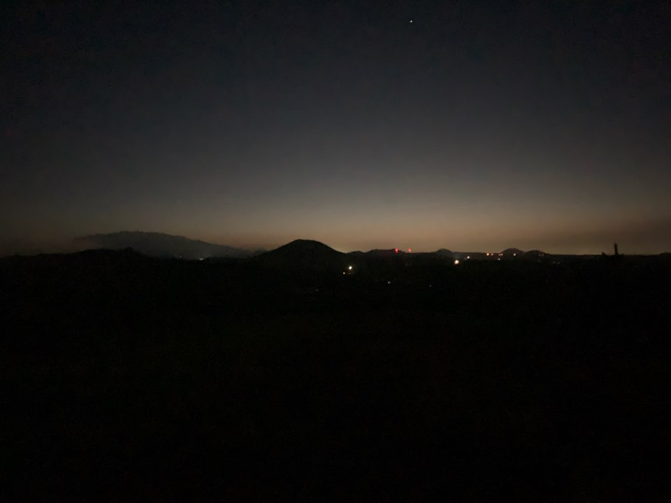

##### 혼돈을 사랑하라.

세상이 가르쳐준  
모든 규칙을 잊으라.  
너 자신의 세계를 창조하고  
너 자신의 언어를 정의하라.  
너의 혼돈을 억압하는 대신  
사랑해야한다.  
만약 너의 혼돈을 사랑한다면  
이 세상은 해답을 주지 못할 것이다.  
해답은 네 안에 있다는 걸 발견하게 될 것이다.  
너의 가장자리를 두려워하지 말라.  
누군가 너를 이해할 수 없다고 한다면  
그에게 말하라  
‘나의 혼돈을 사랑하라’고  
너의 혼돈에 질서를 주입하려고 하는  
세상에 반역하라.  
네가 존재한다는 것을 알리기 위해  
세상을 힘껏 두드려야 한다.  
두려움은 단지  
아직 풀리지 않은 의문에 불과할뿐,  
네가 해답에 다가갈수록   
우주는 너와 놀이를 하며  
너로 하여금 질문을 잊게 할 것이다.  
너 자신이 되라.  
남들이 원하는 사람이 되면  
정복당할 것이니,  
너의 혼돈을 사랑하라.  
너의 다름을 사랑하라.  
너를 다르게 만드는 것  
사람들이 너에 대해 이해하지 못하는 것  
사람들이 너에게 바뀌기를 원하는 것  
너를 유일한 존재로 만드는  
그것을 사랑하라.

-알베르트 에스피노사, 소설 ‘푸른세계’ 중에서