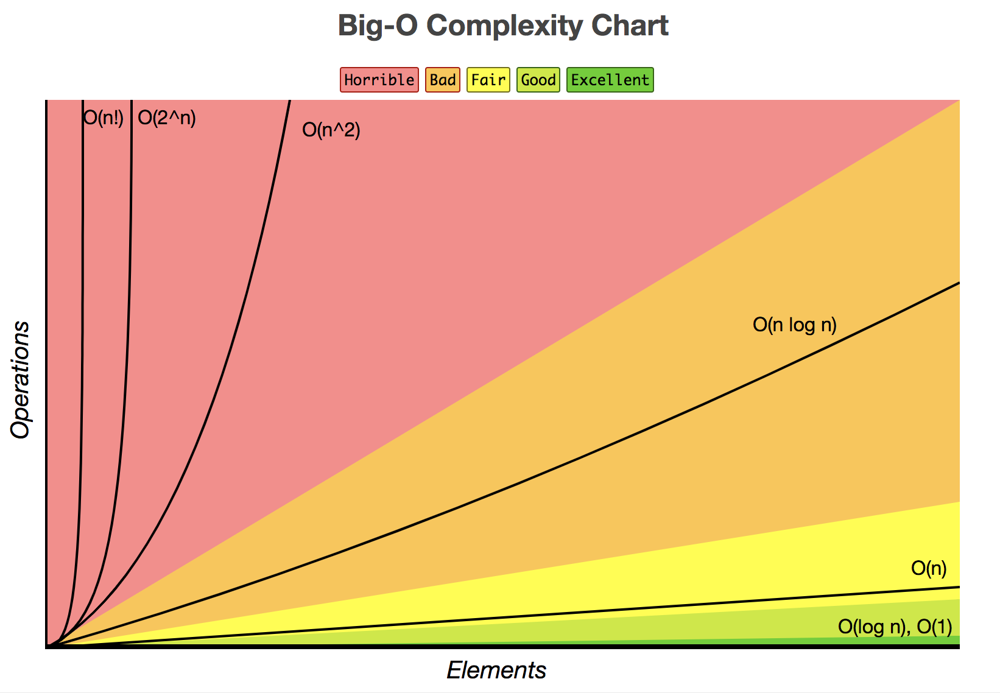

오늘은 컴퓨터과학의 꽃, 알고리즘의 인트로에 늘 나오는 **빅오표기법**에 대해서 이야기해보고자한다!
+_ +

대학생 때, 삼성SCSS 덕분에 컴퓨터과학을 늦게 접하면서 시립대에서 김진석 교수님 알고리즘 수업을 야간에 들었었는데 `컴퓨터과학 전공자와 비전공자를 나누는 기준이 알고리즘`이며 `알고리즘의 효율성을 판별하는 빅오표기법은 매우 중요해요`라고 콕 찦어 말하신게 기억에 남는다.

스타트업에 있을 때는 되게하는데 바빠 빅오표기법을 고민한 적이 없었고,
현업에 들어와서 게임프로그래밍을 하며 알고리즘의 효율성, 뎁스를 줄이기 위한 고민을 했을 뿐 정확하게 빅오표기법으로 얼마다하며 팀장님을 설득한 적이 없다.

백엔드 프로젝트를 몇개씩 진행하면서 느낌으로 이런 가변적인 input이라면 최악의 상황을 고려했을 때 map으로 하는게 낫겟다. stack으로 하는게 났겠다 등의 센스는 늘었지만 정확한 정리가 필요할 거 같아서 이번 기회에 정리를 해보았다.

---

#### 빅오(Big O)표기법

빅오표기법은 알고리즘이 걸리는데 필요한 시간의 수학적인 표현이라고 할 수 있습니다.  
일반적으로 **최악의 시나리오를 상정했을 때의 복잡도**를 의미합니다.


#### 왜 자바스크립트?

물론 알고리즘 쪽에서는 c++이나 java가 가장 대중적이다.  
친한 동생이 카카오 블라인드 테스트에서 나에게 질문한게 자바스크립트, 지금도 사용하고있는 나의 주력 언어이기 때문에 이기회에 같이 정리해보고자한다.

#### 내장함수와 알고리즘

서비스 쪽에 익숙해지다보면 편한 내장 함수들이 많아  
효율성보다 가독성으로 아름답게 문제를 해결하고자 하는 경우가 생긴다.
아래의 경우를 살펴보자  

아래는 동아리 동생 섭이가 이번 2018 카카오 블라인드 문제를 풀면서  
몇몇 케이스에서 시간초과가 난다며 나에게 문의한 코드이다.

```
record.map((txt) => {
        const states = {
            action: txt.split(' ')[0],
            userId: txt.split(' ')[1],
            userNick: txt.split(' ')[2],
        };

        if(states.action === 'Enter') {
            addUser(states.userId, states.userNick);    
        }
        if(states.action === 'Change') {
            changeUserNick(states.userId, states.userNick);
        };

        newRecord.push(states);
    });
```
일단 어떤문제인지 모르는 상태에서 보아도 불편한 부분이 조금 보인다.  
하나씩 살펴보면서 간이 코드리뷰를 해보겠다. (코드공개를 허락해주신 섭섭이에게 감사의 말씀 전합니다)
##### 1. Array.prototype.map 내장함수

record라는 array를 builtin method `map`으로 호출한다.  

    map은 es6에 추가된 array메소드
    내부를 순환하면서  
    콜백함수에서 리턴된 값으로  
    새로운 배열을 반환한다.  

게임 쪽에 있다보니 새로운 배열을 만드는 map을 메모리관리상 안 좋게 보아서 사용한 적이 거의없었고 이 기회에 확실히 보고간다.
위 코드는 return값이 없는 콜백함수를 품고 있고 forEach문을 통해 충분히 할 수 있다.
새로 만들어진 array를 활용하고 있지도 않다.
만약 map을 활용한다면 아래처럼 새로운 배열을 사용하는 로직이어야한다:
```javascript
var newRecord = record.map((txt) => {
  //...
  return states
  })
```

##### 2. string.split()

string의 split은 builtin 메소드로 내부적으로 살펴보면 string을 순회하면서 공백으로 분리하는 작업을 하고 있을 것이다.
전체적으로 보면 map이라는 반복문 안에 split이라는 반복문이다.
심지어 변수 하나당 한번씩 3번 호출하고있다.

```
const states = {
            action: txt.split(' ')[0],
            userId: txt.split(' ')[1],
            userNick: txt.split(' ')[2],
        };
// ...
retunr states
```

수정:
```
const splited = txt.split(' ')
const states = {
           action: splited[0],
           userId: splited[1],
           userNick: splited[2],
       };
// ...
return states
```
함수 호출(`()`)은 늘 신중하게!

##### 3. addUser, changeUserNick 함수가 무슨 일을 할까?

벌써 두렵다.

```javascript
const addUser = (userId, userNick) => {
      const hasData = users.find((user) => {
          if(userId === user.userId) {
              return true;
          } else {
              return false;
          }
      });

      const isNickChanged = users.find((user) => {
          if(userId === user.userId && userNick !== user.userNick) {
              // 바꼈으면 최종으로 바꾸기
              user.userNick = userNick;
          }
      });

      if(!hasData) {
          var newUser = {
              userId,
              userNick
          };
          users.push(newUser);
      }
  }
```
순회문에서 함수호출은 늘 주의해야한다.  
우려한대로 내부순환 메소드가 있다.  
find가 두 번 호출되었는데, 하나는 유저탐색, 하나는 닉네임이 바뀌었는가에 대한 내용.  
find method는 주어진 콜백함수에서 true가 반환되는 케이스의 아이템을 반환한다.  
여담으로 hasData라는 변수에는 user라는 객체가 들어있을 것이 분명하며 hasData라는 변수명은 어울리지않는다.
결국 record.map 함수를 호출해 순환하면서
record와 user라는 array data가 가변적이라고할때 최악의 상황에는 O(N^3)까지 치솟는 케이스이다.

```js
const changeUserNick = (userId, userNick) => {
      users.map((user) => {
          if(user.userId === userId) {
              user.userNick = userNick;
          }
      });
  }

```
이부분은 위에서 말한 것과 비슷하다. 이중 반복문이며 불필요한 배열이 생성된다. 그만큼 GC가 처리해야할 쓰레기양도 늘어난다.

시간초과가 난 것을 생각해보면 target array의 길이가 긴 테스트 케이스가 있는 것이 분명하고  
해시 알고리즘이 정답에 가까운 풀이방법일 가능성이 높은 것 같다.

이 코드를 보고 동생에게
time-complexity-of-javascripts-built-in-methods 라는 블로그글을 소개해줬다.
https://www.pdiniz.com/time-complexity-of-javascripts-built-in-methods/  

내장 함수들을 알고리즘에서 사용할려면 각각의 메소드가 어떤 방식으로 동작하는지 정확히 알 필요가 있다.
find, findIndex, map, forEach, indexOf 등의 array메소드들은 모두 해당 배열을 앞단부터 순회하는 케이스가 많다.
이는 Target Array의 길이가 길어질수록 탐색의 빅오는 최악의 경우 O(N)이다.  
알고리즘 대회는 보통 테스트통과뿐만아니라 시간초과라는 효율성 검사도 있기때문에
이를 남용할 경우, 통과에 실패할 수 밖에 없다.

---

#### Big O in javascript

지금부터 쓸내용은 단순히 자바스크립트에만 해당되는 내용은 아니다.

#### O(1) 인 경우

Array.prototype.pop 같이 특정 배열의 위치의 녀석을 가져오는 경우.

```javascript
var dummyArray = [1, 2, 3, 4];
dummyArray.pop() // 4
```
```javascript
var dummyArray = [1, 2, 3, 4];
const getLast = items =>
  items[items.length-1];

getLast(dummyArray) // 4
```

#### O(N) 인 경우

Linear-Time Algorithm으로 불리는 케이스들이 그것이다. N개의 요소에 대해 선형적으로 순회하는 메소드들이 이에 해당한다. 최악의 경우 N개를 다 순회해야하는 것!

대표적인 예로 Array.prototype.indexOf 메소드

사실 내부에서 하는 일들이 복잡하겠지만 간단하게 풀면 아래와 같다:
```javascript
Array.prototype.indexOf = function (element){
  for (var x = 0, count = this.length; x < count; x++){
    if(this[x] === element){
      return x;
    }
  }
  return -1;
};
```
대상 배열의 길이만 큼 순회하면서 인자로 들어온 element와 순회녀석을 비교한다. 만약 최악의 경우, 찾으려는 녀석이 배열의 마지막에 있다면 array의 길이만큼 탐색해야하는 불상사가 일어난다.

indexOf 내부동작 빅오에 대한 참고자료  
https://stackoverflow.com/questions/19287033/what-is-the-time-complexity-of-javascripts-array-indexof

Array.prototype.slice 처럼 배열을 복사를 하는 경우도 그렇다.

```javascript
Array.prototype.slice = function (begin){
  var newArray = [];
  for (var x = begin, count = this.length; x < count; x++){
    newArray.push(this[x]);
  }
  return newArray
};
```
내부를 다 돌면서 새로운 배열에 push작업을 하기때문

#### O(N^2) 인 경우

빅오가 N의 제곱인 경우는 대표적으로 2중 반복문을 탐색하는 경우를 들 수 잇따.

이글의 앞부분에서 이야기한 map메소드에서 find를 호출한 케이스도 여기에 해당한다.  
2중 반복문으로 매트릭스 만들기:
```
const buildMatrix = (n) => {
  var matrix = new Array(n);
  for (var i = 0; i < n; i++) {
      var cols = new Array(n);
      matrix[i] = cols;
      for (var j = 0; j < n; j++) {
        cols[j] = j
      }
  }
  return matrix
}
```

#### O(logN) 인 경우
Logarithmic Complexity라고 불리는 이 복잡도는 데이터가 커지면 커질수록 효율이 극대화되는 케이스이다. 보통 이런 효율적인 복잡도를 가질려면 데이터가 정렬이 되어야되는 케이스가 많다.  
이들은 검색/정렬 알고리즘의 꽃이며 보통 대규모 컬렉션을 처리할 때 가장 효율적인 방법이다.
대표적인 예로 이진탐색(binary search), 퀵정렬, 병합정렬 등이 있다

```javascript
function FindItemBinarySearch(items, match) {
      var low = 0,
          high = items.length -1;

      while (low <= high) {
          mid = parseInt((low + high) / 2);

           current = items[mid];

          if (current > match) {
             high = mid - 1;
           } else if (current < match) {
              low = mid + 1;
            } else {
              return mid;
           }   
      }       

      return -1;
  }

 ```

퀵정렬:
```javascript
const quickSort = list => {
  if (list.length < 2)
    return list;
  let pivot = list[0];
  let left  = [];
  let right = [];
  for (let i = 1, total = list.length; i < total; i++){
    if (list[i] < pivot)
      left.push(list[i]);
    else
      right.push(list[i]);
  }
  return [
    ...quickSort(left),
    pivot,
    ...quickSort(right)
  ];
};

quickSort([1,2,999,3,4,56,77,8,9,123])
// [1,2,3,4,7,8,56,77,123,999]
```




#### 마무리

어떤 언어든지 내가 어떤 내장함수를 사용한다면
 **잘** 사용하기 위해서 내부적으로 어떻게 동작하는지 어느정도 알아둬야겠다. 빅오 정도도 확실히 알아둔다면 더 좋다.

 해시 테이블 알고리즘의 경우, 탐색이 거의 O(1)이다. 충돌에 따른 리맵핑이 있을 수 있다. 메모리를 많이 먹지만 그만큼 효율적이다.

알고리즘 대회를 준비하거나 대규모 컬렉션 데이터를 다루는 쪽에서 일하게 된다면 정렬 공부를 좀더 확실히 해야한다. 아직 부족한 부분이 정말 많다. 이 블로그를 하면서 차근차근 실력이 쌓였으면 좋겠다.

참고자료  
https://www.reddit.com/r/learnjavascript/comments/4p968g/what_is_the_time_complexity_of_foreach_of_slice/  
https://www.pdiniz.com/time-complexity-of-javascripts-built-in-methods/  
http://www.bradoncode.com/blog/2012/04/big-o-algorithm-examples-in-javascript.html  
https://www.coengoedegebure.com/understanding-big-o-notation/
