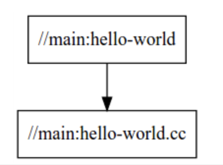
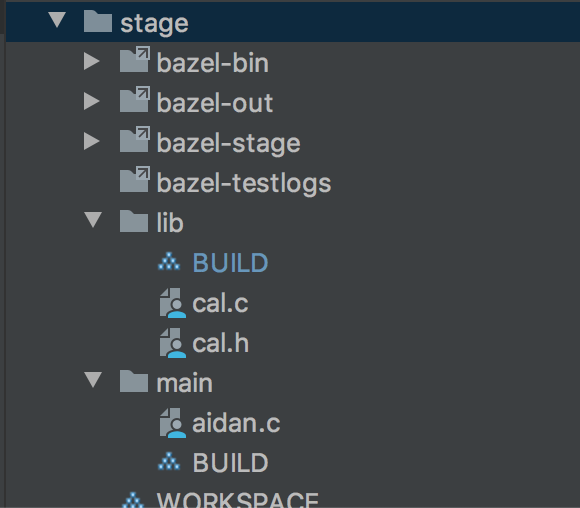

bazel은 구글에서 오픈소스로 내놓은 빌드툴이다.

이전에 golang 밋업발표 때 함께 발표했던 카카오 모빌리티의 데이터랩장 승일님이 **bazel for go**를 발표했었는데 그때 당시에는 뭐 저런 것도 있구나 정도로 이해하고 넘어갔었고 내가 쓸일은 없을 거라고 생각했다. (vendor를 쓰다가 골치아팟던 적이 있지 않았고 go는 빌드 자체가 원래 빠르기 때문에 나처럼 작은 프로젝트는 bazel까지 갈 일이 없었다.)


(https://github.com/golangkorea/gophercon-talks)발표자료가 모여있는 사이트

근데 상황이 바뀌었다. 증권IT에 들어오게되면서 빌드구조가 복잡하고 디펜던시가 흉악한(?) 증권 C코드를 보면서 다시 한번 찾아보게되었다. c쪽에서 사용하는 makefile 문법은 그 태생 자체가 원래 지저분하고 공부하지 않으면 절대 유추할 수 없는 기호들 (@, \, ?) 거기에 다양한 니즈들이 반영되어 시스템명령어들까지 섞이고 조건문도 붙으면서 가시성이 뚝 떨어진다. 특히 include된 makefile.inc 파일들을 쫓아가다보면 내가 어떤 변수를 추적하고 있었는지 까먹게되어서 업무효율이 극도로 떨어진다.

그리고 ldd, lddtree를 통해서 바이너리의 연결된것들을 찾아보려고해도 dependency가 어떻게 되는지 확인하기가 무척힘들다. 심지어 매매 쪽의 경우 동적 링크를 허용하지 않겠다는 미명하에 ldd에 추적되지 않도록 묶인 디펜던시를 숨겨두었다.

읽기좋은 빌드 명세서는 없단 말인가... dependency에 대한 visualizing을 다 해결해주는 것은 없단 말인가.

bazel

바젤의 공식 홈페이지의 bazel overview를 보면 바젤의 장점 다섯가지를 제시하는데
첫번째로 high level build language, 인간이 읽을 수 있는 추상적인 언어를 사용하여 프로젝트의 빌드 속성을 높은 의미로 설명한다. 다른 도구들과 달리 바젤은 라이브러리, 바이너리, 데이터셋 등의 개념을 사용해 컴파일러 및 링커와 같은 도구에 대한 호출을 작성하는 복잡성을 방지한다.

첫 장점부터 설레었다.
나에게 다른건 크게 중요하지 않았다.
빌드 스크립트의 깔끔함!!!

아래는 바젤의 빌드 definition 파일이다. starlark라는 언어를 사용해 보기쉽고 이해하기 편하게 빌드를 정의할 수 있다.:

```bazel
load("@rules_cc//cc:defs.bzl", "cc_library")

cc_library(
     name = "hello-time",
     srcs = ["hello-time.cc"],
     hdrs = ["hello-time.h"],
     visibility = ["//main:__pkg__"],
 )
```
대에충 hello-time이라는 라이브러리를 만들건데 src들은 이게 필요하고 헤더파일은 저거다.라는 내용이다.

bazel은 기본적으로 디펜던시를 그래프로 표현해주는 기능도 포함한다.



비주얼라이즈는 operation에 정말 중요한 부분이다.

바로 시작해보았다.

```
$ tree stage
stage
├── WORKSPACE
├── lib
│   ├── BUILD
│   ├── cal.c
│   └── cal.h
└── main
    ├── BUILD
    └── aidan.c
```
우선 특정 디렉토리에 WORKSPACE라는 빈파일을 만들어 바젤의 워킹영역을 선언한다.
라이브러리는 cal은 간단히 더하고 빼는 함수를 들고있다.
main인 aidan.c에서 해당 라이브러리를 호출하는 디렉토리세팅이다.

lib/cal.c :
```c
#include "cal.h"

int ADD(int a, int b){
    return a+b;
}
```

lib/cal.h
```
int ADD (int a, int b);
```
lib/BUILD:
```
load("@rules_cc//cc:defs.bzl", "cc_library")

cc_library(
    name = "cal",
    srcs = ["cal.c"],
    hdrs = ["cal.h"],

    visibility = ["//main:__pkg__"],
)
```
visibility옵션을 이용하면 어떤 페키지에서 해당라이브러리를 참조할수있도록 허용할지도 결정할수있다~


이제 main을 작성해서 해당 라이브러리르 호출하는 스크립트를 짜보자.  

main/aidan.c:
```
#include <stdio.h>
#include "lib/cal.h"

int main(int argc, char *argv[]) {
    int total;
    total=ADD(1,2);
    printf("%d \n",total);
    return 0;
}
```
main/BUILD:
```
load("@rules_cc//cc:defs.bzl", "cc_binary")

cc_binary(
    name = "aidan",
    srcs = ["aidan.c"],
    deps = [
            "//lib:cal",
    ],
)
```
cc_binary로 내가 만들형태가 aidan이라는 바이너리파일임을 명세하고 필요한 dependency로 lib:cal 을 정의해준다.

이제 모든 준비가 끝났으니 bazel을 이용해 aidan이라는 바이너리파일을 빌드해보자.
```
baesang-ig-ui-MacBook-Pro:stage aidan$ bazel build //main:aidan
INFO: Analyzed target //main:aidan (14 packages loaded, 52 targets configured).
INFO: Found 1 target...
Target //main:aidan up-to-date:
  bazel-bin/main/aidan
INFO: Elapsed time: 5.614s, Critical Path: 0.22s
INFO: 4 processes: 4 darwin-sandbox.
INFO: Build completed successfully, 7 total actions
```

성공적으로 빌드되고 이제 해당디렉토리에 bazel의 빌드 결과물들이 생성되어 있음을 확인할 수 있다.


결과물인 바이너리파일은 `bazel-bin` 디렉토리에 있다.
```
baesang-ig-ui-MacBook-Pro:stage aidan$ bazel-bin/main/aidan
3
```
호~ 잘동작한다.

디펜던시를 확인하기도 좋고 내부 캐시도 동작하기때문에 비슷한 다른버전을 컴파일시 빠른 속도를 자랑한다.

바젤 공식사이트 튜토리얼
https://docs.bazel.build/versions/3.1.0/tutorial/cpp.html


뭔가 워크스페이스별로 파이프라인을 구축하면 꽤나 아름다운 파이프라인 구조를 만들 수 있을거같은데...
우선 증권가 pro*C 프리컴파일러를 지원하지 않는거같아 잠시 닫아두었다.(좀더알아보면 있을 수도) 여유가되어 동료가 더 늘어난다면 bazel로 뜯어고쳐보는 때가 오길! (제발)
