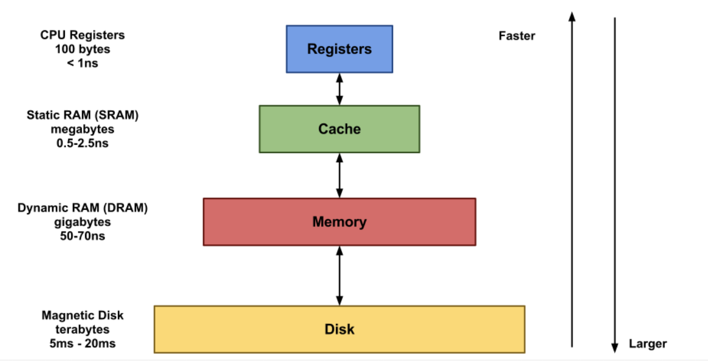
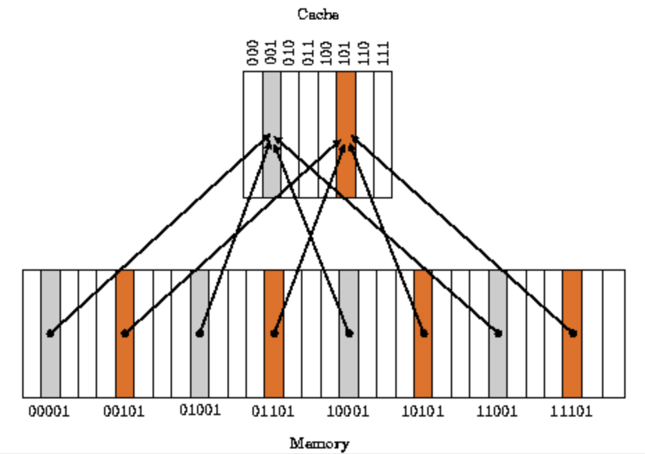
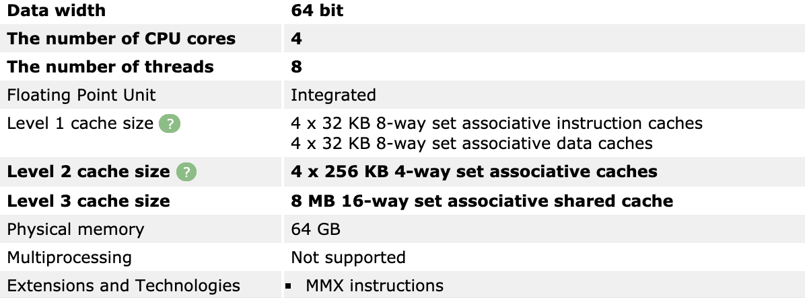
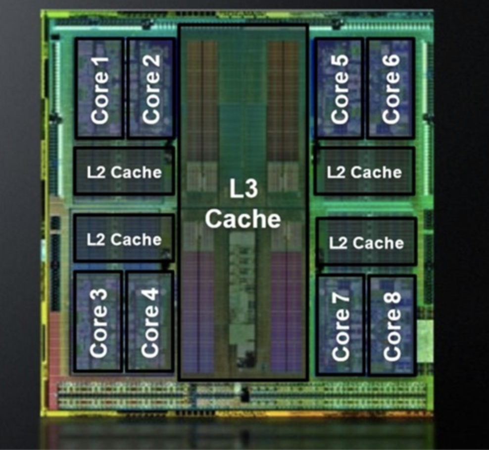

### CPU 캐시란?


컴퓨터 시스템의 성능을 향상 시키기 위해 주로 CPU칩 안에 포함되는 빠르고 작은 매우 비싼 메모리입니다. 프로그램에서 직접적으로 읽거나 쓸 수 없고 하드웨어의 메모리 관리 시스템이 내부적으로 제어합니다. 대부분의 프로그램은 한번 사용할 데이터를 다시 사용할 가능성이 높고, 그 주변의 데이터도 곧 사용할 가능성이 높은 데이터 지역성을 가지고 있다. 데이터 지역성을 활용하여 메인 메모리에 있는 데이터를 캐시 메모리에 불러와 두고, cpu가 필요한 데이터를 캐시에서 먼저 찾도록 하면 향상시킬수 있다.

여기서 포인트는 **데이터의 지역성을 활용**한다!

##### 캐시 메모리는 데이터 지역성(locality)의 원리를 사용함

- 시간 지역성(Temporal locality)
  - For, while 같은 반복문에 사용되는 조건 변수처럼 한번 참조된 데이터는 잠시후 참조될 가능성이 높다.
- 공간 지역성(Spatial locality)
  - a[0], a[1]처럼 같은 데이터 배열에 연속적으로 접근할때 참조된 데이터 근처에 있는 데이터가 잠시 후 사용될 가능성이 높다.


CPU는 메모리에 데이터를 요청할 때, DRAM에 접근하기 전에 일단 캐시메모리에 접근하여 존재 여부를 확인한다. 캐시메모리는 메인메모리인 DRAM보다는 훨씬 작아서 데이터를 모두 저장할 수 없다. **DRAM이 보통 4~16GB 정도인데, 인텔 i5, i7에 들어가는 캐시 메모리는 32KB~8MB 정도**이다. 

존재가 외부에 드러나지 않기 때문에 캐시메모리는 CPU에 투명(transparent)하다고 한다. 투명하지 않은 작은 온칩 메모리는 Scratchpad Memory라고 부른다.

cpu가 데이터를 요청했을 때 캐시 메모리가 해당 데이터를 가지고. 있다면 이를 **캐시히트**라고 부르며, 해당 데이터가 없어서 DRAM에 접근해야 한다면 **캐시 미스**라고 부릅니다.

캐시미스 유형엔 3가지(compulsory, conflict, capacity)가 있는데 그중 가장 자주 발생하는 conflict miss를 잠깐 살펴보고가자.

**conflict miss**:
캐시메모리에 A데이터와 B데이터를 저장해야하는데, A와 B가 같은 캐시 메모리 주소에 할당되어서 나는 캐시 미스다.

캐시 미스 비율은 대체로 평균 10% 안쪽이기 때문에 캐시 메모리를 통해 컴퓨터 시스템의 평균 성능을 크게 향상 시킬수 있으며 클럭속도, 코어 개수와 함께 컴퓨터 성능에서 매우 큰 비중을 차지한다. 그러나 많은 사람들이 캐시 메모리에 대해 잘 모르며 실제 캐시 메모리가 없이 클럭 속도가 더 높은 cpu가 클럭속도는 낮지만 캐시메모리가 있는 cpu보다 대체로 더 나쁜 성능을 보여준다. (셀러론이 싼데는 다 이유가 있다.)

---
### 가장 기본적인 캐시 구조

- Direct Mapped Cache
- Fully Associative Cache
- Set Associative Cache





### Direct Mapped Cache

DRAM의 여러개 주소가 캐시메모리의 한 주소에 대응되는 다대일(n:1)방식

- 메모리 공간이 32개 (00000₂부터 11111₂)
- 캐시 메모리 공간이 8개 (000₂부터 111₂)

Ex ) 00**000₂**, 01**000₂**, 10**000₂**, 11**000₂**인 곳의 데이터를 캐시 메모리의 주소가 000₂인 곳에만 읽고 쓰는 방식이다.

(아이패드 설명) 

이때 000₂을 인덱스 필드(Index Field), 인덱스를 제외한 나머지 비트 00₂, 01₂, 10₂, 11₂을 태그 필드(Tag Field)라 하고, 기본적으로 태그 비트와 인덱스 비트 뒤에 데이터를 저장하는 데이터 필드(Data Field)가 붙어있는 구조를 갖고 있다.

Direct Mapped Cache의 작동 방식은 대략 다음과 같다.

캐시 메모리가 비워진 상태로 cpu가 메인 메모리의 00000₂ 주소의 데이터를 두 번 연속으로 읽는다고 하자. CPU는 먼저 캐시메모리를 뒤적이는데 요청한 주소가 00000₂이므로 캐시 메모리의 주소가 000₂인 곳을 확인한다. 확인 후 아무것도 없는 것을 확인하고 직접 메인 메모리의 00000₂ 주소를 참조하여 데이터를 읽어온다.

이때  캐시 메모리의 000₂인 공간에 00₂태그비트와 아까 읽은 메인 메모리 00000₂의 데이터를 저장해 놓는다. 그 다음 바로 같은 동작을 수행하면서 똑같이 캐시 메모리의 000₂ 인 곳을 확인하는데 이번엔 데이터가 들어있으니 그 데이터가 CPU가 요구한 주소의 데이터와 일치하는지 태그 비트를 비교하는 검사를 한 뒤 태그 비트마저 일치하면 캐시 메모리에서 데이터를 가져온다.

간단하고 빠르지만 대신 약점이 굉장히 큰데, Conflict miss 문제가 굉장히 큰 방식이다. 직관적으로 생각해서 위 그림의 회색 데이터는 하나도 저장할 필요가 없는데 주황색 데이터 중 2개 이상을 동시에 저장해야 하는 일이 생기면 굉장히 골치아플 것임을 알 수 있다.

### Fully Associative Cache

쉽게 설명하면 비어있는 캐시메모리가 있으면 그냥 마음대로 주소를 저장하는 방식. 즉 저장시 크게 알고리즘 비용이 없어 간단한데, 찾을 때 문제. 모든 블럭을 순회해 데이터가 있는지 검사. 이를 위해 CAM(content Addressable memory)라는 특수한 형태의 메모리 구조를 사용하는데, 가격이 비싸 흠!

### Set Associative Cache

Direct Mapping과 Associative를 섞었다. 특정 로우를 지정해서 그 로우안의 어떤 열이든 비어있으면 저장. DMC에 비해 검색은 오래걸리지만 저장이 빠르며 Associative에 비해 저장이 느리지만 검색이 빠른 중간형. 

현대 잘나간다는 cpu 캐시들은 대부분 이방식을 취하고 있다.

Core 2 Duo E8400 의 경우:

```
L1 Data cache           2 x 32 KBytes, 8-way set associative, 64-byte line size
L1 Instruction cache    2 x 32 KBytes, 8-way set associative, 64-byte line size
L2 cache                6144 KBytes, 24-way set associative, 64-byte line size
```

Core i7 2600K 의 경우:

```
L1 Data cache           4 x 32 KBytes, 8-way set associative, 64-byte line size
L1 Instruction cache    4 x 32 KBytes, 8-way set associative, 64-byte line size
L2 cache                4 x 256 KBytes, 8-way set associative, 64-byte line size
L3 cache                8 MBytes, 16-way set associative, 64-byte line size
```


내 맥북(2016년형 맥북프로 터치바 모델):
```shell
ui-MacBookPro:~ a.$ sysctl -n machdep.cpu.brand_string
Intel(R) Core(TM) i7-6820HQ CPU @ 2.70GHz
```

해당 모델명으로 구글링을 해보면 쉽게 캐시 아키텍쳐 디테일을 알 수 있다.




저의 맥북도 set associative 방식이네요

Level 3 cache는 8m이나 되는데 shared cache라는 점이 눈에 띕니다.  
아래와 같은 구조라고 보시면되겠습니다.  




cpu코어들이 공유하는 메모리로, 각 코어별 캐시와 차이점이 있으며 L1, L2에 비해 느립니다.


### 캐시라인

(그림설명 추가 및 캐시라인에 대한 설명을 추가할 예정)

- line 이란 캐시영역의 기본단위
  - 요즘은 보통 16워드(64byte)를 사용한다.


### n-way


출처 위키피디아: DM과 2way -associative 방식

- n-way는 결국 set associative에서, 몇개의 라인을 1개의 셋으로 했느냐를 알려준다. 1-way set associative는 결국 dm과 동일한 셈이다. 캐시의 라인 수와 way수가 같다면 fully associative가 된다. 
- 따라서 way수가 클수록, 구현이 어렵고, 속도가 떨어지며, 제조비용이 높아지지만 캐시의 효율성(miss rate 가 낮으면 효율이 좋음)이 좋아진다.


---
### 캐시를 고려하는 프로그래밍

멀티쓰레드 프로그래밍을 하다보면 **캐시 동기화** 때문에 싱글쓰레드 프로그래밍보다 느려지는 경우가 있다. 내가 즐겨사용하는 golang에서도 slice를 여러개의 goroutine이 경합하며 변경(쓰기)하려고할 때  싱글쓰레드보다 연산이 느려지는 경우가 발생한다. 이를 개선하기 위해서는 cpu캐시에 대한 이해가 필요하며 불필요한 공유자원을 줄이는 작업(전역변수를 goroutine 내 지역변수로 전환)이 필요하다. 

참고하면 좋은 자료  
cpu shared cache를 잘 사용하는 방법 <https://smallake.kr/?p=10552>