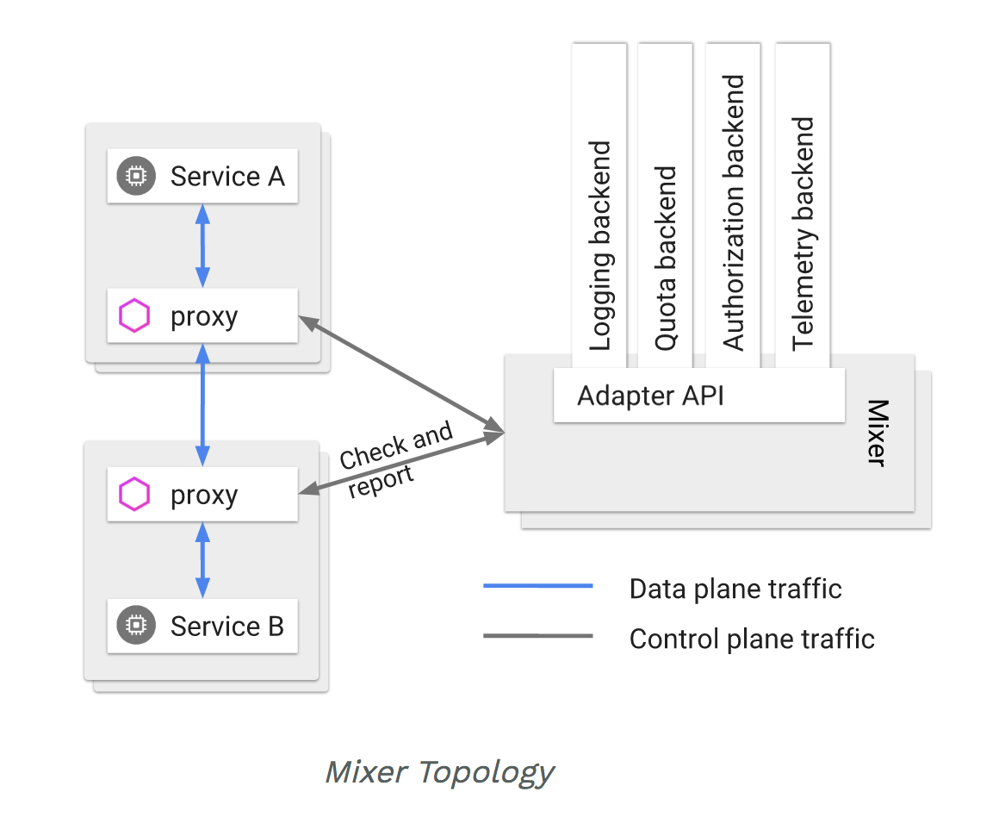
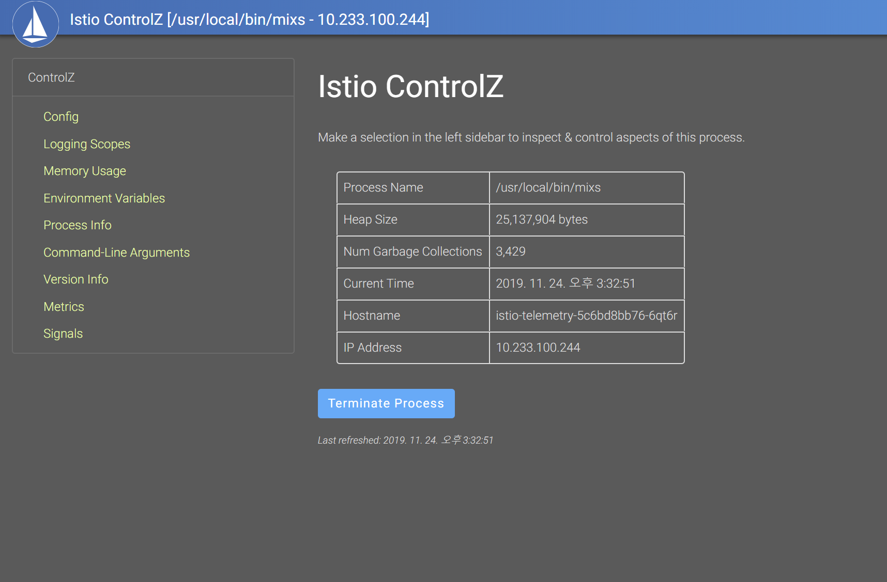
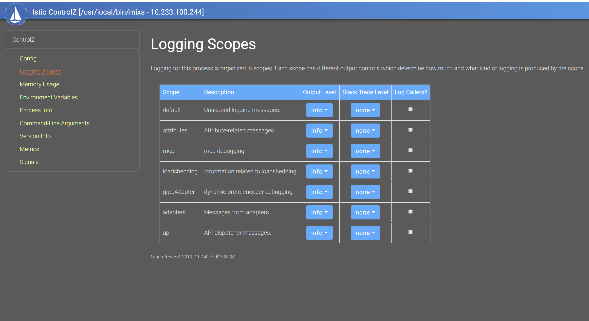
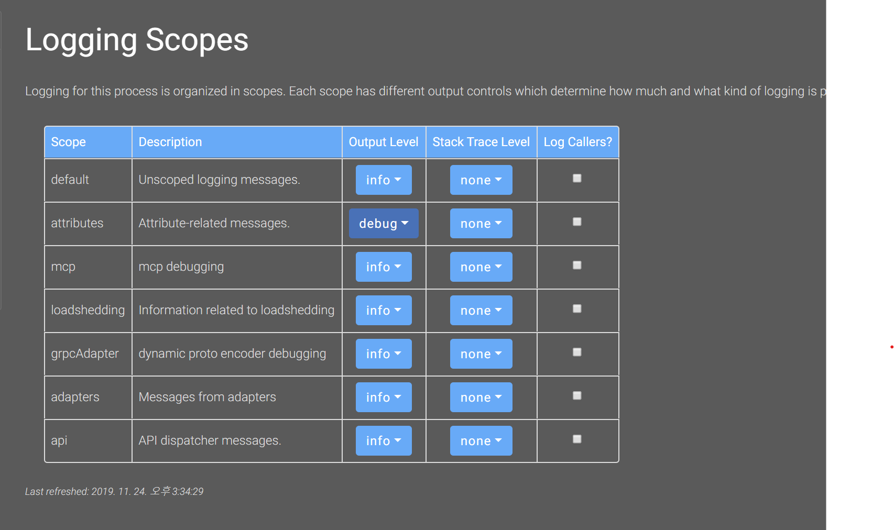

istio의 mixer는 서비스에 대한 원격 분석등의 수집을 도와주는 유연한 모델이다.
서비스 옆에 붙어 있는 istio-proxy들의 수집되는 정보들을 mixer를 통해
파이프라이닝 할 수 있다.



그림처럼 adapter api를 사용하기 때문에 다양한 어댑터를 사용해 확장성과 유연성을 다 갖춘 모델이다.

istio 믹서에 문제가 생긴다면 서비스에 대한 수집 정보들에 영향이 생길 수 있다.
그러므로 특정 서비스에 라우팅이 안되고 모니터링상 이슈가 없었다면 로그나 수집 데이터를 생성, 운반하는 믹서에 이슈가 있는지 확인해보아야한다.


istio는 쿠버네티스 대시보드처럼 손쉽게 istio의 현재 상태와 스코프 기능을 제공하는
controlZ라는 서비스를 제공하고있다.



```
$ kubectl -n istio-system port-forward --address 0.0.0.0 $(kubectl -n istio-system get pod -l istio=mixer,istio-mixer-type=telemetry -o jsonpath='{.items[0].metadata.name}') 9876:9876
```

믹서 내부에 9876포트로 controlZ라는 웹서비스를 제공하고있다.

가장 유용하게 사용하는 logging scopes이다.



이제 믹서 컨테이너에 접근해서 매니징 툴의 옵션에 따라 믹서의 로깅이 어떻게 변하는지 확인해보자.
믹서 로그 follow 명령어:
```
kubectl -n istio-system logs -f  -l app=telemetry -c mixer
```

```
[root@pransible ~]# kubectl -n istio-system logs -f  -l app=telemetry -c mixer                                     2019-11-23T18:18:12.657025Z     warn    Neither --kubeconfig nor --master was specified.  Using the inClusterConfig.  This might not work.
2019-11-23T18:18:12.657986Z     info    Setting up event handlers
2019-11-23T18:18:12.658108Z     info    Starting Secrets controller
2019-11-23T18:18:12.658147Z     info    Waiting for informer caches to sync
2019-11-23T18:18:12.658523Z     info    adapters        serving prometheus metrics on 42422     {"adapter": "prometheus.istio-system"}
2019-11-23T18:18:12.660656Z     info    Cleaning up handler table, with config ID:0
2019-11-23T18:18:12.660970Z     info    Starting monitor server...
Istio Mixer: 1.4.0-c4def934e4f8d1feb42725da41ee0078cde8397f-Clean
Starting gRPC server on port 9091
2019-11-23T18:18:12.665030Z     info    ControlZ available at 127.0.0.1:9876
```

고요하다.



attribute의 output log level을 debug로 낮춘다.
```
2019-11-24T06:34:36.403365Z     debug   attributes      Returning bag with attributes:
connection.mtls               : false
context.protocol              : http
context.proxy_error_code      : -
context.proxy_version         : 1.4.0
context.reporter.kind         : inbound
context.reporter.uid          : kubernetes://~~~~-79ff5b5498-4jfht.live
destination.ip                : [0 0 0 0 0 0 0 0 0 0 255 255 10 233 74 246]
destination.namespace         : live
destination.port              : 10810
destination.service.host      : ~~~.live.svc.cluster.local
destination.service.name      : ~~~
destination.service.namespace : live
destination.service.uid       : istio://live/services/~~~~
destination.uid               : kubernetes://~~~~.live
origin.ip                     : [172 16 60 51]
request.headers               : stringmap[:authority:~~~~ :method:GET :path:/health accept-encoding:gzip user-agent:kube-probe/1.14 x-b3-sampled:0 x-b3-spanid:2426b947e3649f03 x-b3-traceid:03e874e74590cfd22426b947e3649f03 x-forwarded-proto:http x-request-id:fe707112-f1ad-4758-9167-935993ec821f]
request.host                  : 10.233.74.246:10810
request.method                : GET
request.path                  : /health
request.scheme                : http
request.size                  : 0
request.time                  : 2019-11-24 06:34:35.40168 +0000 UTC
request.total_size            : 164
request.url_path              : /health
request.useragent             : kube-probe/1.14
response.code                 : 200
response.duration             : 702.709µs
response.headers              : stringmap[:status:200 connection:close content-length:0 date:Sun, 24 Nov 2019 06:34:35 GMT server:istio-envoy x-envoy-decorator-operation:~~~~.live.svc.cluster.local:80/* x-envoy-upstream-healthchecked-cluster:voyager-message-agent.live x-envoy-upstream-service-time:0]
response.size                 : 0
response.time                 : 2019-11-24 06:34:35.402313 +0000 UTC
response.total_size           : 265


2019-11-24T06:34:36.421913Z     debug   attributes      Returning bag with attributes:
connection.mtls               : false
context.protocol              : http
context.proxy_error_code      : -
context.proxy_version         : 1.4.0
context.reporter.kind         : outbound
context.reporter.uid          : kubernetes://istio-ingressgateway-74747c4b5b-9xh9d.istio-system
destination.ip                : [10 233 70 250]
destination.port              : 8200
destination.service.host      : ~~~~.infra.svc.cluster.local
destination.service.name      : ~~~~
destination.service.namespace : infra
destination.service.uid       : istio://infra/services/apm-server
destination.uid               : kubernetes://apm-server-77769c7774-fk84t.infra
origin.ip                     : [172 16 60 55]
request.headers               : stringmap[:authority:~~~~~ :method:POST :path:/intake/v2/events accept:text/html, image/gif, image/jpeg, *; q=.2, */*; q=.2 cache-control:no-cache content-encoding:deflate content-type:application/x-ndjson pragma:no-cache user-agent:elasticapm-java/1.11.0 x-b3-parentspanid:8e8b487a024c77a3 x-b3-sampled:0 x-b3-spanid:eaec8cf992cc2f27 x-b3-traceid:187803d56ecc87e08e8b487a024c77a3 x-envoy-decorator-operation:-~~~.infra.svc.cluster.local:8200/* x-envoy-external-address:~~~~ x-forwarded-for:~~~~ x-forwarded-proto:http x-request-id:6dbf98a6-ae72-4b3b-bf70-1b4006c21e55]
request.host                  : ~~~~
request.method                : POST
request.path                  : /intake/v2/events
request.scheme                : http
request.size                  : 701
request.time                  : 2019-11-24 06:34:25.413794 +0000 UTC
request.total_size            : 1435
request.url_path              : /intake/v2/events
request.useragent             : elasticapm-java/1.11.0
response.code                 : 202
response.duration             : 10.008387838s
response.headers              : stringmap[:status:202 content-length:0 date:Sun, 24 Nov 2019 06:34:34 GMT server:istio-envoy x-envoy-upstream-service-time:0]
response.size                 : 0
response.time                 : 2019-11-24 06:34:35.422055 +0000 UTC
response.total_size           : 105
source.namespace              : istio-system
source.uid                    : kubernetes://istio-ingressgateway-74747c4b5b-9xh9d.istio-system

```

순식간에 수많은 proxy들로 부터 생성되는 attribute들의 정보가 쏟아진다.
이뿐만 아니라 adater log level을 컨트롤하면 mixer에 내가 세팅한 어댑터가 잘 등록되어
메세지가 전달되는지 확인할 수 있다.
handler와 instance, rule등에 문제가 없다면 attribute와 adapter스코프를 조정해보면서
문제 해결의 단서를 찾아나가시면 좋다. 꿀팁! 행복한 디버깅 고고
