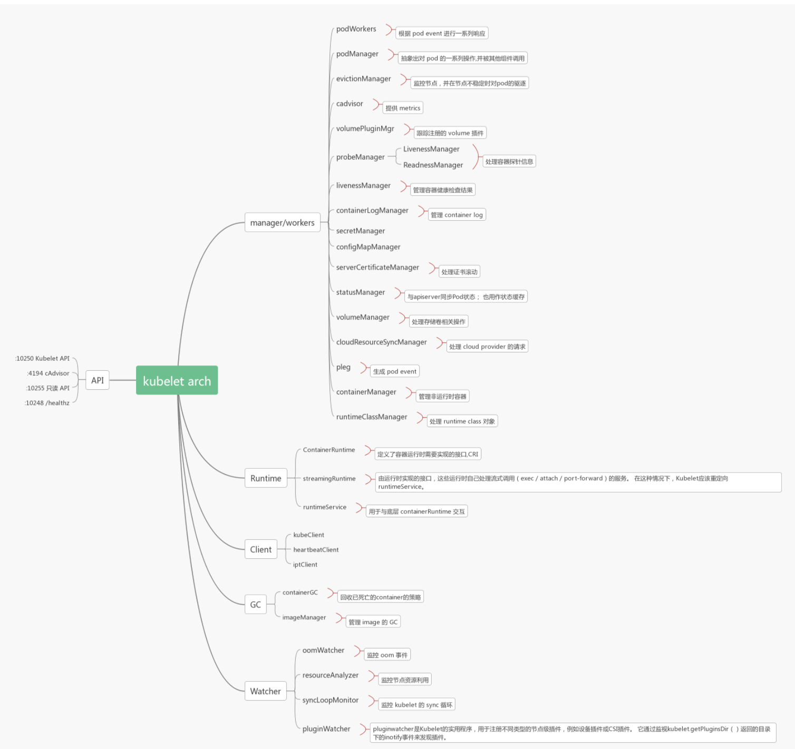
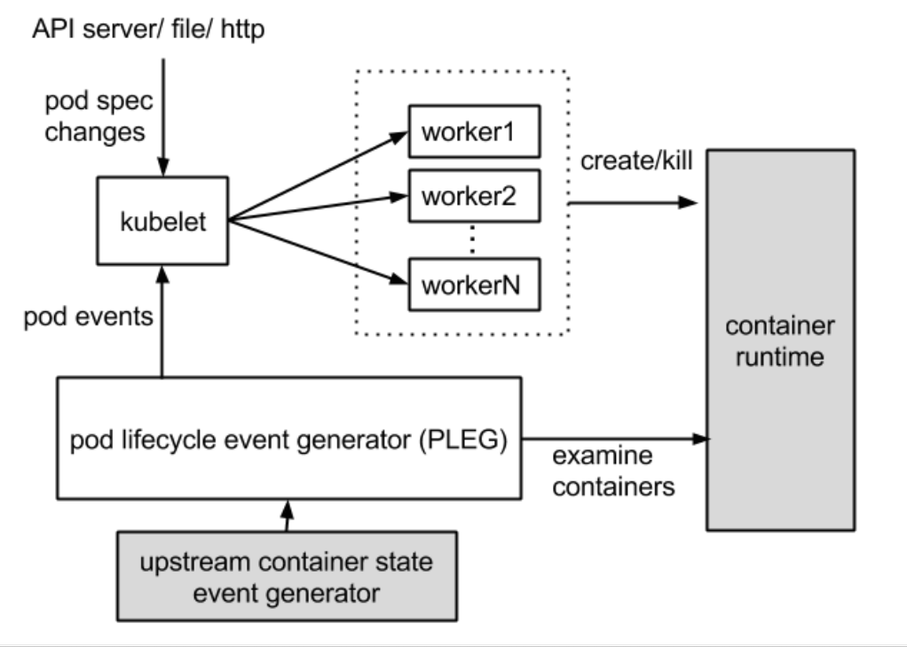
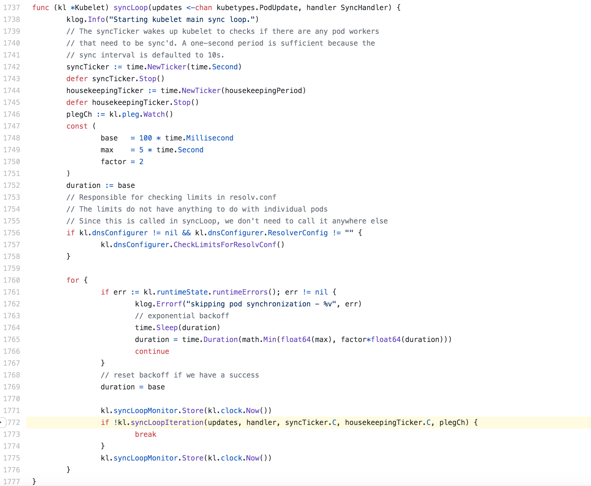
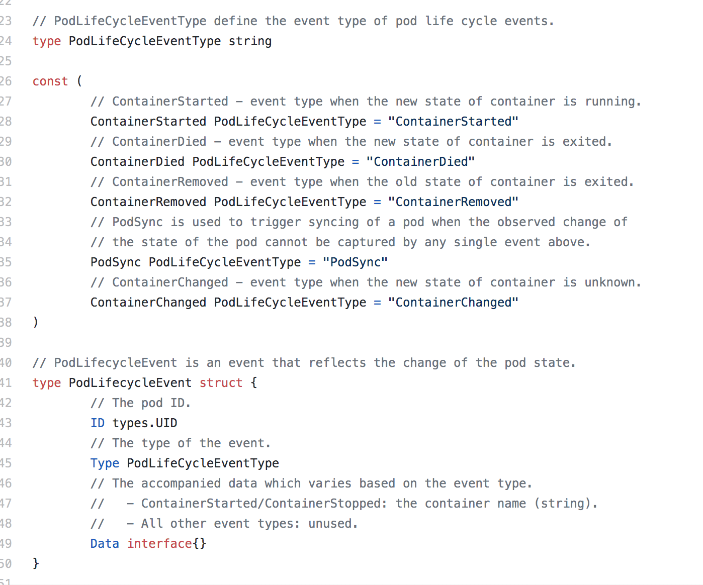
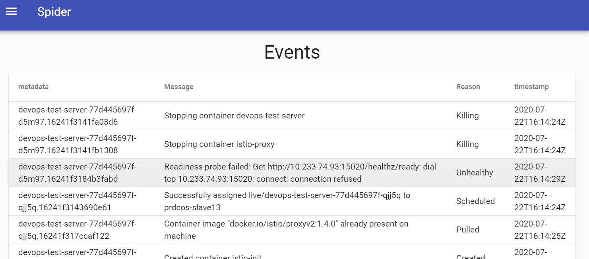
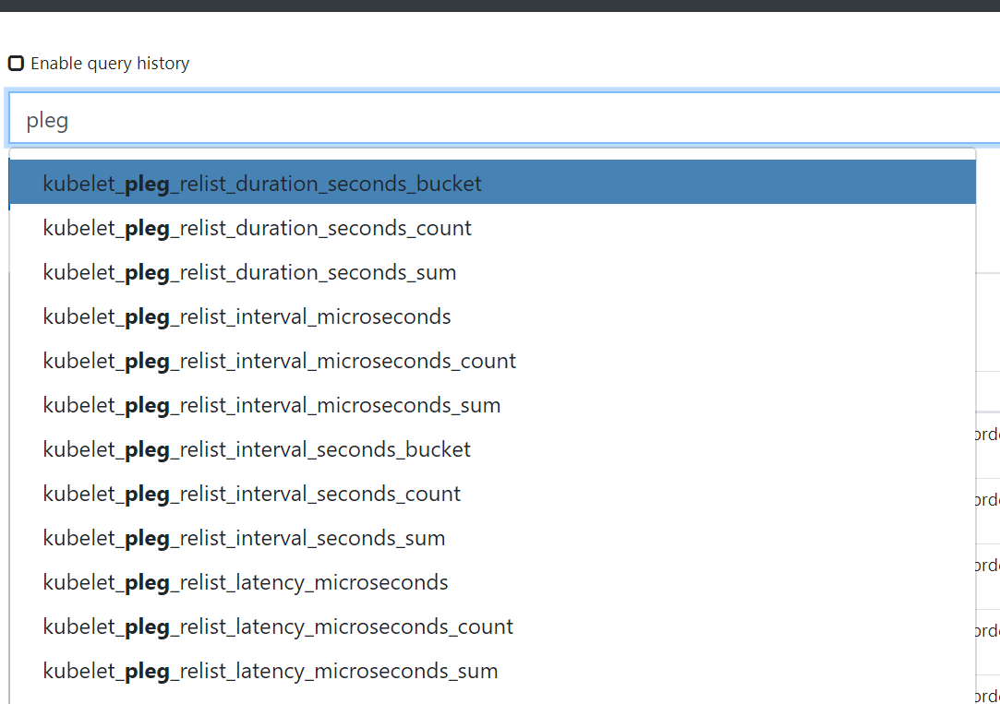

### kubelet architecture



출처:
https://programmer.help/blogs/kubelet-source-code-analysis-startup.html

그림처럼 kubelet에는 다양한 컴포넌트들이 하위 고루틴으로 돌아가고있다.


---

centos 기준 어떤 특정머신에 이슈가 있을때 가장 자주 쳐보는 명령어

```
journalctl -xf
```
unit 옵션을 주어서 kubelet 로그만 확인한다.
```
journalctl -xfu kubelet
```


k8s 머신장애 상황 or not ready 인 상태에서 kubelet 로그들이 가장 활발한 활동을 보여준다.  
당연한 이야기이지만 SRE나 인프라 책임이라면 장애시 필요한 로그를 빠르게 확인할 수 있어야한다.
오늘 포스팅에서는 쿠버네티스 클러스터에서 항상 중요 로그를 쏟아내는 kubelet과   그
로그에 종종볼수 있는 PLEG라는 것의 실체를 가볍게 확인해본다.


##### k8s kubelet.go SourceCode (1.15버전 기준)
[https://github.com/kubernetes/kubernetes/blob/7e75a5ef43b3e1db761e8152ac654cfa67dd62bd/pkg/kubelet/kubelet.go](https://github.com/kubernetes/kubernetes/blob/7e75a5ef43b3e1db761e8152ac654cfa67dd62bd/pkg/kubelet/kubelet.go)

const는 상수이기때문에 쿠버네티스에서 바꾸지못하도록 세팅해둔 값

```jsx
const (
	// Max amount of time to wait for the container runtime to come up.
	maxWaitForContainerRuntime = 30 * time.Second

	// nodeStatusUpdateRetry specifies how many times kubelet retries when posting node status failed.
	nodeStatusUpdateRetry = 5

	// ContainerLogsDir is the location of container logs.
	ContainerLogsDir = "/var/log/containers"

	// MaxContainerBackOff is the max backoff period, exported for the e2e test
	MaxContainerBackOff = 300 * time.Second

	// Period for performing global cleanup tasks.
	housekeepingPeriod = time.Second * 2

	// Period for performing eviction monitoring.
	// TODO ensure this is in sync with internal cadvisor housekeeping.
	evictionMonitoringPeriod = time.Second * 10

	// The path in containers' filesystems where the hosts file is mounted.
	etcHostsPath = "/etc/hosts"

	// Capacity of the **channel** for receiving pod lifecycle events. This number
	// is a bit arbitrary and may be adjusted in the future.
	plegChannelCapacity = 1000
// Generic PLEG relies on relisting for discovering container events.
	// A longer period means that kubelet will take longer to detect container
	// changes and to update pod status. On the other hand, a shorter period
	// will cause more frequent relisting (e.g., container runtime operations),
	// leading to higher cpu usage.
	// Note that even though we set the period to 1s, **the relisting itself can
	// take more than 1s to finish if the container runtime responds slowly
	// and/or when there are many container changes in one cycle.**
	plegRelistPeriod = time.Second * 1

...

```

아래쪽에 `pleg`라는 단어가 눈에 띈다.
이는 pod lifecycle event generator의 약자인데
Pleg (Pod LifeCycle Event Generator)와 관련된 로그는 이슈 발생시 쉽게 확인할 수 있다.

pleg Channel Capa는 1000.
golang channel은 goroutine간의 통신을 위해 비동기, 동적으로 동작하는 큐인데 위의 버퍼사이즈 1000개가 꽉차는 순간 blocking 발생.
이후부터 동기적으로 동작하는 특성을 가지고있다.

plegRelistPeriod 무언가 주기가 있나보다 뒤에서 확인해보자.

의도적으로 oom을 내었던 mem-test라는 파드에 대한 kubelet로그:
```jsx
kubelet[2449754]: I0616 16:54:18.316391 2449754 kubelet.go:1933] SyncLoop (PLEG): "mem-test-68bcccd59d-974pr_live(503eff33-754a-4938-8a71-c6ac261ebb6c)", event: &pleg.PodLifecycleEvent{ID:"503eff33-754a-4938-8a71-c6ac261ebb6c", Type:"ContainerDied", Data:"a00d5fef27e49d975847a6cec03a2144d46dcc72dd3cfbf86f35b7cf997a9434"}
kubelet[2449754]: E0616 16:54:18.317234 2449754 **pod_workers.go**:190] Error syncing pod 503eff33-754a-4938-8a71-c6ac261ebb6c ("mem-test-68bcccd59d-974pr_live(503eff33-754a-4938-8a71-c6ac261ebb6c)"), skipping: failed to "StartContainer" for "mem-test" with CrashLoopBackOff: "Back-off 1m20s restarting failed container=mem-test pod=mem-test-68bcccd59d-974pr_live(503eff33-754a-4938-8a71-c6ac261ebb6c)"
kubelet[2449754]: I0616 16:54:26.852529 2449754 setters.go:73] Using node IP: "172.--.--.--"
kubelet[2449754]: E0616 16:54:33.619148 2449754 pod_workers.go:190] Error syncing pod 503eff33-754a-4938-8a71-c6ac261ebb6c ("mem-test-68bcccd59d-974pr_live(503eff33-754a-4938-8a71-c6ac261ebb6c)"), skipping: failed to "StartContainer" for "mem-test" with CrashLoopBackOff: "Back-off 1m20s restarting failed container=mem-test pod=mem-test-68bcccd59d-974pr_live(503eff33-754a-4938-8a71-c6ac261ebb6c)"
kubelet[2449754]: I0616 16:54:36.866426 2449754 setters.go:73] Using node IP: "172.------"
kubelet[2449754]: I0616 16:54:42.384150 2449754 container_manager_linux.go:457] [ContainerManager]: Discovered runtime cgroups name: /systemd/system.slice
kubelet[2449754]: E0616 16:54:45.619505 2449754 pod_workers.go:190] Error syncing pod 503eff33-754a-4938-8a71-c6ac261ebb6c ("mem-test-68bcccd59d-974pr_live(503eff33-754a-4938-8a71-c6ac261ebb6c)"), skipping: failed to "StartContainer" for "mem-test" with CrashLoopBackOff: "Back-off 1m20s restarting failed container=mem-test pod=mem-test-68bcccd59d-974pr_live(503eff33-754a-4938-8a71-c6ac261ebb6c)"
```

SyncLoop라는 것과 함께 PLEG를 확인할 수 있다.

#### 그렇다면 본격적으로 kubelet과 pleg를 알아보자.



kubelet은 파드스펙의 변경을 마스터로부터 전달 받을 수도 있고 머신으로부터 파드와 관련된 이벤트(ex. oom)를 전달받아 액션이 수행될 수 있다.
그렇기 때문에 이런 다양한 상황을 통제하는 SyncLoop가 존재하고 각각의 이벤트 source에 따라 다른 처리를 하고있다.



kubelet은 이렇듯 multiple sources로 부터 일어나는 파드 스펙 변화를 감지해야하고, 또 한편으로 컨테이너 런타임을 주기적으로 polling해서 모든 컨테이너의 최신 상태를 점검해야한다.

<!-- 폴링은 파드나 컨테이너의 수가 증가함에 따라 무시할 수 없는 오버헤드를 발생시킬수 있고, 컨테이너 런타임을 개별적으로 쿼리하는 포드당 하나의 작업자인 큐블렛의 병렬처리로 인해 무마된다. 주기적 동시에 많은 수의 요청은 과부하 된 컨테이너 런타임으로 인한 높은 cpu사용량  성능 저하 문제를 유발하고 궁극적으로 큐블렛의 확장성을 제한한다. 그래서 PLEG라는 녀석을 따로 똑 떼어놓은것 -->

#####  relist를 이용한 컨테이너 상태 변화 감시

pod lifecycle event를 생성하기 위해 PLEG는 모든 컨테이너의 상태 변화를 감지할수 있어야한다. PLEG는 주기적인 relist 작업을 통해 이것을 수행해낸다. (docker ps라고 생각하면 편하다.) 단일 스레드(PLEG)에 의해서만 수행되며. 모든 파드 작업자가 동시에 컨테이너 런타임에 도달하지 않아도 된다는 이점이 있음.
relisting의 장점은 컨테이너 런타임에 구애받지 않고 외부 종속성이 필요없다는 것이다.

ple 구조체:




갑자기 golang

golang은 `effective- go` 라는 책에서부터 인스턴스에 대한 Initializing 패턴이 조금 정형화된 느낌이 있다.

`New~`라는 prefix를 가진 함수를 보면 특정 주요 객체에 대해 initializing을 함.

istio의 믹서 서버 이니셜라이징:
```jsx
// istio /mixer /server.go
func newServer(a *Args, p *patchTable) (server *Server, err error) {
	if err := a.validate(); err != nil {
		return nil, err
	}

	if err := p.configLog(a.LoggingOptions); err != nil {
		return nil, err
	}

	s := &Server{}

	defer func() {
		// If return with error, need to close the server.
		if err != nil {
			_ = s.Close()
		}
	}()

	s.gp = pool.NewGoroutinePool(a.APIWorkerPoolSize, a.SingleThreaded)
	s.gp.AddWorkers(a.APIWorkerPoolSize)

	s.adapterGP = pool.NewGoroutinePool(a.AdapterWorkerPoolSize, a.SingleThreaded)
	s.adapterGP.AddWorkers(a.AdapterWorkerPoolSize)
```

보통 이 New로 시작하는 함수에서 다양한 파생 goroutine을 실행하고 들고 있기때문에. 이부분을 확인하면되고

init() , start() , run() 같은 리시버 함수까지 확인하면 보통 주요한 설정들을 다 확인할 수있음.

다음은 큐블렛의 이니셜라이징:
```jsx
// NewMainKubelet instantiates a new Kubelet object along with all the required internal modules.
// No initialization of Kubelet and its modules should happen here.
func NewMainKubelet(kubeCfg *kubeletconfiginternal.KubeletConfiguration,
	kubeDeps *Dependencies,
	crOptions *config.ContainerRuntimeOptions,
	containerRuntime string,
	hostname string,
	hostnameOverridden bool,
	nodeName types.NodeName,
	nodeIP string,
	providerID string,
...

containerGCPolicy := kubecontainer.GCPolicy{
		MinAge:             minimumGCAge.Duration,
		MaxPerPodContainer: int(maxPerPodContainerCount),
		MaxContainers:      int(maxContainerCount),
	}

	daemonEndpoints := &v1.NodeDaemonEndpoints{
		KubeletEndpoint: v1.DaemonEndpoint{Port: kubeCfg.Port},
	}

	imageGCPolicy := images.ImageGCPolicy{
		MinAge:               kubeCfg.ImageMinimumGCAge.Duration,
		HighThresholdPercent: int(kubeCfg.ImageGCHighThresholdPercent),
		LowThresholdPercent:  int(kubeCfg.ImageGCLowThresholdPercent),
	}
...

nodeLister := corelisters.NewNodeLister(nodeIndexer)

	// TODO: get the real node object of ourself,
	// and use the real node name and UID.
	// TODO: what is namespace for node?
	nodeRef := &v1.ObjectReference{
		Kind:      "Node",
		Name:      string(nodeName),
		UID:       types.UID(nodeName),
		Namespace: "",
	}

	**oomWatcher**, err := oomwatcher.NewWatcher(kubeDeps.Recorder)
	if err != nil {
		return nil, err
	}

	clusterDNS := make([]net.IP, 0, len(kubeCfg.ClusterDNS))
	for _, ipEntry := range kubeCfg.ClusterDNS {
		ip := net.ParseIP(ipEntry)
		if ip == nil {
			klog.Warningf("Invalid clusterDNS ip '%q'", ipEntry)
		} else {
			**clusterDNS** = append(clusterDNS, ip)
		}
	}
	httpClient := &http.Client{}
	parsedNodeIP := net.ParseIP(nodeIP)
	protocol := utilipt.ProtocolIPv4
	if utilnet.IsIPv6(parsedNodeIP) {
		klog.V(0).Infof("IPv6 node IP (%s), assume IPv6 operation", nodeIP)
		protocol = utilipt.ProtocolIPv6
	}
...

klet := &Kubelet{
		hostname:                                hostname,
		hostnameOverridden:                      hostnameOverridden,
		nodeName:                                nodeName,
		kubeClient:                              kubeDeps.KubeClient,
		heartbeatClient:                         kubeDeps.HeartbeatClient,
		onRepeatedHeartbeatFailure:              kubeDeps.OnHeartbeatFailure,
		rootDirectory:                           rootDirectory,
		resyncInterval:                          kubeCfg.SyncFrequency.Duration,
		sourcesReady:                            config.NewSourcesReady(kubeDeps.PodConfig.SeenAllSources),
		registerNode:                            registerNode,
		registerWithTaints:                      registerWithTaints,
		registerSchedulable:                     registerSchedulable,
		dnsConfigurer:                           dns.NewConfigurer(kubeDeps.Recorder, nodeRef, parsedNodeIP, clusterDNS, kubeCfg.ClusterDomain, kubeCfg.ResolverConfig),
		serviceLister:                           serviceLister,
		serviceHasSynced:                        serviceHasSynced,
		nodeLister:                              nodeLister,
		masterServiceNamespace:                  masterServiceNamespace,
		streamingConnectionIdleTimeout:          kubeCfg.StreamingConnectionIdleTimeout.Duration,
		recorder:                                kubeDeps.Recorder,
		cadvisor:                                kubeDeps.CAdvisorInterface,
		cloud:                                   kubeDeps.Cloud,
		externalCloudProvider:                   cloudprovider.IsExternal(cloudProvider),
		providerID:                              providerID,
		nodeRef:                                 nodeRef,
		nodeLabels:                              nodeLabels,
		nodeStatusUpdateFrequency:               kubeCfg.NodeStatusUpdateFrequency.Duration,
		nodeStatusReportFrequency:               kubeCfg.NodeStatusReportFrequency.Duration,
		os:                                      kubeDeps.OSInterface,
		oomWatcher:                              oomWatcher,
		cgroupsPerQOS:                           kubeCfg.CgroupsPerQOS,
		cgroupRoot:                              kubeCfg.CgroupRoot,
		mounter:                                 kubeDeps.Mounter,
		hostutil:                                kubeDeps.HostUtil,
		subpather:                               kubeDeps.Subpather,
		maxPods:                                 int(kubeCfg.MaxPods),
		podsPerCore:                             int(kubeCfg.PodsPerCore),
		syncLoopMonitor:                         atomic.Value{},
		daemonEndpoints:                         daemonEndpoints,
		containerManager:                        kubeDeps.ContainerManager,
		containerRuntimeName:                    **containerRuntime**,
		redirectContainerStreaming:              crOptions.RedirectContainerStreaming,
		nodeIP:                                  parsedNodeIP,
		nodeIPValidator:                         validateNodeIP,
		clock:                                   clock.RealClock{},
		enableControllerAttachDetach:            kubeCfg.EnableControllerAttachDetach,
		iptClient:                               utilipt.New(utilexec.New(), protocol),
		makeIPTablesUtilChains:                  kubeCfg.MakeIPTablesUtilChains,
		iptablesMasqueradeBit:                   int(kubeCfg.IPTablesMasqueradeBit),
		iptablesDropBit:                         int(kubeCfg.IPTablesDropBit),
		experimentalHostUserNamespaceDefaulting: utilfeature.DefaultFeatureGate.Enabled(features.ExperimentalHostUserNamespaceDefaultingGate),
		keepTerminatedPodVolumes:                keepTerminatedPodVolumes,
		nodeStatusMaxImages:                     nodeStatusMaxImages,
		lastContainerStartedTime:                newTimeCache(),
	}
...
```

```jsx
if kubeCfg.ServerTLSBootstrap && kubeDeps.TLSOptions != nil && utilfeature.DefaultFeatureGate.Enabled(features.RotateKubeletServerCertificate) {
		klet.serverCertificateManager, err = kubeletcertificate.NewKubeletServerCertificateManager(klet.kubeClient, kubeCfg, klet.nodeName, klet.getLastObservedNodeAddresses, certDirectory)
		if err != nil {
			return nil, fmt.Errorf("failed to initialize certificate manager: %v", err)
		}
		kubeDeps.TLSOptions.Config.GetCertificate = func(*tls.ClientHelloInfo) (*tls.Certificate, error) {
			cert := klet.serverCertificateManager.Current()
			if cert == nil {
				return nil, fmt.Errorf("no serving certificate available for the kubelet")
			}
			return cert, nil
		}
	}
```

1년 지나서 인증서 이슈때 보게되는 로그

좀더 아래엔 친숙한 애들이 다 선언되어있음.

```jsx
klet.probeManager = prober.NewManager(
		klet.statusManager,
		klet.livenessManager,
		klet.startupManager,
		klet.runner,
		kubeDeps.Recorder)

	tokenManager := token.NewManager(kubeDeps.KubeClient)
```

```jsx

// setup volumeManager
	klet.volumeManager = volumemanager.NewVolumeManager(
		kubeCfg.EnableControllerAttachDetach,
		nodeName,
		klet.podManager,
		klet.statusManager,
		klet.kubeClient,
		klet.volumePluginMgr,
		klet.containerRuntime,
		kubeDeps.Mounter,
		kubeDeps.HostUtil,
		klet.getPodsDir(),
		kubeDeps.Recorder,
		experimentalCheckNodeCapabilitiesBeforeMount,
		keepTerminatedPodVolumes,
		volumepathhandler.NewBlockVolumePathHandler())

	klet.reasonCache = NewReasonCache()
	klet.workQueue = queue.NewBasicWorkQueue(klet.clock)
	klet.podWorkers = newPodWorkers(klet.syncPod, kubeDeps.Recorder, klet.workQueue, klet.resyncInterval, backOffPeriod, klet.podCache)

	klet.backOff = flowcontrol.NewBackOff(backOffPeriod, MaxContainerBackOff)
	klet.podKiller = NewPodKiller(klet)

	etcHostsPathFunc := func(podUID types.UID) string { return getEtcHostsPath(klet.getPodDir(podUID)) }
	// setup eviction manager
	evictionManager, evictionAdmitHandler := eviction.NewManager(klet.resourceAnalyzer, evictionConfig, killPodNow(klet.podWorkers, kubeDeps.Recorder), klet.podManager.GetMirrorPodByPod, klet.imageManager, klet.containerGC, kubeDeps.Recorder, nodeRef, klet.clock, etcHostsPathFunc)

	klet.evictionManager = evictionManager

```

```jsx
// Run starts the kubelet reacting to config updates
func (kl *Kubelet) Run(updates <-chan kubetypes.PodUpdate) {
	if kl.logServer == nil {
		kl.logServer = http.StripPrefix("/logs/", http.FileServer(http.Dir("/var/log/")))
	}
	if kl.kubeClient == nil {
		klog.Warning("No api server defined - no node status update will be sent.")
	}

	// Start the cloud provider sync manager
	if kl.cloudResourceSyncManager != nil {
		go kl.cloudResourceSyncManager.Run(wait.NeverStop)
	}

	if err := kl.initializeModules(); err != nil {
		kl.recorder.Eventf(kl.nodeRef, v1.EventTypeWarning, events.KubeletSetupFailed, err.Error())
		klog.Fatal(err)
	}

	// Start volume manager
	go kl.volumeManager.Run(kl.sourcesReady, wait.NeverStop)

	if kl.kubeClient != nil {
		// Start syncing node status immediately, this may set up things the runtime needs to run.
		go wait.Until(kl.syncNodeStatus, kl.nodeStatusUpdateFrequency, wait.NeverStop)
		go kl.fastStatusUpdateOnce()

		// start syncing lease
		go kl.nodeLeaseController.Run(wait.NeverStop)
	}
	go wait.Until(kl.updateRuntimeUp, 5*time.Second, wait.NeverStop)

	// Set up iptables util rules
	if kl.makeIPTablesUtilChains {
		kl.initNetworkUtil()
	}

	// Start a goroutine responsible for killing pods (that are not properly
	// handled by pod workers).
	go wait.Until(kl.podKiller.PerformPodKillingWork, 1*time.Second, wait.NeverStop)

	// Start component sync loops.
	kl.**statusManager**.Start()
	kl.**probeManager**.Start()

	// Start syncing RuntimeClasses if enabled.
	if kl.runtimeClassManager != nil {
		kl.runtimeClassManager.Start(wait.NeverStop)
	}

	// Start the pod lifecycle event generator.
	**kl.pleg.Start()
	kl.syncLoop(updates, kl)**
}
```

Sync는 Desire state를 선언하는 식(declaretive)으로 리소스를 관리하는 쿠버네티스에게 중요한 함수들임.

선언한 상태와 현재 상태를 지속적으로 비교하고 선언한상태에 맞춰줘야하기때문에 Sync~관련 함수들이 자주 호출됨.


kubelet sync루프 함수의 핵심은. 저 노란 조건문 부분임. iteration 부분


channel을 자주 사용하는 golang의 경우
select문을 종종 볼수 있는데
여러개의 채널(큐)에 데이터가 들어오길 동시에 기다리는 역할을 함.
주로 select문이 선언된 함수는 go runtime이 특별하게 관리하며,
case형태로 분기감시하는 channel단에 이벤트가 들어오면 런타임이 해당 goroutine을 awake시키는 형태로 관리됨. **순서가 보장됨**.

복수개의 채널을 감시한다는것 자체가 꽤나 중요한 역할을 하는 함수라는 것을 뜻함.
그만큼 많은 테스트가 필요하고 프로젝트 주요 핵심 비즈니스 로직이 담겨져있을 가능성이 큼.

syncLoopIteration 함수는 select문을 활용해 다음과 같은 5개 채널을 계속 감시하고 이벤트가 들어오길 기다리고잇음.

```jsx
// Arguments:
// 1.  configCh:       a channel to read config events from
// 2.  handler:        the SyncHandler to dispatch pods to
// 3.  syncCh:         a channel to read periodic sync events from
// 4.  housekeepingCh: a channel to read housekeeping events from
// 5.  plegCh:         a channel to read PLEG updates from

// * configCh: dispatch the pods for the config change to the appropriate
//             handler callback for the event type
// * plegCh: update the runtime cache; sync pod
// * syncCh: sync all pods waiting for sync
// * housekeepingCh: trigger cleanup of pods
// * liveness manager: sync pods that have failed or in which one or more
//                     containers have failed liveness checks
```

```js
func (kl *Kubelet) syncLoopIteration(configCh <-chan kubetypes.PodUpdate, handler SyncHandler,
	syncCh <-chan time.Time, housekeepingCh <-chan time.Time, plegCh <-chan *pleg.PodLifecycleEvent) bool {
	**select {**
	case u, open := <-configCh:
		// Update from a config source; dispatch it to the right handler
		// callback.
		if !open {
			klog.Errorf("Update channel is closed. Exiting the sync loop.")
			return false
		}

		switch u.Op {
		case kubetypes.ADD:
			klog.V(2).Infof("SyncLoop (ADD, %q): %q", u.Source, format.Pods(u.Pods))
			// After restarting, kubelet will get all existing pods through
			// ADD as if they are new pods. These pods will then go through the
			// admission process and *may* be rejected. This can be resolved
			// once we have checkpointing.
			handler.HandlePodAdditions(u.Pods)
		case kubetypes.UPDATE:
			klog.V(2).Infof("SyncLoop (UPDATE, %q): %q", u.Source, format.PodsWithDeletionTimestamps(u.Pods))
			handler.HandlePodUpdates(u.Pods)
		case kubetypes.REMOVE:
			klog.V(2).Infof("SyncLoop (REMOVE, %q): %q", u.Source, format.Pods(u.Pods))
			handler.HandlePodRemoves(u.Pods)
		case kubetypes.RECONCILE:
			klog.V(4).Infof("SyncLoop (RECONCILE, %q): %q", u.Source, format.Pods(u.Pods))
			handler.HandlePodReconcile(u.Pods)
		**case kubetypes.DELETE:
			klog.V(2).Infof("SyncLoop (DELETE, %q): %q", u.Source, format.Pods(u.Pods))
			// DELETE is treated as a UPDATE because of graceful deletion.
			handler.HandlePodUpdates(u.Pods)**
		case kubetypes.SET:
			// TODO: Do we want to support this?
			klog.Errorf("Kubelet does not support snapshot update")
		default:
			klog.Errorf("Invalid event type received: %d.", u.Op)
		}

		kl.sourcesReady.AddSource(u.Source)

	case e := <-**plegCh**:
		if e.Type == pleg.ContainerStarted {
			// record the most recent time we observed a container start for this pod.
			// this lets us selectively invalidate the runtimeCache when processing a delete for this pod
			// to make sure we don't miss handling graceful termination for containers we reported as having started.
			kl.lastContainerStartedTime.Add(e.ID, time.Now())
		}
		if isSyncPodWorthy(e) {
			// PLEG event for a pod; sync it.
			if pod, ok := kl.podManager.GetPodByUID(e.ID); ok {
				**klog.V(2).Infof("SyncLoop (PLEG): %q, event: %#v", format.Pod(pod), e)**
				handler.HandlePodSyncs([]*v1.Pod{pod})
			} else {
				// If the pod no longer exists, ignore the event.
				klog.V(4).Infof("SyncLoop (PLEG): ignore irrelevant event: %#v", e)
			}
		}

		if e.Type == pleg.ContainerDied {
			if containerID, ok := e.Data.(string); ok {
				kl.cleanUpContainersInPod(e.ID, containerID)
			}
		}
	case <-syncCh:
		// Sync pods waiting for sync
		podsToSync := kl.getPodsToSync()
		if len(podsToSync) == 0 {
			break
		}
		klog.V(4).Infof("SyncLoop (SYNC): %d pods; %s", len(podsToSync), format.Pods(podsToSync))
		handler.HandlePodSyncs(podsToSync)
	case update := <-kl.livenessManager.Updates():
		if update.Result == proberesults.Failure {
			// The liveness manager detected a failure; sync the pod.

			// We should not use the pod from livenessManager, because it is never updated after
			// initialization.
			pod, ok := kl.podManager.GetPodByUID(update.PodUID)
			if !ok {
				// If the pod no longer exists, ignore the update.
				klog.V(4).Infof("SyncLoop (container unhealthy): ignore irrelevant update: %#v", update)
				break
			}
			klog.V(1).Infof("SyncLoop (container unhealthy): %q", format.Pod(pod))
			handler.HandlePodSyncs([]*v1.Pod{pod})
		}
	case <-housekeepingCh:
		if !kl.sourcesReady.AllReady() {
			// If the sources aren't ready or volume manager has not yet synced the states,
			// skip housekeeping, as we may accidentally delete pods from unready sources.
			klog.V(4).Infof("SyncLoop (housekeeping, skipped): sources aren't ready yet.")
		} else {
			klog.V(4).Infof("SyncLoop (housekeeping)")
			if err := handler.HandlePodCleanups(); err != nil {
				klog.Errorf("Failed cleaning pods: %v", err)
			}
		}
	}
	return true
}
```

아까 보았던 로그가 여기서 생성되는것 을 확인가능.

파드를 삭제해서 로그를 살펴보자
kube event watch



```jsx
kubelet[3866895]: I0723 01:14:24.416476 3866895 kubelet.go:1904] **SyncLoop (DELETE, "api")**: "devops-test-server-77d445697f-d5m97_live(**5154def3-e139-48fc-a9dd-da13b691583b**)"
kubelet[3866895]: I0723 01:14:24.416772 3866895 kuberuntime_container.go:581] Killing container "docker://f9810afd20eb486c1b04001f2531f15ba82a7a428219fec1199733d8c2b27434" with 30 second grace period
kubelet[3866895]: I0723 01:14:24.416843 3866895 kuberuntime_container.go:581] Killing container "docker://5194b2f95969d12c65416c81fcca35dfc93332940a824dfa0862290adb2a213d" with 30 second grace period
kubelet[3866895]: I0723 01:14:24.768784 3866895 kubelet.go:1933] SyncLoop (PLEG): "devops-test-server-77d445697f-d5m97_live(5154def3-e139-48fc-a9dd-da13b691583b)", event: **&pleg.PodLifecycleEvent{ID:"5154def3-e139-48fc-a9dd-da13b691583b"**, Type:"ContainerDied", Data:"f9810afd20eb486c1b04001f2531f15ba82a7a428219fec1199733d8c2b27434"}
kubelet[3866895]: I0723 01:14:25.536213 3866895 prober.go:112] Readiness probe for "devops-test-server-77d445697f-d5m97_live(5154def3-e139-48fc-a9dd-da13b691583b):istio-proxy" failed (failure): Get http://10.233.74.93:15020/healthz/ready: dial tcp 10.233.74.93:15020: connect: connection refused
kubelet[3866895]: I0723 01:14:27.536196 3866895 prober.go:112] Readiness probe for "devops-test-server-77d445697f-d5m97_live(5154def3-e139-48fc-a9dd-da13b691583b):istio-proxy" failed (failure): Get http://10.233.74.93:15020/healthz/ready: dial tcp 10.233.74.93:15020: connect: connection refused
kubelet[3866895]: I0723 01:14:29.536089 3866895 prober.go:112] Readiness probe for "devops-test-server-77d445697f-d5m97_live(5154def3-e139-48fc-a9dd-da13b691583b):istio-proxy" failed (failure): Get http://10.233.74.93:15020/healthz/ready: dial tcp 10.233.74.93:15020: connect: connection refused
kubelet[3866895]: 2020-07-23 01:14:29.723 [INFO][1746797] plugin.go 442: Extracted identifiers ContainerID="0d540964a67f2b6b27bfd07027395619a4d9222c89a1de627d389de1fbb50285" Node="prdcos-slave11" Orchestrator="k8s" WorkloadEndpoint="prdcos--slave11-k8s-devops--test--server--77d445697f--d5m97-eth0"
kubelet[3866895]: 2020-07-23 01:14:29.726 [INFO][1746797] k8s.go 477: Releasing IP address(es) ContainerID="0d540964a67f2b6b27bfd07027395619a4d9222c89a1de627d389de1fbb50285"
kubelet[3866895]: 2020-07-23 01:14:29.726 [INFO][1746797] utils.go 168: Calico CNI releasing IP address ContainerID="0d540964a67f2b6b27bfd07027395619a4d9222c89a1de627d389de1fbb50285"
kubelet[3866895]: 2020-07-23 01:14:29.772 [INFO][1746826] ipam_plugin.go 299: Releasing address using handleID ContainerID="0d540964a67f2b6b27bfd07027395619a4d9222c89a1de627d389de1fbb50285" HandleID="cni0.0d540964a67f2b6b27bfd07027395619a4d9222c89a1de627d389de1fbb50285" Workload="prdcos--slave11-k8s-devops--test--server--77d445697f--d5m97-eth0"
kubelet[3866895]: 2020-07-23 01:14:29.772 [INFO][1746826] ipam.go 1164: Releasing all IPs with handle 'cni0.0d540964a67f2b6b27bfd07027395619a4d9222c89a1de627d389de1fbb50285'
kubelet[3866895]: 2020-07-23 01:14:29.783 [INFO][1746826] ipam_plugin.go 308: Released address using handleID ContainerID="0d540964a67f2b6b27bfd07027395619a4d9222c89a1de627d389de1fbb50285" HandleID="cni0.0d540964a67f2b6b27bfd07027395619a4d9222c89a1de627d389de1fbb50285" Workload="prdcos--slave11-k8s-devops--test--server--77d445697f--d5m97-eth0"
kubelet[3866895]: 2020-07-23 01:14:29.784 [INFO][1746826] ipam_plugin.go 317: Releasing address using workloadID ContainerID="0d540964a67f2b6b27bfd07027395619a4d9222c89a1de627d389de1fbb50285" HandleID="cni0.0d540964a67f2b6b27bfd07027395619a4d9222c89a1de627d389de1fbb50285" Workload="prdcos--slave11-k8s-devops--test--server--77d445697f--d5m97-eth0"
kubelet[3866895]: 2020-07-23 01:14:29.784 [INFO][1746826] ipam.go 1164: Releasing all IPs with handle 'live.devops-test-server-77d445697f-d5m97'
kubelet[3866895]: 2020-07-23 01:14:29.787 [INFO][1746797] k8s.go 481: Cleaning up netns ContainerID="0d540964a67f2b6b27bfd07027395619a4d9222c89a1de627d389de1fbb50285"
kubelet[3866895]: 2020-07-23 01:14:29.788 [INFO][1746797] network_linux.go 450: Calico CNI deleting device in netns /proc/1159948/ns/net ContainerID="0d540964a67f2b6b27bfd07027395619a4d9222c89a1de627d389de1fbb50285"
kubelet[3866895]: 2020-07-23 01:14:29.825 [INFO][1746797] network_linux.go 467: Calico CNI deleted device in netns /proc/1159948/ns/net ContainerID="0d540964a67f2b6b27bfd07027395619a4d9222c89a1de627d389de1fbb50285"
kubelet[3866895]: 2020-07-23 01:14:29.825 [INFO][1746797] k8s.go 493: Teardown processing complete. ContainerID="0d540964a67f2b6b27bfd07027395619a4d9222c89a1de627d389de1fbb50285"
kubelet[3866895]: I0723 01:14:29.868810 3866895 kubelet.go:1933] SyncLoop (PLEG): "devops-test-server-77d445697f-d5m97_live(5154def3-e139-48fc-a9dd-da13b691583b)", event: &pleg.PodLifecycleEvent{ID:"**5154def3-e139-48fc-a9dd-da13b691583b**", Type:"ContainerDied", Data:"5194b2f95969d12c65416c81fcca35dfc93332940a824dfa0862290adb2a213d"}
kubelet[3866895]: I0723 01:14:30.894194 3866895 kubelet.go:1933] SyncLoop (PLEG): "devops-test-server-77d445697f-d5m97_live(5154def3-e139-48fc-a9dd-da13b691583b)", event: &pleg.PodLifecycleEvent{ID:"5**154def3-e139-48fc-a9dd-da13b691583b**", Type:"ContainerDied", Data:"0d540964a67f2b6b27bfd07027395619a4d9222c89a1de627d389de1fbb50285"}
kubelet[3866895]: I0723 01:14:31.031077 3866895 reconciler.go:177] operationExecutor.UnmountVolume started for volume "istio-envoy" (UniqueName: "kubernetes.io/empty-dir/5154def3-e139-48fc-a9dd-da13b691583b-istio-envoy") pod "5154def3-e139-48fc-a9dd-da13b691583b" (UID: **"5154def3-e139-48fc-a9dd-da13b691583b")**
kubelet[3866895]: I0723 01:14:31.031149 3866895 reconciler.go:177] operationExecutor.UnmountVolume started for volume "default-token-5m57n" (UniqueName: "kubernetes.io/secret/5154def3-e139-48fc-a9dd-da13b691583b-default-token-5m57n") pod "5154def3-e139-48fc-a9dd-da13b691583b" **(UID: "5154def3-e139-48fc-a9dd-da13b691583b")
kubelet[3866895]: I0723 01:14:31.048406 3866895 operation_generator.go:860] UnmountVolume.TearDown succeeded for volume "kubernetes.io/empty-dir/5154def3-e139-48fc-a9dd-da13b691583b-istio-envoy" (OuterVolumeSpecName: "istio-envoy") pod "5154def3-e139-48fc-a9dd-da13b691583b" (UID: "5154def3-e139-48fc-a9dd-da13b691583b"). InnerVolumeSpecName "istio-envoy". PluginName "kubernetes.io/empty-dir", VolumeGidValue ""
kubelet[3866895]: I0723 01:14:31.053611 3866895 operation_generator.go:860] UnmountVolume.TearDown succeeded for volume "kubernetes.io/secret/5154def3-e139-48fc-a9dd-da13b691583b-default-token-5m57n" (OuterVolumeSpecName: "default-token-5m57n") pod "5154def3-e139-48fc-a9dd-da13b691583b" (UID: "5154def3-e139-48fc-a9dd-da13b691583b"). InnerVolumeSpecName "default-token-5m57n". PluginName "kubernetes.io/secret", VolumeGidValue ""
kubelet[3866895]: I0723 01:14:31.053704 3866895 operation_generator.go:860] UnmountVolume.TearDown succeeded for volume "kubernetes.io/secret/5154def3-e139-48fc-a9dd-da13b691583b-istio-certs" (OuterVolumeSpecName: "istio-certs") pod "5154def3-e139-48fc-a9dd-da13b691583b" (UID: "5154def3-e139-48fc-a9dd-da13b691583b"). InnerVolumeSpecName "istio-certs". PluginName "kubernetes.io/secret", VolumeGidValue ""
kubelet[3866895]: I0723 01:14:31.131597 3866895 reconciler.go:297] Volume detached for volume "default-token-5m57n" (UniqueName: "kubernetes.io/secret/5154def3-e139-48fc-a9dd-da13b691583b-default-token-5m57n") on node "prdcos-slave11" DevicePath ""
kubelet[3866895]: I0723 01:14:31.131619 3866895 reconciler.go:297] Volume detached for volume "istio-certs" (UniqueName: "kubernetes.io/secret/5154def3-e139-48fc-a9dd-da13b691583b-istio-certs") on node "prdcos-slave11" DevicePath ""
kubelet[3866895]: I0723 01:14:31.131628 3866895 reconciler.go:297] Volume detached for volume "istio-envoy" (UniqueName: "kubernetes.io/empty-dir/5154def3-e139-48fc-a9dd-da13b691583b-istio-envoy") on node "prdcos-slave11" DevicePath ""**
```

syncLoop에서 delete api요청을 받았음을 로그로 적시해두고 pleg와 관련한 이벤트id를 함께 주었다. (configCh을 통해 이벤트를 전달받음)


pod lifecycle event id  grep 으로 일련의 이벤트에 따른 플로우를 추적가능하다.

내가 서비스하는 환경에서는 Calico CNI 함께 사용하기 때문에 관련된 ip 릴리즈 과정까지 함께 확인할 수 있었다.

여담으로 handler.HandlePodUpdates(u.Pods) 함수를 실행하게되면 kubelet의 dispatchWorker 함수를 통해 파드업데이트에 대한 이벤트를 전파한다. 이벤트를 전달받은 podWorker, podManager등 각각의 컴포넌트들이 해당 파드에 대한 상태를 확인하며 update작업을 이행한다(configMap unregister, secret unmount etc) 동시성 이슈가 있는작업이다보니 mutex함수들이 컴포넌트들에 많이 보이게된다. 로그 수준을 v4 로 수준으로 낮추면 해당 각 컴포넌트들의 작업로그를 다확인할 수 있다.


맨앞으로 돌아가서 pleg relist period 가 1초였던것을 기억하는가

1초는 디폴트 루프 타임인데... 컨테이너상태를 최신화 relist 하는데 동기적으로 작동하는 루프타임이기에 다음 루프는 컨테이너 상태 최신화가 느려질수록 더 느려지게된다.
relist
그러므로 컨테이너간의 cni이슈나 머신에 컨테이너가 너무많이 떠서 이슈가 생기거나. 코어가 부족해서 머신이 힘들어하거나 등등 기타 이슈들을 이 relist latency 메트릭으로 미리 감지할수있다.

Even though relist is set as calling every 1s, it can take more than 1s to finish**. If the container runtime responds slowly and/or when there are many container changes in one cycl**e. So, the next relist will call after the previous one is complete. For example, if relist takes 5s to complete, then next relist time is 6s (1s + 5s).

근데 이것이 심해져서 3분이 넘어가면 pleg is no healthy 라는 에러를 큐블렛이 자체적으로 뿜는다.

코어 8개짜리 머신에서 리소스가 현저히 부족한 곳에 부하테스트를 쭈욱 돌렸더니 실제 발생했던 에러 로그

```jsx
PLEG is not healthy: pleg was last seen active 3m29.89897787s ago; threshold is 3m0s
```
PLEG is not healthy는
다양한 원인으로 인해 발생할 수 있다.  
- 컨테이너 런타임 레이턴시 또는 타임아웃 (성능, 교착상태, 버그 등)
- 너무 많은 파드가 호스트에 떠있고 리소스가 부족해 relist 를 3분이내에 못한케이스
- CNI 버그로 파드 네트워크 상태를 못가져오는경우 등등


 위에서 언급한대로 relist latency 메트릭이 제공되고 있으니 해당 레이턴시에 대한 어럴트를 적정수준으로 설정해두면 머신에 있는 이슈를 미리 감지할 수 있고 더나아가 노드 증설 및 서비스 리밸런싱을 고려해볼 수 있다.
 


누군가에게 막막한 쿠버네티스 운영에 조금이나마 도움이 되었으면한다ㅎㅎ


다음 시간에는 kubelet 이야기 2편로 kubeDeps.Recorder에 대해서 이야기해보겠다.


```jsx
klet.probeManager = prober.NewManager(
		klet.statusManager,
		klet.livenessManager,
		klet.startupManager,
		klet.runner,
		**kubeDeps.Recorder**)
```
참고
[https://developers.redhat.com/blog/2019/11/13/pod-lifecycle-event-generator-understanding-the-pleg-is-not-healthy-issue-in-kubernetes/](https://developers.redhat.com/blog/2019/11/13/pod-lifecycle-event-generator-understanding-the-pleg-is-not-healthy-issue-in-kubernetes/)

[https://github.com/kubernetes/community/blob/master/contributors/design-proposals/node/pod-lifecycle-event-generator.md](https://github.com/kubernetes/community/blob/master/contributors/design-proposals/node/pod-lifecycle-event-generator.md)
