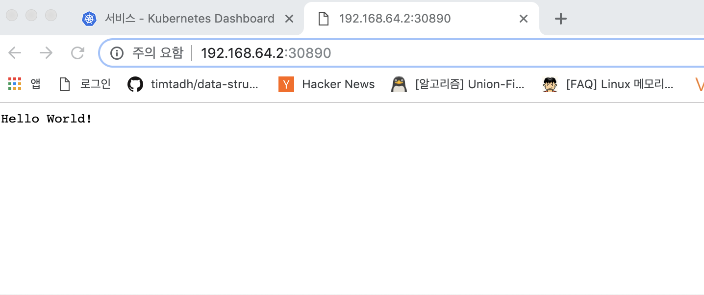
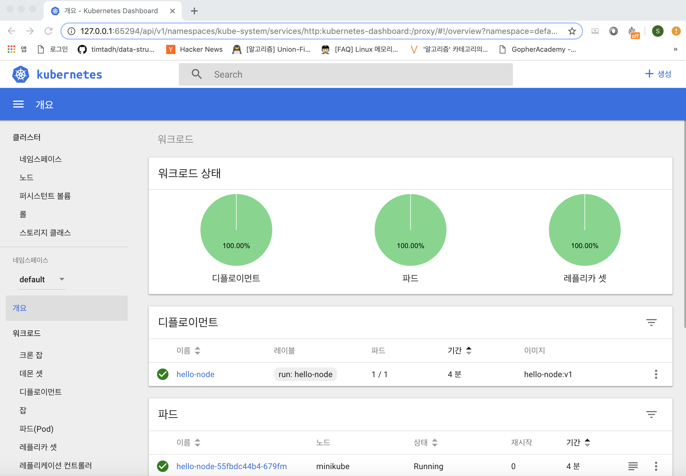

##### 쿠버네티스 개발환경을 구성하는 동기

퇴사 직전에 최대 관심사는 `kubernetes`였다. 카카오가 더이상 자회사에게 DKOS(메소스 마라톤) 서비스를 제공하지 않음에 따라 DKOS에 있는 개발환경을 어디론가 옮겨야하는 이슈에 직면했다. 
인프라팀장님한테 물리서버 혹은 VM을 받아서 개발환경을 구축할 수 있다는 소식에 설레는 마음으로 쿠버네티스 책을 구매하고 이것저것 공부했지만 이것저것 딜레이가 되면서 퇴사때까지 해보지못한게 작은 한이 되었다. 메소스마라톤 환경을 직접 구성해보지 않았기 때문에 적당히 문제 없을 수준으로 공부하고 사용했었다. 그래서 부사수가 왔음에도 정확한 설명을 하지 못해 스스로에 대해 부족함과 아쉬움을 느꼈다. 이제 회사가 없으니 쿠버네티스 개발환경을 직접 내 노트북에 세팅하기로 마음먹었다. 그러면서 얻게되는 지식을 적어갈 예정이다.

글쓰기가 주가되는 것이아니라 쿠버네티스 환경에 적응하는 것이기때문에 불친절할 예정 그래서 느낌가져가기 

<br>
##### 공부 목표

<쿠버네티스 느낌가져가기> 는 내 개인적인 욕심에 의해 내 관심사위주로 기록한다. 

- Golang 서비스 개발용 단일 쿠버네티스 Dev클러스터 구축
- 서비스 디스커버리 공부용
- istio 서비스메쉬 적용
- 부가지식 느낌가져가기
- 쿠버네티스 쿡북 ; 클라우드 네이티브 애플리케이션 구축 공부

<br>


##### 미니큐브 설치하기

개인 노트북에서 단일 노드 클러스터 환경을 구축하기  
랩탑에서 실행할 수 있는 올인원 솔루션 미니큐브(?) 미니쿠베? 를 사용하기로한다.

- 공식 홈페이지: https://kubernetes.io/ko/docs/setup/minikube/#%EB%84%A4%ED%8A%B8%EC%9B%8C%ED%82%B9
- https://medium.com/humanscape-tech/kubernetes-%EB%8F%84%EC%9E%85-%EC%A0%84-minikube-%EC%82%AC%EC%9A%A9%EA%B8%B0-2eb2b6d8e444

이해 쏙쏙 설명잘되어있다.

재밋는건 minikube가 docker host(daemon)를 가지고 있기때문에 docker-env 세팅을 통해 docker 이미지를 빌드하고 쉽게 쿠버네티스에서 이용할 수 있다.

```shell
$ eval $(minikube docker-env)
//나중에 사용하지 않을 때는
$ eval $(minikube docker-env -u).
``` 

무튼 이것저것 다하고 세팅하고 예쁜 대쉬보드에서 클러스터의 정보를 확인가능하다
```shell
$ minikube dashboard
```

##### 예제 블로그처럼 간단한 노드 서버를 띄워보자 

```js
// server.js
var http = require('http');
var handleRequest = function(request, response) {
  console.log('Received request for URL: ' + request.url);
  response.writeHead(200);
  response.end('Hello World!');
};
var www = http.createServer(handleRequest);
www.listen(8080);
```
도커파일 작업:
```
// Dockerfile
FROM node:6.9.2 // base layer
EXPOSE 8080 // 컨테이너의 노출될 포트지정
COPY server.js . // 해당파일 작업공간에 복사
CMD node server.js // 실행
```
빌드 작업:
```shell
ui-MacBookPro:hello-node a.$ docker build -t hello-node:v1 .
Sending build context to Docker daemon  3.072kB
Step 1/4 : FROM node:6.9.2
6.9.2: Pulling from library/node
75a822cd7888: Pull complete 
57de64c72267: Pull complete 
4306be1e8943: Pull complete 
871436ab7225: Pull complete 
0110c26a367a: Pull complete 
1f04fe713f1b: Pull complete 
ac7c0b5fb553: Pull complete 
Digest: sha256:2e95be60faf429d6c97d928c762cb36f1940f4456ce4bd33fbdc34de94a5e043
Status: Downloaded newer image for node:6.9.2
 ---> faaadb4aaf9b
Step 2/4 : EXPOSE 8080
 ---> Running in 733cc93f6d94
Removing intermediate container 733cc93f6d94
 ---> 32967d7bbf91
Step 3/4 : COPY server.js .
 ---> 4f7c06453152
Step 4/4 : CMD node server.js
 ---> Running in 8864e2f6e1f7
Removing intermediate container 8864e2f6e1f7
 ---> 5985b8fa724c
Successfully built 5985b8fa724c
Successfully tagged hello-node:v1
```
쿠버네티스야 이 이미지 실행시켜줘:
```
$ kubectl run hello-node --image=hello-node:v1 --port=8080 --image-pull-policy=Never
```
홀랄라:
```
ui-MacBookPro:~ a.$ kubectl get pods
NAME                          READY   STATUS    RESTARTS   AGE
hello-node-55fbdc44b4-679fm   1/1     Running   0          2m44s
```

접근할 수 있도록 expose 명령어를 통해 로드밸런서와 링크시킨다.
```bash
ui-MacBookPro:~ a.$ kubectl expose deployment hello-node --type=LoadBalancer
service/hello-node exposed
```

미니큐브야 헬로노드 보여줘:
```bash
ui-MacBookPro:~ a.$ minikube service hello-node
🎉  Opening kubernetes service default/hello-node in default browser...
```

주소는 192.168.64.2:30890



쿠버네티스야 서비스들좀 보여줘바:
```
ui-MacBookPro:~ a.$ kubectl get services
NAME         TYPE           CLUSTER-IP      EXTERNAL-IP   PORT(S)          AGE
hello-node   LoadBalancer   10.101.83.218   <pending>     8080:30890/TCP   19m
kubernetes   ClusterIP      10.96.0.1       <none>        443/TCP          5d11h
```
cluster-ip로 접근해보았는데 전혀안먹음, 클러스터 내부 ip임


```shell
ui-MacBookPro:~ a.$ kubectl cluster-info
Kubernetes master is running at https://192.168.64.2:8443
KubeDNS is running at https://192.168.64.2:8443/api/v1/namespaces/kube-system/services/kube-dns:dns/proxy

To further debug and diagnose cluster problems, use 'kubectl cluster-info dump'.
```

```shell
$ minikube dashboard
```


```
ui-MacBookPro:~ a.$ kubectl describe deployment
Name:                   hello-node
Namespace:              default
CreationTimestamp:      Sun, 05 May 2019 16:30:56 +0900
Labels:                 run=hello-node
Annotations:            deployment.kubernetes.io/revision: 1
Selector:               run=hello-node
Replicas:               1 desired | 1 updated | 1 total | 1 available | 0 unavailable
StrategyType:           RollingUpdate
MinReadySeconds:        0
RollingUpdateStrategy:  25% max unavailable, 25% max surge
Pod Template:
  Labels:  run=hello-node
  Containers:
   hello-node:
    Image:        hello-node:v1
    Port:         8080/TCP
    Host Port:    0/TCP
    Environment:  <none>
    Mounts:       <none>
  Volumes:        <none>
Conditions:
  Type           Status  Reason
  ----           ------  ------
  Available      True    MinimumReplicasAvailable
  Progressing    True    NewReplicaSetAvailable
OldReplicaSets:  <none>
NewReplicaSet:   hello-node-55fbdc44b4 (1/1 replicas created)
Events:
  Type    Reason             Age   From                   Message
  ----    ------             ----  ----                   -------
  Normal  ScalingReplicaSet  33m   deployment-controller  Scaled up replica set hello-node-55fbdc44b4 to 1
```
로그 보여줘:
```
ui-MacBookPro:~ a.$ kubectl get pods
NAME                          READY   STATUS    RESTARTS   AGE
hello-node-55fbdc44b4-679fm   1/1     Running   0          2m44s

ui-MacBookPro:~ a.$ kubectl logs hello-node-55fbdc44b4-679fm
Received request for URL: /
Received request for URL: /favicon.ico
```

여기까지 확인하고 주요 용어 개념을 정리하고 가자.
조대협님의 블로그를 보면 끝난다.
http://bcho.tistory.com/1255

<br>
#### 핵심위주로 느낌정리
**pod**

- 컨테이너를 담고 있는 그릇 (여러개 가능)
- 같은 Pods 안에서의 여러 컨테이너가 같은 네트워크 네임스페이스와 ip를 가진다. localhost로 통신가능
- 같은 Pods 안에서의 같은 볼륨 공유가능

**ReplicaSet**  
Pod 갯수 관리

**Deployment**  
pod 와 ReplicaSet을 통합해 배포할 수 있는 단위
배포 히스토리를 버전별로 관리가능

**Service**  

- route to pod(using labels) - 내부 ip로 pod에 대한 Load balancing 
- 외부에서 접근하려면 아래 두타입 활용가능
- 타입 : Load Balancer, NodePort(iptables)

**ConfigMap and Secret**  
ConfigMap: 어플리케이션의 configuration or shell script
Secret: 보안 벨류

여기서 흥미롭게 본건 같은 Pods안에서 네트워크 공유  
```cassandraql
- pause 컨테이너가 하나 더생깁니다.
- Pod 내부에서 컨테이너간 통신은 loaclhost & port로 통신
- Docker 네트워킹의 Mapped Container Mode
- docker run -d --name pause pause_image
- docker run -d --name web -net=container:pause web_image
```

-net=container:pause 
이부분이 핵심
 docker network부분을 좀더 보면됩니다. 

그러하다. kube-DNS와 라우팅 방법은 좀더 천천히 살펴보기로한다.

