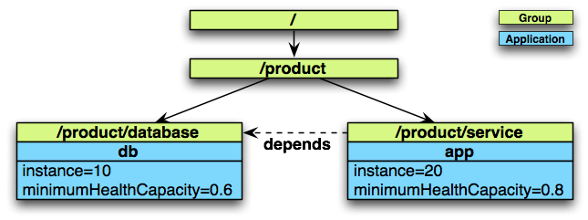

### Marathon Application Deployment
<br>
마라톤 어플리케이션 배포

마라톤에서 어플리케이션 또는 그룹의 정의가 변경 될 때마다 배포가 수행됩니다.
배포는 다음 작업을 수행 할 수 있는 일련의 작업입니다.

- 하나 이상의 어플리케이션을 시작 또는 중지
- 하나 이상의 어플리케이션을 업그레이드
- 하나 이상의 어플리케이션을 스케일조정

배포에는 시간이 걸리고 즉시 사용할 수 없습니다.  
성공적으로 마칠 때까지 마라톤에서 배포가 활성된 것으로 간주.

---
#### 종속성
종속성이 없는 어플리케이션은 제한없이 순서에 상관없이 배포할 수 있습니다.
하지만 있는 경우에는 필요한 순서로 배치 작업이 수행됩니다.



#### 데이터베이스

- Starting: 만약 DB 와 어플리케이션이 시스템에 추가되면. db가 앱보다 먼저 실행됩니다.
- Stopping: 만약 DB와 어플리케이션이 시스템에서 제거되면. 앱이먼저 제거되고 나서 디비가 제거됩니다.
- Upgrade: 롤링 재시작
- Scaling: 만약 디비와 앱이 스케일링을 하는 경우, 디비가 먼저 반응하고나서 앱이 반응합니다.

---

#### Rolling Restarts
롤링 재시작은 마라톤이 새버전의 어플리케이션을 배포하는데 사용됩니다.
일반적으로 새버전의 앱을 배포하는데에는 두단계가 필요합니다.
- 새 버전으로 일련의 프로세스를 시작하고
- 이전버전의 프로세스 집합을 중지하는 것입니다.

마라톤에서 롤링재시작을 할 수 있습니다. 업그레이드 전략 `minimumHealthCapacity` 을 정의합니다.

`minimumHealthCapacity`는 인스턴스 카운트에 적용될 때 업데이트 중
특정 버전의 응용 프로그램이 항상 유지해야하는 정상 인스턴스 수를 정의하는 `백분율`입니다.
```
- minimumHealthCapacity == 0: 새 버전이 배포되기 전에 `모든 이전 인스턴스가 종료` 될 수 있습니다.
- minimumHealthCapacity == 1: 이전 버전이 중지되기 전에 새 버전의 모든 인스턴스가 나란히 배치됩니다.
- minimumHealthCapacity 0에서 1사이: 이전 버전을 minimumHealthCapacity로 확장하고 minimumHealthCapacity과 나란히 새버전을 시작합니다. 이 작업이 성공적으로 진행되면 새 버전의 크기가 100%로 조정되고 이전 버전이 중지됩니다.
```

의존성이 있다면 이것은 더 복잡해집니다.
위의 예에서 응용 프로그램이 업데이트되면 Marathon은 다음 작업을 수행합니다.

  1. 모든 인스턴스가 대체되고 준비가 완료될때까지 applicaiton db를 업그레이드한다.
  2. 모든 인스턴스가 교체되고 준비가 되었으며, Healthy 할 때까지 응용 프로그램을 업그레이드 (upgradeStrategy 고려사항)

**참고**  
minimumHealthCapacity 0.5 이상을 선택하면 클러스터의 업데이트 프로세스에 사용할 수 있는 용량이 더 있어야합니다. 만약 minimumHealthCapacity 0.5보다 더 동일한 앱의 인스턴스의 절반 이상이 나란히 실행된다. 이러한 용량 제약 조건은 종속성이 있는 경우 함께 추가됩니다. 우리의 예에서는 db에 0.6 app에 0.8을 정의했습니다.
즉, 업데이트가 실행되면 12개의 db인스턴스와 32개의 app 인스턴스(16개 및 16개 신규)가 나란히 실행됩니다.

---
#### Force a Deployment
애플리케이션은 한번에 하나의 배포로만 변경할 수 있습니다.
앱의 다른 변경사항은 첫번째 배포가 완료 될 때까지 대기해야합니다.
강제 플래그를 사용하여 배치를 실행하여 이 규칙을 어길 수 있습니다.
REST 인터페이스는 모든 상태 변경 조작에 강제 플래그를 허용합니다.

주의: force플래그는 배포가 실패한 경우에만 사용해야합니다!

강제 플래그가 설정되면 이 배포의 영향을 받는 모든 배포가 취소됩니다. 이 작업으로 인해 시스템이 일관성 없는 상태로 남을 수 있습니다. 특히 앱이 롤링 업그레이드 중에 있을 때 배포가 취소되면 일부 오래된 작업과 일부 새로운 작업이 실행되는 상태가 될 수 있습니다. 새 배포로 해당 응용 프로그램이 업데이트 되지 않으면 해당 어플에 대한 이후 배포가 이루어질 때까지 해당 배포가 해당 상태로 유지됩니다.

안전하게 강제 업데이트 할 수 있는 유일한 배포 유형은 단일 앱에만 영향을 미치는 배포 유형뿐입니다.
여러 앱에 영향을 주는 배포를 강제하는 유일한 이유는 실패한 배포를 해결하기 위해서입니다.

#### A Failed Deployment

실패한 배포  
배포는 하나씩 차례로 실행되는 단계로 구성됩니다.  
다음 단계는 이전 단계가 성공적으로 완료된 경우에만 실행됩니다.  
단계가 성공적으로 끝나지 않을 상황이 있습니다. 다음은 그 상황들입니다.  

- 새 어플리케이션이 올바르게 시작되지 않았다.
- 새로운 어플리케이션이 heathy상태가 되지않는다.
- 새 어플리케이션의 종속성이 선언되지 않았으므로 사용할 수 없습니다.
- 클러스터 용량이 소진되었습니다.
- 앱은 도커 컨테이너를 사용하며 마라톤에서 도커컨테이너 실행시 구성변경이 이루어지지 않았습니다.

이런경우 배포는 영원히 수행됩니다.  
시스템을 치료하려면 현재 배포의 문제를 해결하고 새로운 배포를 적용해야합니다.

#### /v2/deployments endpoint

실행중인 배포목록은 /v2/deployments endpoint를 통해 엑세스할 수 있습니다.  
모든 배포에 사용할 수 있는 몇가지 정보가 있습니다.

- affectedApps: 이 배포의 영향을 받는 어플리케이션
- steps: 이 배포를 위해 수행할 단계입니다
- currentStep: 현재 수행하고 있는 단계.

모든 단계는 몇가지 액션들을 가지고 있습니다.  
단계 내 액션들은 동시에 수행됩니다.  
가능한 액션은 다음과 같습니다.  

- StartApplication: 지정된 어플리케이션을 시작하십시오.
- StopApplication: 지정된 어플리케이션을 중지하십시오.
- ScaleApplication: 지정된 어플리케이션의 크기를 조정합니다.
- RestartApplication: 지정된 어플리케이션을 minimumHealthCapacity
- KillAllOldTasksOf: 지정된 어플리케이션의 나머지작업을 종료.
