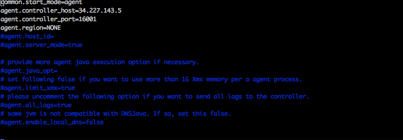

마크다운문서가 테마때문에 잘 적용되지 않아 수정할 예정입니다. 다음번 업데이트에 테마를 고칠예정이니 불편해도 양해부탁드려요

## nGrinder agent가 controller에 못붙는 현상


### 환경

IDC에서 AWS로 옮겨오면서 테스트환경을 구축하기위해 n-grinder EC2 인스턴스 이미지를 떠 놨습니다.


**참고**

n-grinder는 마스터-슬레이브처럼 controller와 agent로 구성됩니다. controller는 하나의 머리 역할을 하는 곳으로 task와 스크립트 관리, 테스트 결과를 수집해 통계자료로 보여주며 웹 인터페이스를 제공한다. agent는 cotroller의 명령을 받아 수행합니다. agent는 유저가 요청한 task정보에 따라 부하를 발생시켜 프로세스와 쓰레드를 관리하고 대상 시스템의 CPU와 메모리를 모니터링합니다.


- nGrinderController 인스턴스(m5a.large) 이미지
- nGrinderAgent 인스턴스(c5.2xlarge) 이미지

각각의 인스턴스에 docker를 설치해놨고 public 아이피를 할당해 ssh로 접근해 아래와 같은 docker 명령어를 실행했습니다.


### docker

컨테이너 서비스에 익숙해서 docker이미지를 이용하는 쪽으로 서비스를 구성했습니다. 물론 직접 다운받아서 설치하셔도되지만 tomcat이라던지 귀찮은 것들을 만져줘야하는 번거로움이 있어 docker사용을 추천드립니다.

nGrinder controller:

```shell
$ docker run -d -v ~/ngrinder-controller:/opt/ngrinder-controller -p 80:80 -p 16001:16001 -p 12000-12009:12000-12009 ngrinder/controller:3.4
```

n grinder controller는 포트옵션으로 웹포트, 에이전트와의 연결, 부하관리를 위한 포트들로 구성되어 있으며 자세한 내용은 <https://hub.docker.com/r/ngrinder/controller/> 에서 확인할 수 있습니다.

nGrinder agent:

```shell
$ docker run -v ~/ngrinder-agent:/opt/ngrinder-agent -d ngrinder/agent:3.4 controller_ip:controller_web_port
```

agent는 controller_ip:controller_webport 부분을 옵션 argument로 전달해야합니다. 예를들어 controller가 떠있는 instance의 public ip가 18.253.31.50이고 80번 포트를 웹포트로 열었다면 '18.253.31.50:80'을 뒤에 붙여주시면 됩니다.


## 상황

controller와 agent를 일정시간 사용 후 볼륨을 공유하였기 때문에 데이터가 유실되지 않도록 AWS 인스턴스 이미지(AMI)를 저장해두었습니다. 다시 테스트가 필요한 상황이 와서 해당 이미지로 인스턴스를 시작했고 다시 위의 docker 명령어를 통해 서비스를 구동했습니다.

controller의 public ip가 변동되었기 때문에 agent에서도 새로 부여받은 컨트롤러의 ip:port값을 붙여 docker run을 수행했습니다.

그런데 controller에 agent managemnet페이지에서 agent가 붙지 않았습니다.


## 원인파악

docker ngrinderagent 실행시 명령:

```shell
[ec2-user@ip-10-100-76-225 ~]$ docker run -v ~/ngrinder-agent:/opt/ngrinder-agent -d ngrinder/agent:3.4 34.238.52.51:80

4a853787e84bc1e878a2a39e0f5d259ac3ad2049213c55bff151bff858dd1d40
```

`docker logs` 명령어를 통해 agent 인스턴스가 커넥션을 하는 과정에서 어떤 로그들이 남았는지 확인해보았습니다.

`docker logs [OPTION] containerID` : 특정 컨테이너의 로그 확인

```
[ec2-user@ip-10-100-76-225 ~]$ docker logs 4a853787e84b
deleting pid...
agent binary already exists.
2018-11-19 05:48:55,003 INFO  agent config: The path to ngrinder agent home is ambiguous:
2018-11-19 05:48:55,007 INFO  agent config:     '' is accepted.
2018-11-19 05:48:55,008 INFO  agent config: NGRINDER_AGENT_HOME : /opt/ngrinder-agent/.ngrinder-agent
2018-11-19 05:48:55,009 WARN  agent config: The agent configuration file '/opt/ngrinder-agent/.ngrinder-agent/agent.conf' already exists.
2018-11-19 05:48:55,009 WARN  agent config: If you want to use the '/opt/ngrinder-agent/__agent.conf' file
2018-11-19 05:48:55,009 WARN  agent config: Please run agent with -o option
2018-11-19 05:48:55,047 INFO  starter: ***************************************************
2018-11-19 05:48:55,048 INFO  starter:    Start nGrinder Agent ...
2018-11-19 05:48:55,048 INFO  starter: ***************************************************
2018-11-19 05:48:55,049 INFO  starter: JVM server mode is disabled.
2018-11-19 05:48:55,057 INFO  starter: connecting to controller 34.227.143.5:16001
2018-11-19 05:48:55,070 INFO  agent controller daemon: The agent controller daemon is started.
2018-11-19 05:51:06,127 ERROR agent controller: Error while connecting to agent controller server at /34.227.143.5:16001
```

WARN로그가 3개 뜬것을 확인할 수 있습니다. agent config설정 과정에서 config파일이 이미 있다는 경고를 뿜어냅니다. 그리고 옛날 controller_ip의 16001 포트로 연결을 시도하는 것을 볼 수 있습니다. 인자값으로 넘긴 34.238.52.51:80 는 철저히 무시되었네요.

인자값 명령어가 전달되지 못했나?...

ps명령어를 통해 작성된 command를 확인해보겠습니다.

```shell
PID   USER     TIME   COMMAND
    1 root       0:00 bash /scripts/run.sh 34.238.52.51:80
    9 root       0:00 {run_agent.sh} /bin/sh /opt/ngrinder-agent/run_agent.sh
   11 root       0:00 {run_agent_inter} /bin/sh ./run_agent_internal.sh
   12 root       0:00 java -server -cp lib/* org.ngrinder.NGrinderAgentStarter --mode=agent --command=run
   36 root       0:00 bash
   43 root       0:00 ps - aux
```

- 1PID로 bash스크립트를 실행하는데 새로할당된 ip값이 넘어갔음을 확인할 수 있습니다

우린 이쯤에서 아 저 config파일에 이전 주소데이터가 남아있구나하고 추측 할수 있습니다. 한번 살펴보겠습니다.해당 컨테이너에 접속할 필요없이 우리는 볼륨세팅을 했기때문에 호스트머신의 볼륨을 탐색합니다.

```shell
$ vi  ~/ngrinder-agent/.ngrinder-agent/agent.conf
```



이곳에서 이전 controller의 주소와 연결포트가 등록되어있음이 확인되었습니다.


## 해결

해결책으로 3가지 방법이 있습니다.

- 위 agent의 conf파일을 수정한다.
- agent를 실행시킬때 -o option을 사용한다. (찾아보니 overwrite옵션이라고 합니다.)
  "~/ngrinder_agent/run_agent.sh -o"
- agent를 볼륨세팅없이 구동해 이전의 기록된 conf내용을 무시한다.

저의 경우엔 agent와 controller를 계속 띄우는게 회사비용이기때문에 매번 올렸다 내렸다 사용할 것 같아 주소변동이 잦기때문에 2번째 방법을 쓸까하다가 agent가 저장할 내용이없다고 판단해서 3번째 방법으로 그냥 볼륨세팅을 제거하고 실행시켰습니다.

```shell
$ docker run -d ngrinder/agent:3.4 controller_ip:controller_web_port
```

해결~


p.s. 관련 문제를 github에서 찾아보니 저와 같은 문제를 가진 사람이 있었습니다. 참고~

 https://github.com/naver/ngrinder/issues/63
