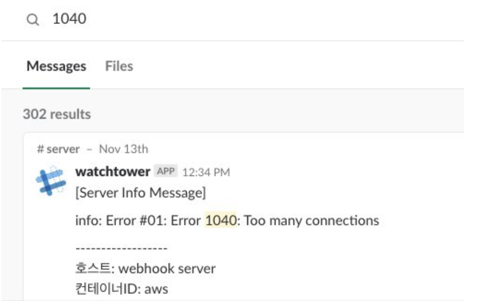
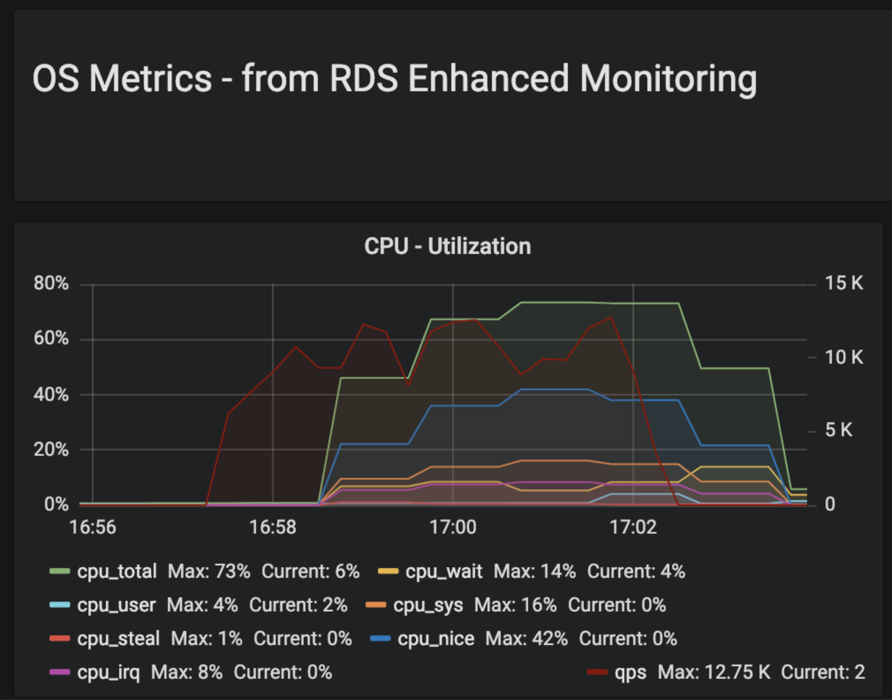

도커로 서비스 개발을 하다보면 상태 확인을 위해 호스트 머신이 아닌 컨테이너에 접근해야하는 경우가 생긴다.
호스트 머신 한 대에 여러 docker 서비스가 떠있을 수 있기 때문이다. (내가 이용 중인 AWS(ECS)도 내가 띄운 서비스 이외에 로그수집기, executor등의 또다른 docker 컨테이너가 떠있다.) 
그러므로 호스트 머신에서 netstat 명령어는 모든 도커 서비스의 소켓정보들을 보여주기때문에 특정 서비스에 대한 스코프기능이 지원되지 않는다.

도커를 조금 이용해본 개발자라면 쉽게 `docker exec` 명령어로 해당 컨테이너에 접근해 내부에서 소켓상태를 살펴보려할 것이다.

```bash
$ docker exec -it {container_id} bash
```

하지만 안타깝게도 컨테이너 내부에서 `netstat`을 쳐보면 지원되지 않는 명령어라는 응답뿐,,,

---

그렇다면 어떻게 접근해서 docker 컨테이너 내부의 소켓상태를 확인할 수 있을까?

#### nsenter 활용하기

docker는 namespace라는 리눅스의 기술을 확용해 컨테이너 환경을 격리, 구축한다. namespace 기술은 독립적인 프로세스 할당 및 네트워크 충돌방지 등의 기능을 제공하기때문에 각각의 컨테이너가 서로 충돌하지 않고 독립적으로 
동작할 수 있게 한다. 

`nsenter`라는 명령어는 `namespace enter`의 약어이다. 말그대로 격리된 namespace에 enter하는 명령어이다.

nsenter의 option `-t`는 target option이다. 특정 타겟 process id를 넘기면 그 뒤의 명령어를 실행할 수 있다.

예를들어, 15652라는 PID를 가진 프로세스의 netstat을 실행하는 명령이다:

```bash
$ sudo nsenter -t 15652 -n netstat
Active Internet connections (only servers)
Proto Recv-Q Send-Q Local Address           Foreign Address         State      
tcp        0      0 0.0.0.0:80              0.0.0.0:*               LISTEN     
```
해당 프로세스의 netstat이 이쁘게 보이는 것을 확인할 수 있다.
그렇다면 이제 본론으로 돌아가서 내가 띄운 docker의 프로세스 id만 nsenter의 타겟으로 넘겨주면 내부 작업상태를 모니터링 할 수 있다.
##### 1. 내가 만든 docker 서비스 프로세스 아이디 확인

```bash
docker inspect -f '{{.State.Pid}}' {container_id or name}
```

```bash
$ docker inspect -f '{{.State.Pid}}' cb2939r52s22
5645  
```

docker ps를 통해 알고있는 docker 컨테이너 아이디를 넣어 5645라는 pid를 알게되었다.

##### 2. nsenter를 통해 해당 프로세스의 소켓 상태확인

다음은 nsenter 명령어를 활용해 5645 프로세스의 netstat을 확인하는 부분이다. (부하테스트 직전상태)
```bash
[ec2-user@ip-10-100-77-76 ~]$ sudo nsenter -t 5645 -n netstat
Active Internet connections (w/o servers)
Proto Recv-Q Send-Q Local Address               Foreign Address             State
tcp        0      0 ip-172-17-0-2.ec2.:webcache ip-10-100-77-225.ec2.:45104 ESTABLISHED
tcp        0      0 ip-172-17-0-2.ec2.:webcache ip-10-100-77-225.ec2.:14804 TIME_WAIT
tcp        0      0 ip-172-17-0-2.ec2.:webcache ip-10-100-76-6:seclayer-tls TIME_WAIT
tcp        0      0 ip-172-17-0-2.ec2.:webcache ip-10-100-76-65.ec:plethora TIME_WAIT
tcp        0      0 ip-172-17-0-2.ec2.:webcache ip-10-100-77-225.ec2.:14830 TIME_WAIT
tcp        0      0 ip-172-17-0-2.ec2.:webcache ip-10-100-76-65.ec2.i:23284 ESTABLISHED
tcp        0      0 ip-172-17-0-2.ec2.:webcache ip-10-100-76-65.ec2.i:27948 ESTABLISHED
tcp        0      0 ip-172-17-0-2.ec2.:webcache ip-10-100-77-225.ec2.:14848 TIME_WAIT
tcp        0      0 ip-172-17-0-2.ec2.:webcache ip-10-100-77-225.ec2.:45544 ESTABLISHED
Active UNIX domain sockets (w/o servers)
Proto RefCnt Flags       Type       State         I-Node Path

```

9개의 소켓이 존재하는 것이 확인되었다. (time_wait 5개, established 4개)

---

#### 실무 경험 기록

##### 페이스북 웹훅 수신 서버_ 부하테스트 및 안정화  
```
- 서버 구조: 1대 ELB - 4개의 서비스(웹훅 수신서버)
- 웹훅서버 스펙 : connection pool 50개 (vCPU 4, Memory 2048 MiB)
- 예상 목표 : 초당 8000쿼리(8,000 qps)
- 플랫폼 DBA분과 협업하며 부하테스트 진행(n-grinder, aws rdb) 2018.11.12~13
```

부하테스트를 도중 서비스가 죽는 현상 발생    
connection pool을 50개로 할당했다(?)고 생각했음.  
우선 db에러(1040 too many connections)가 slack메세지로 쏟아짐

_302개의 1040에러 메세지_


결론부터 이야기하자면 2가지 문제가 있었다.  

- container를 실행하는 곳의 소켓 갯수제한 문제 (ulimit)
- connection pool 세팅 실수

부하테스트 중 nsenter를 이용해 mysql과 관련된 커넥션 소켓 갯수확인:
```bash
[ec2-user@ip-10-100-77-76 ~]$ sudo nsenter -t 5645 -n netstat | grep 'mysql' |  wc -l
63
... // 30초 뒤
[ec2-user@ip-10-100-77-76 ~]$ sudo nsenter -t 5645 -n netstat | grep 'mysql' | wc -l
257
```

엥,,, 왜 50개가 넘어가냐... 점차 늘더니 컨테이너 Down...
50개가 넘어가는 것도 이상한데 분명 3만여개까지 괜찮을텐데 어쩌다 이리빨리죽지.

ECS의 인스턴스는 ulimit을 3만여개로 해제해놨는데?... 왜 소켓 수때문에 die하는 거지
실제로 ssh로 접속해 해당 컨테이너에 접근해 ulimit을 쳐봤더니 세상에 open files 1024
```bash
[ec2-user@ip-10-100-85-46 ~]$ docker exec -it f0b9e1245e24 bash
queen@f0b9e1245e24:/go$ ulimit -a
core file size          (blocks, -c) 0
data seg size           (kbytes, -d) unlimited
scheduling priority             (-e) 0
file size               (blocks, -f) unlimited
pending signals                 (-i) 128600
max locked memory       (kbytes, -l) 64
max memory size         (kbytes, -m) unlimited
open files                      (-n) 1024
pipe size            (512 bytes, -p) 8
POSIX message queues     (bytes, -q) 819200
real-time priority              (-r) 0
stack size              (kbytes, -s) 8192
cpu time               (seconds, -t) unlimited
max user processes              (-u) 128600
virtual memory          (kbytes, -v) unlimited
file locks                      (-x) unlimiteds

```
DKOS(mesos)때는 해당 docker 컨테이너의 ulimit이 자연스럽게 호스트머신을 따라갓지만 ECS는 nofile옵션을 세팅해줘야했음

해당 task의 container 옵션 nofile 추가
```json
"ulimits": [
        {
          "name": "nofile",
          "softLimit": 16384,
          "hardLimit": 16384
        }
      ],

```

그다음으로 connection pool은 50개 세팅은 왜?
내가 사용하는 golang서버는 xorm이라는 orm을 사용중이었음.
```
db.SetMaxIdleConns(50)
```
TCP연결에는 4가지 상태가 있다. connecting, idle, inuse and closing
나는 idle 상태의 소켓 갯수 max를 50개로 제한하고 있었다.
MaxOpenConnections는 앞의 3가지 상태의 연결 갯수를 제한한다 connecting idle inuse
그래서 만약 당신이 close와 open을 빨리하게되면 위와같은일은 발생할 수 있다.

https://stackoverflow.com/questions/38454970/connection-pooling-with-xorm-and-go-mysql

수정: 
```
db.SetMaxOpenConns(50)
```

두가지 문제 해결 후 성공적인 부하테스트 종료!


12,000 qps 구간 성능 안정화 확인 껄껄껄

#### 마무리
nsenter를 이용한 모니터링이 실제 트러블슈팅에 많은 도움이 되었다.  
namespace, nsenter에 대한 공부를 추가로 할 예정
