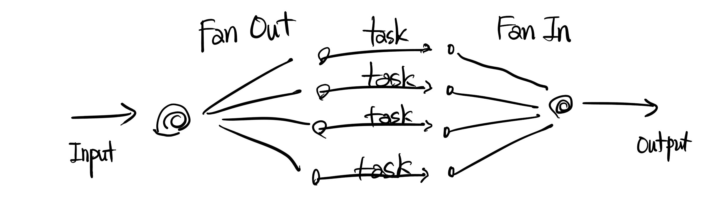

회사일을 바쁘다보니 이것저것 신경쓸게 많아 정리해야지정리해야지 하고 너무 늦게 글을 쓰는 감이 없지 않네요. 이어서 해보도록 하겠습니다. 이전 시간에 Pipeline 패턴을 알아봤는데 이를 좀더 활용해 `Fan out Fan in` 패턴을 알아보고자합니다.

golang 멀티플렉싱 디자인패턴 중 하나인 Fan out Fan In은 `큰 건물의 회전문`을 생각하면서 이해하면 편합니다.

#### prerequisites

- chan에 대한 이해를 토대로 pipe함수를 작성할 수 있다.
- Pipeline 디자인패턴을 숙지했다.

------


### Basic

Fan의 사전적 의미는 선풍기, 환풍기, 회전문 같은 것입니다. `회전문`처럼 생각했습니다.

 - `Fan-out`은 특정 채널을 통해 Input이 들어왔을 때 여러 개의 goroutine을 생성해 task를 분산 처리합니다.
 - `Fan-In`은 처리된 결과들을 내뱉는 채널들을 하나로 취합하는 **merge**과정을 거쳐 생성된  하나의 채널에서 output을 뽑아냅니다.



---


이전 pipeline 디자인패턴 시간에 배운 코드를 간단히 보겠습니다:

```golang
func main() {
	// 작업시작시간 기록
	start := time.Now()

	c0 := factoryRand(100000)
	c1 := printNumber(c0)
	c2 := squareNumber(c1)

	// 최종적으로 더하는 작업을 메인 프로세스에서 진행합니다
	sum := 0
	for n := range c2 {
		sum += n
	}
	fmt.Printf("Total Sum of Squares: %d\n", sum)

	// 작업 종료 후 시간기록
	elapsed := time.Since(start)
	fmt.Println("작업소요시간: ", elapsed)
}
```

각각 작업별로 task goroutine을 효율적으로 나누고 있습니다.

- factoryRand: 0에서 100까지의 정수들 중 랜덤 값을 뿜어내는 채널을 반환합니다. 예제의 파라미터는 10만이므로 10만 개의 랜덤 값을 생성해 c0채널로 값을 전달합니다.
- printNumber: 전달 받은 랜덤 값을 출력하는 Task를 수행합니다.
- squareNumber: input 값을 제곱하는 Task를 수행합니다.
- 최종적으로 더하는 작업을 메인함수에서 진행합니다.


---
#### Fan-Out

squareNumber라는 task에 가중치를 더 두고싶다면 어떻게 해야할까요.  좀더 제곱하는 작업을 빠르게 처리하고 싶다면!

c1채널을 여러 squareNumber가 공유하면 됩니다:

```golang
	inputStreamChan := factoryRand(100000)
	inputChan := printNumber(inputStreamChan)

	// Fan-out to 3 Go-routine
	c1 := squareNumber(inputChan)
	c2 := squareNumber(inputChan)
	c3 := squareNumber(inputChan)
```

3번의 squareNumber pipe함수 호출을 통해  printNumber Task를 거친 **inputChan**을 공유합니다. 즉, squareNumber를 처리하는 goroutine 3개가 생성되고 `각각의 고루틴들은 inputChan을 통해 들어오는 데이터를 처리하고자 경합`합니다. 즉, InputChan은 Fan 역할을 하게 됩니다.


그림처럼 squareNumber작업에 좀 더 가중치를 둡니다. 이렇게 Fan-out 부분을 완성했습니다. 여러 고루틴들도 작업을 처리했으니 이제 작업들을 합쳐 하나의 output에서 확인하도록 Fan-In 부분을 설계해봅시다.

#### Fan-In

모든 작업들을 거쳐 분산처리가 되었기때문에 c1, c2, c3 등의 채널이 생성되었습니다. 모든 output이 나오는 출구를 합쳐야하는 작업이 필요합니다. 즉, 여러개의 채널을 하나의 채널로  합치는 `merge`함수를 작성해야합니다. (건물로 생각하면 여러개의 엘리베이터를 타고 1층에 도착한 사람이 건물 밖으로 나가기 위해 하나의 회전문을 이용하도록 한다고 생각하면 됩니다.)

select로 여러개의 channel을 한개의 고루틴에서 수신하도록 하는 방법도 있겠지만 select문 내부 케이스를 동적으로 여러개를 만들 수 없다는 한계점이 있기때문에 저는 동적으로 하나의 채널을 수신할 수 있는 함수를 늘리는 방법을 선호합니다.

merge코드입니다:

```golang
func merge(cs ...<-chan int)  <-chan int {
	var wg sync.WaitGroup
	out := make(chan int)

	multiplex := func(c <-chan int) {
		for n := range c {
			out <- n
		}
		wg.Done()
	}
	wg.Add(len(cs))
	for _, c := range cs {
		go multiplex(c)
	}


	go func() {
		wg.Wait()
		close(out)
	}()
	return out
}
```

WaitGroup을 활용해서 multiplex함수를 인자로 들어온 채널의 갯수만큼 생성합니다. multiplex함수는 인자로 받은 채널에서 값을 꺼내 out이라는 하나의 회전문으로 결과값을 보낸후 역할을 다했다는 의미로 waitgroup의 Done()을 호출합니다.

c1, c2, c3을 인자로 넘겨주면 merge함수는 **out채널**을 반환합니다.

우리가 메인함수에서 해야 할 일은 merge함수에서 반환한 out채널에서 output 데이터를 꺼내기만 하면 됩니다.

```golang
for output := range merge(c1, c2, c3) {
	//fmt.Println(output)
	sum += output
}
```

이렇게 Fan-In 작업까지 완료가 되었습니다.

잘 동작하는 지, 고루틴이 잘 회수되었는지 확인 후 성능테스트를 진행합니다.

최종 코드:

```golang
func main() {

	fmt.Println("시작 고루틴 갯수:", runtime.NumGoroutine())
	start := time.Now()

	inputStreamChan := factoryRand(100000)
	inputChan := printNumber(inputStreamChan)

	c1 := squareNumber(inputChan)
	c2 := squareNumber(inputChan)
	c3 := squareNumber(inputChan)

	sum := 0
	for output := range merge(c1, c2, c3) {
		//fmt.Println(output)
		sum += output
	}


	fmt.Printf("Total Sum of Squares: %d\n", sum)
	elapsed := time.Since(start)
	fmt.Println("초과시간: ", elapsed)

	time.Sleep(1 * time.Second)
	fmt.Println("남은 고루틴 갯수:", runtime.NumGoroutine())
}
```

실행결과:

```golan
print:  56
print:  40
print:  64
print:  87
print:  52
print:  39
Total Sum of Squares: 329490313
초과시간:  501.302042ms
남은 고루틴 갯수: 1
```


---
### Benchmark Test

**테스트 환경**

- Go 1.11버전
- MacOs (Darwin/ amd64)
- 8Core, 16G mem


FanOut FanIn 패턴을 적용한것과 적용하지 않은것을 비교해보기위해 벤치마크 테스트 코드를 작성해보았습니다.


우선 Test를 돌릴 파이프라인 함수입니다:

```golang
func pipeSingleLine() (sum int) {
	c0 := factoryRand(100000)
	c1 := printNumber(c0)
	c2 := squareNumber(c1)

	// 최종적으로 더하는 작업을 메인 프로세스에서 진행합니다
	sum = 0
	for n := range c2 {
		sum += n
	}
	return
}

func pipeMultiflexing() (sum int){
	inputStreamChan := factoryRand(100000)
	inputChan := printNumber(inputStreamChan)

	// Fan-out to 3 Go-routine
	c1 := squareNumber(inputChan)
	c2 := squareNumber(inputChan)
	c3 := squareNumber(inputChan)

	// Fan-in
	sum = 0
	for output := range merge(c1, c2, c3) {
		//fmt.Println(output)
		sum += output
	}
	return
}
```

Benchmark Test코드입니다:

```golang
func BenchmarkSingleLine (b *testing.B) {
	for i:= 0; i< b.N; i++ {
		pipeSingleLine()
	}
}

func BenchmarkMultiplexing(b *testing.B) {
	for i:= 0; i< b.N; i++ {
		pipeMultiflexing()
	}
}
```

결과입니다:

```shell
KAKAOui-MacBook-Pro-5:multiflexing aidan$ go test -bench=. -benchmem
goos: darwin
goarch: amd64
BenchmarkSingleLine-8                 10         168099834 ns/op             561 B/op          5 allocs/op
BenchmarkMultiplexing-8               10         133645758 ns/op            1652 B/op         13 allocs/op
PASS
ok      _/Users/aidan/go/src/reborn/multiflexing        3.328s

```

예상한 바와 같이 SquareNumber 작업을 한개의 고루틴에서 처리하는 Singleline 보다 Fan-In Fan-Out을 활용한 멀티플렉싱 파이프라인이 좀더 좋은 성능을 보였습니다.

- SingleLine: 작업당 약 1억 6천만 나노초
- Multiplexing: 작업당 약 1억 3천만 나노초

1억 나노초는 0.1초와 같습니다.  0.16초와 0.13초이니 **0.03초** 차이입니다. 인간에겐 눈깜빡할 시간보다 짧은 시간이지만 컴퓨터에겐 긴 시간입니다. (아쉽긴 하네요.) 나노초 단위의 차이에 따라 승패가 좌지우지되는 초단타 프로그래밍처럼 엄청 퍼포먼스가 필요한 작업이라면 성능 증진을 위해 멀티플렉싱을 사용할 수 있습니다.

### 마무리

재미있었지만 사실 기대한 바와 다르게 엄청 큰 차이가 아니어서 아쉬웠습니다. 뭔가 squareNumber가 아닌 복잡한 Task라면 좀 더 유의미한 차이를 확인할 수 있지않을까 싶네요. 부족한 글을 따라와주셔서 감사합니다. 다음엔 고루틴 스케쥴러의 경합상태에서 양보와 관련된 Gosched와 관련해 글을 포스팅하도록 하겠습니다.


참고자료

- https://blog.golang.org/pipelines
