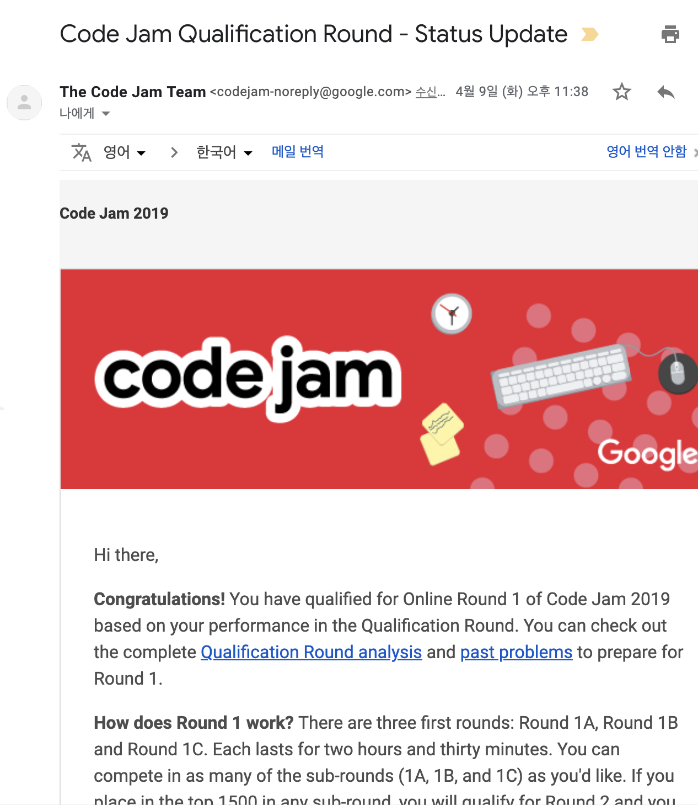

20대의 마지막으로 기본기를 탄탄히하자는 생각으로 알고리즘 공부를 진행해 왔다. 목표가 있으면 동기부여에 좋기때문에 구글코드잼을 도전해보았다.  
올해 4월 7일에 진행된 Qualification Round는 다음 라운드로 통과할 수 있는 자격을 주는 테스트이다. 문제는 어렵지 않다. bfs, dfs, dp 등 문제만 읽어도 케이스가 좀 나뉘는 한국의 정형화된 코딩테스트에 비해 창의력이 필요한 문제가 좀더 많았다.
문제 하나당 3개의 테스트 케이스가 존재한다. `normal case`는 보통 자료의 크기가 적어 정확성 테스트가 진행돠며 통과할경우 `6point`를 얻게된다. 
`hard case`는 좀더 데이터 input의 크기가 크며 효율성을 증명하는 테스트이다 통과할경우 `10point`를 얻게된다. `hidden case`는 점수가 없으며 결과에 대해 나오지 않는다. 슈퍼 트릭, 창의력 대장등이 통과하는 테스트이다.  

자바스크립트가 제일 편한 언어이지만 Golang으로 꾸역꾸역 진행해보았다.

2번, 3번, 4번문제는 큰고민 없었지만 
쉽다는 1번문제를 헤맨 바보가 여기있다.
normal case는 통과해 6점을 확보해 크게 걱정하진 않았지만
4를 깨버리면 된다는 힌트를 듣고 hard case를 나중에 겨우 통과하게되었다.

1번문제  Foregone Solution  

최종 답안:
```
func main() {
	f, _ := os.Open("input_file.in")
	mi := MyInput{rdr: f}
	// mi := MyInput{rdr: os.Stdin}

	t := mi.readInt()
	dataMap := make(map[int]bool)

	for caseNo := 1; caseNo <= t; caseNo++ {
		// TODO - solve the case !
		testCase := mi.readInt()

	Loop:
		for i := 1; i < testCase/2; i++ {
			if isContainFour(i, dataMap) {
				continue Loop
			}
			anotherNum := testCase - i
			if isContainFour(anotherNum, dataMap) {
				continue Loop
			} else {
				fmt.Printf("Case #%d: %d %d\n", caseNo, i, anotherNum)
				break Loop
			}
		}

	}
}

func isContainFour(i int, dm map[int]bool) bool {
	if d, ok := dm[i]; ok {
		return d
	}
	for {
		if i%10 == 4 {
			return true
		}
		i /= 10
		if i < 10 {
			return i == 4
		}
	}
}

```

초기답안은 최적화를 할려고 메모이제이션에 혈안이 되어있었지만 생각해보니 그냥 숫자 4만 깨면 되는 쉬운문제였다. 완전탐색에 갇혀있던 바보,,, 이처럼 그냥 창의력대장들이 유리한 문제가 많다. 


통과를 축하해주며 다음 라운드 진출에 대해 리마인드 시켜주는 구글코드잼 결과메일:


운수대통으로 서브 Round A, B, C를 통과했으면 좋겠다.ㅎㅎ 
