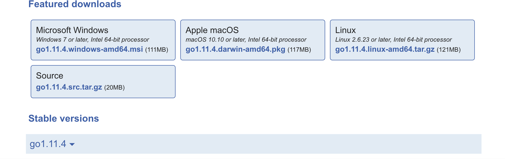
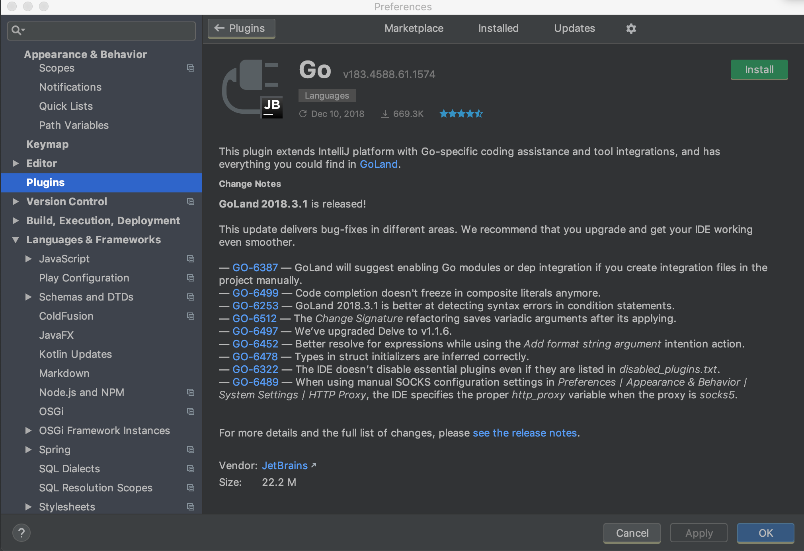
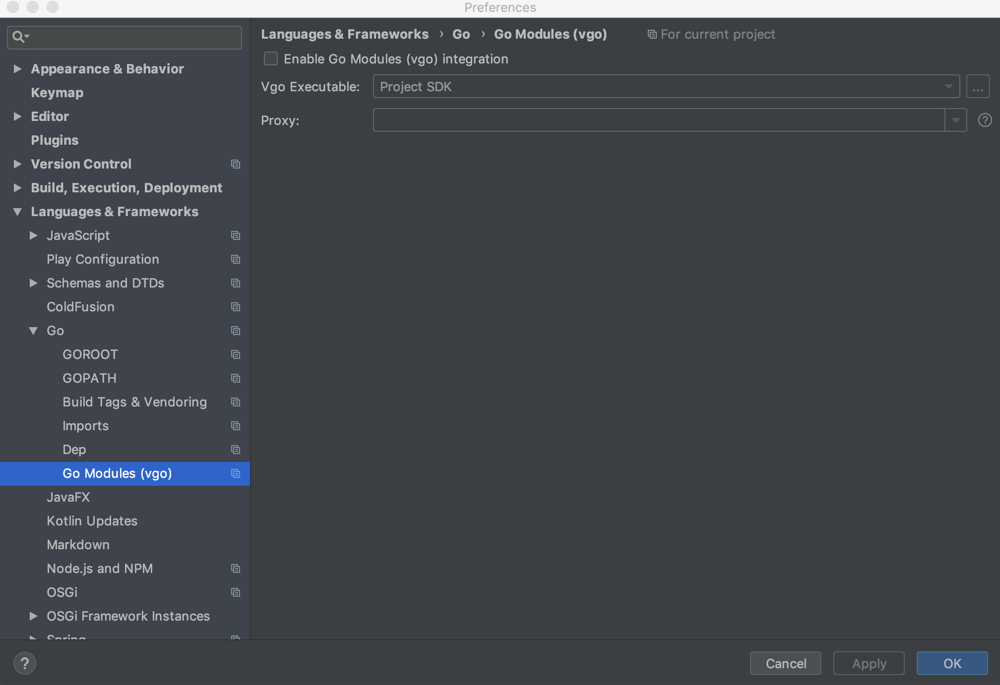
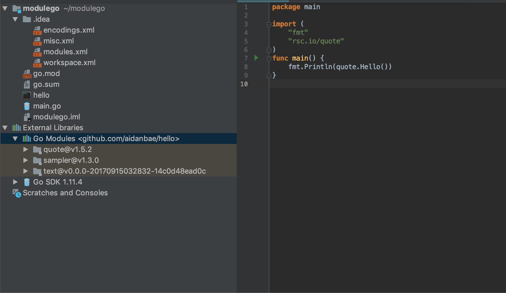
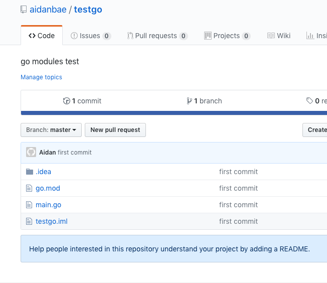
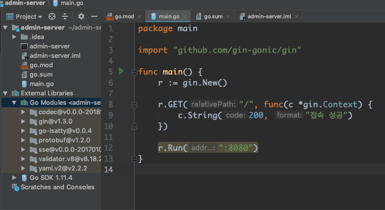
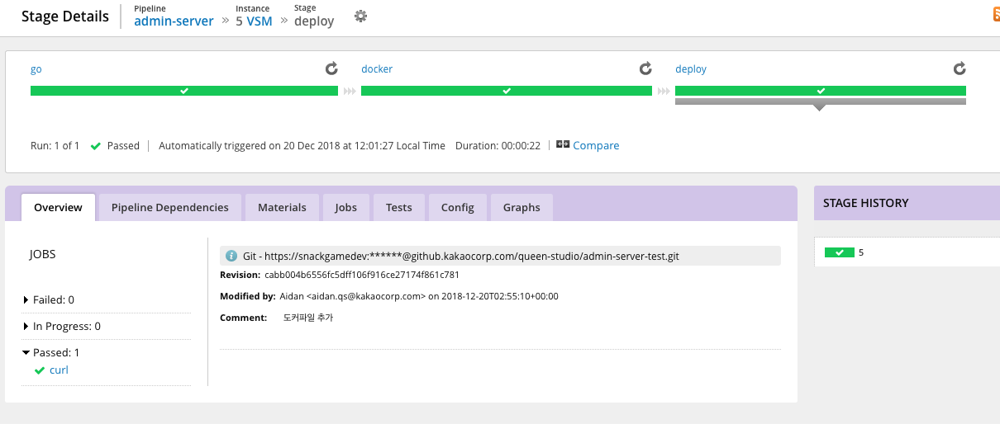
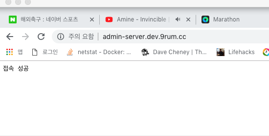
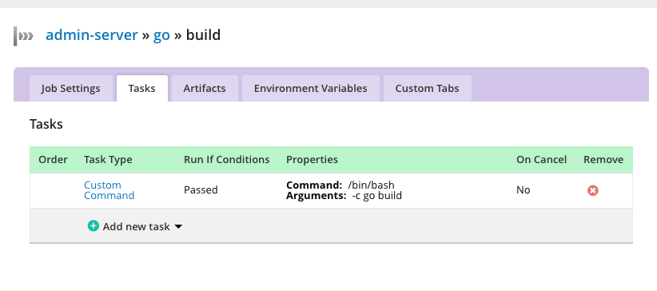

## Go modules 시작하기

golang version 1.11버전부터 획기적인 변화가 생겼습니다. 버전관리 프로젝트(vgo)를 Russ Cox의 메인오더로 go modules가 추가되었습니다.  

go modules는 vgo, dep, glide등으로 파생되었던 버전관리의 표준을 이야기하며
gopath의 종말을 외쳤습니다. 즉, 패키지간 종속성 관리를 golang team이 표준화하여 관리하는 정책입니다.

**개발환경**

- IDE : intellij IDEA
- version: golang 1.11.4
- os : darwin(mac os)


Golang으로된 프로젝트를 동시에 여러개 진행(페이스북 웹훅 클러스터)하면서  불편했던 것 중 하나가 GOPATH설정 바꾸기였다. 내가 사용하던 intellij IDEA는 GOPATH를 기준으로 인덱싱을 했었기때문에 **작업 프로젝트가 설정에 추가된 GOPATH가 아니라면 다시 GOPATH를 수정하고 프로젝트를 켜야했다.** Golang Korea 10월 밋업에서 Naver쪽분이 Go 1.11 Modules를 소개해줬었고, 내심 바꿔야하나 고민하고 있었는데 이번 연말에 어느정도 정비할 수 있는 시간이 주어져서 Go Modules를 도입, 기록하게되었다.

표준이 없어서 vgo, glide, dep등으로 파생되던 종속성관리가 Russ Coss의 메인오더아래 Golang team의 공식적인 롤로 배치되었다. 어제 1.12Beta버전이 릴리즈되었고 1.13버전부터는 GOPATH가 역사의 뒤안길로 사라진다는 소식까지 전해졌다. Go modules의 도입은 이제 Golang을 사용하는 팀에게 선택이 아닌 필수가 되었다.

우리 팀의 선택은 이전까지 `glide`였다.

빌드머신에서도 glide가 설치되어있어서 빌드시 vendor디렉토리의 라이브러리들 종속성을 검사 후 빌드한다.(glide up, go install) glide가 탄탄하게 버전을 관리해주어서 만족하면서 사용했지만 뒤돌아보니 불편한 점도 없지 않았다.

glide를 따로 관리해야하는 것도 귀찮았고 vendor디렉토리때문에 빌드머신의 오더량이 늘기도했다. Golang을 막 배우기 시작한 신입 개발자는 Path관리에 애를 먹기도했다.

하지만 Go modules와 함께라면 이런고민이 싹사라진다.


---
### 시작하기

우선 golang 1.11.4(stable version, 2018.12기준)을 설치했다.

```shell
$ brew upgrade golang
```

만약 brew가 없다면 공식사이트(https://golang.org/dl/) 에서 본인의 운영체제에 맞는 선택을 하면 된다.




golang을 1.11.4로 업그레이드 한 뒤에 내가 사용하는 intellij IDEA를 들어갔으나 업데이트에 게으른 나는 2017년 버전을 사용중이어서 golang 1.9버전까지밖에 지원하지 않았다. 2018버전으로 업그레이드를 진행했다.


Golang Plugin도 쌔걸로 설치!

갓브레인답게 Go Modules(vgo)라는 탭이 보인다.

공식 golang wiki를 참고해가며 시작해보았다.

```shell
$ go mod init github.com/you/hello

go: creating new go.mod: module github.com/you/hello
```

저의  Github username인 aidanbae를 넣어서 프로젝트를 만들어보겠습니다.

 modulego 라는 디렉토리를 만들고 아래 명령어를 쳤습니다:

```bash
$ go mod init github.com/aidanbae/hello
```

해당 명령어를 치면 go.mod라는 파일이 생깁니다.  파일을 확인해봅시다:

```shell
$ cat go.mod
module github.com/aidanbae/hello
```

메인 함수를 이제 작성해보겠습니다.
modulego / main.go :

```golang
package main

import (
   "fmt"
   "rsc.io/quote"
)
func main() {
   fmt.Println(quote.Hello())
}
```

quote라는 라이브러리에 있는 `Hello`라는 함수를 호출, 프린트하는 동작만하는 프로그램입니다.

이제 라이브러리를 받아보겠습니다.

```shell
$ go get -u
```

```shell
$ cat go.mod

module github.com/aidanbae/hello

require rsc.io/quote v1.5.2
```

필요한 라이브러리가 require 문으로 선언된 것 확인


intellij IDEA(2018)에서 왼쪽 Go Modules 가 확인됩니다.(외쳐 갓브레인)

이쯤에서 go modules공식문서의 멘트를 확인하고가겠습니다.

Note there was no go get required. Your typical day-to-day workflow can be adding import statements to your .go code as needed, and then when you run a standard command like go build and go test, it will automatically update go.mod and download dependencies if needed.

#### 핵심요약
- go get은 이제 필수 사항이 아니라는 점
- standard command인 go build/ go test 같은걸 하면 자동으로 go.mod가 업데이트되고 필요하면 다운로드 받는다


해당 프로젝트에 `go get 특정라이브러리`를 그냥 사용해봤습니다.

```shell
KAKAOui-MacBook-Pro-5:modulego aidan$ go get github.com/fatih/color@latest
go: finding github.com/fatih/color v1.7.0
go: downloading github.com/fatih/color v1.7.0
go: finding github.com/mattn/go-colorable v0.0.9
go: finding github.com/mattn/go-isatty v0.0.4
go: downloading github.com/mattn/go-colorable v0.0.9
go: downloading github.com/mattn/go-isatty v0.0.4
```

라이브러리의 최신버전을 다운받습니다.

```shell
KAKAOui-MacBook-Pro-5:modulego aidan$ cat go.mod
module github.com/aidanbae/hello

require (
		github.com/fatih/color v1.7.0 // indirect
		github.com/mattn/go-colorable v0.0.9 // indirect
		github.com/mattn/go-isatty v0.0.4 // indirect
        rsc.io/quote v1.5.2
)
```

require 구문이 복잡해진것을 확인했습니다. `//indirect`라는 주석이 자동으로 붙어서 사용되지않거나 간접적인 라이브러리라는 것이 눈에 보입니다.

`go list -m all` : 최종버전의 직간접적인 디펜더시 리스트를 보여줍니다.

```
KAKAOui-MacBook-Pro-5:modulego aidan$ go list -m all
github.com/aidanbae/hello
github.com/fatih/color v1.7.0
github.com/mattn/go-colorable v0.0.9
github.com/mattn/go-isatty v0.0.4
golang.org/x/text v0.0.0-20170915032832-14c0d48ead0c
rsc.io/quote v1.5.2
rsc.io/sampler v1.3.0
```

`go mod tidy` : 불필요한 종속성을 제거합니다.

```
KAKAOui-MacBook-Pro-5:modulego aidan$ go mod tidy
KAKAOui-MacBook-Pro-5:modulego aidan$ cat go.mod
module github.com/aidanbae/hello

require rsc.io/quote v1.5.2
```

다시 깔끔해진것을 확인(color라이브러리 제거)

이외에 다양한 커맨드가 있습니다.

`go mod vendor` : vendor/ 디렉토리를 만드는 옵션커맨드

`go get -u` or `go get -u=patch` — Update all direct and indirect dependencies to latest minor or patch upgrades ([details](https://github.com/golang/go/wiki/Modules#how-to-upgrade-and-downgrade-dependencies))

이쯤에서 `go build`를 통해 실행 바이너리 파일을 빌드하고 실행해봅시다.

```
// hello라는 module명을 go.mod에서 정의했기때문에 hello로 바이너리파일이 떨어집니다.
$ go build
$ ./hello
Hello, world
```


### 모듈

모듈은 단일 유닛으로 버전 패키지의 집합체입니다.

모듈은 정확한 종속성 요구사항을 기록하며 실행 가능한 빌드를 만드는 역할을 가집니다.

Semver형: v(major).(minor).(patch) 을 따릅니다.

Ex) v1.3.0

흐음 대략적인 내용을 알겠고 패키지 관리를 어떻게 하는지 직접 제 github에서 적용해보겠습니다.

```
// testgo
package testgo

import "fmt"

func Hi() {
   fmt.Println("안녕하세요")
}

// go.mod
module github.com/aidanbae/testgo
```

testgo라는 프로젝트를 만들었고 Hi()라는 Public Method를 작성해두었습니다. 간단하게 "안녕하세요"를 출력하는 메서드입니다.

`git init, git add .`등의 과정을 거친 뒤 github 원격 레파지토리에 add 후 push합니다.

```
KAKAOui-MacBook-Pro-5:testgo aidan$ git remote add origin https://github.com/aidanbae/testgo.git
KAKAOui-MacBook-Pro-5:testgo aidan$ git push -u origin master
Counting objects: 10, done.
Delta compression using up to 8 threads.
Compressing objects: 100% (9/9), done.
Writing objects: 100% (10/10), 3.30 KiB | 3.30 MiB/s, done.
Total 10 (delta 0), reused 0 (delta 0)
To https://github.com/aidanbae/testgo.git
 * [new branch]      master -> master
Branch master set up to track remote branch master from origin.
```

추가완료된 모습



이제 앞서서 진행했던 프로젝트에서 이 testgo패키지를 호출해봅시다:

```
KAKAOui-MacBook-Pro-5:modulego aidan$ go get github.com/aidanbae/testgo
go: finding github.com/aidanbae/testgo latest
go: downloading github.com/aidanbae/testgo v0.0.0-20181219071846-157e7ca01e59
```

go.mod파일을 봐봅시다:

```
KAKAOui-MacBook-Pro-5:modulego aidan$ cat go.mod
module github.com/aidanbae/hello

require (
github.com/aidanbae/testgo v0.0.0-20181219071846-157e7ca01e59 // indirect
        rsc.io/quote v1.5.2
)
```

오호 버전을 따로 지정해주지않아서인지 버전부분이 독특하네요.

modulego프로젝트에서 testgo의 Hi메서드를 사용해보겠습니다.

```golang
package main

import (
   "fmt"
   "rsc.io/quote"
   "github.com/aidanbae/testgo"
)
func main() {
   fmt.Println(quote.Hello())
   // testgo 패키지의 Hi메서드 호출
   testgo.Hi()
}
```

```
KAKAOui-MacBook-Pro-5:modulego aidan$ go build
KAKAOui-MacBook-Pro-5:modulego aidan$ cat go.mod
module github.com/aidanbae/hello

require (
    github.com/aidanbae/testgo v0.0.0-20181219071846-157e7ca01e59
        rsc.io/quote v1.5.2
)
```

바이너리 파일로 떨어진 hello라는 프로그램을 실행해보겠습니다.

```
KAKAOui-MacBook-Pro-5:modulego aidan$ ./hello
Hello, world.
안녕하세요
```

안녕하세요가 찍혔습니다.

이제 찜찜하게 남아있던 버저닝을 살펴봅시다.

v0.0.0-20181219071846-157e7ca01e59

임시버저닝이라 이쁘지 않네요. github에 푸시된 time과 관련된값이 붙어있군요.

그렇다면 버저닝을 어떻게 해야할까요?

testgo프로젝트로 돌아가서 tag를 푸시하면 됩니다.

```
KAKAOui-MacBook-Pro-5:testgo aidan$ git tag v1.0.0
KAKAOui-MacBook-Pro-5:testgo aidan$ git push --tags
Total 0 (delta 0), reused 0 (delta 0)
To https://github.com/aidanbae/testgo.git
 * [new tag]         v1.0.0 -> v1.0.0
```

modulego프로젝트로 돌아가서 `go get  프로젝트@버전쿼리` 명령어를 수행합니다.

latest버전을 go get해봅니다:

```
KAKAOui-MacBook-Pro-5:modulego aidan$ go get github.com/aidanbae/testgo@latest
go: finding github.com/aidanbae/testgo v1.0.0
go: downloading github.com/aidanbae/testgo v1.0.0
```

```
KAKAOui-MacBook-Pro-5:modulego aidan$ cat go.mod
module github.com/aidanbae/hello

require (
github.com/aidanbae/testgo v1.0.0
        rsc.io/quote v1.5.2
)
```

프로젝트의 버저닝이 바뀌었습니다.

잘 동작합니다.

go.sum파일도 부수적으로 생기는데 이 파일의 용도는 암호화 체크섬 확인용입니다. 종속성 관리를 위해 필요한 파일입니다.

```
$cat go.sum
github.com/aidanbae/testgo v0.0.0-20181219071846-157e7ca01e59 h1:JHRjeNAAgeeuOcoqzkv1yEdVqYRMCLZrDWdajy6SoYY=
github.com/aidanbae/testgo v0.0.0-20181219071846-157e7ca01e59/go.mod h1:fBhsUnTPEk9grTwDSqwR+ignKY137xSHC0dZq9sFbYE=
github.com/aidanbae/testgo v1.0.0 h1:UqvPTUnEWYoltu088+ZJewrXqntPzxdkj5NNp8muQ0c=
github.com/aidanbae/testgo v1.0.0/go.mod h1:fBhsUnTPEk9grTwDSqwR+ignKY137xSHC0dZq9sFbYE=
golang.org/x/text v0.0.0-20170915032832-14c0d48ead0c h1:qgOY6WgZOaTkIIMiVjBQcw93ERBE4m30iBm00nkL0i8=
golang.org/x/text v0.0.0-20170915032832-14c0d48ead0c/go.mod h1:NqM8EUOU14njkJ3fqMW+pc6Ldnwhi/IjpwHt7yyuwOQ=
rsc.io/quote v1.5.2 h1:w5fcysjrx7yqtD/aO+QwRjYZOKnaM9Uh2b40tElTs3Y=
rsc.io/quote v1.5.2/go.mod h1:LzX7hefJvL54yjefDEDHNONDjII0t9xZLPXsUe+TKr0=
rsc.io/sampler v1.3.0 h1:7uVkIFmeBqHfdjD+gZwtXXI+RODJ2Wc4O7MPEh/QiW4=
rsc.io/sampler v1.3.0/go.mod h1:T1hPZKmBbMNahiBKFy5HrXp6adAjACjK9JXDnKaTXpA=
```

버전을 latest로 수동으로 받았으나  latest로 늘 관리한다면 메이저 버전이 변할때 위험하겠지않을까요?

-`go get -u` : 메이저버전을 제외한 마이너버전의 업데이트, 패치버전의 업데이트가 진행됩니다.

-`go get -u=patch` : 패치버전까지만 최신버전으로 업데이트합니다. 예를들어 v1.0.0에서 v1.1.0으로 업데이트되지않습니다.


다시 천천히 봐보겠습니다.

만약 testgo에서 간단한 에러코드가 생겼고 수정이 생겨  v1.0.1이 되었습니다.

```
//testgo
func Hi() {
   fmt.Println("안녕하세요 v1.0.1입니다.")
}
// git
KAKAOui-MacBook-Pro-5:testgo aidan$ git add .
KAKAOui-MacBook-Pro-5:testgo aidan$ git commit -m '1.0.1수정'
[master d8b2598] 1.0.1수정
 3 files changed, 34 insertions(+), 21 deletions(-)
 create mode 100644 .idea/vcs.xml
KAKAOui-MacBook-Pro-5:testgo aidan$ git tag v1.0.1
KAKAOui-MacBook-Pro-5:testgo aidan$ git push --tags origin master
Counting objects: 6, done.
Delta compression using up to 8 threads.
Compressing objects: 100% (6/6), done.
Writing objects: 100% (6/6), 1.07 KiB | 1.07 MiB/s, done.
Total 6 (delta 3), reused 0 (delta 0)
remote: Resolving deltas: 100% (3/3), completed with 3 local objects.
To https://github.com/aidanbae/testgo.git
   157e7ca..d8b2598  master -> master
 * [new tag]         v1.0.1 -> v1.0.1
```

이제 modulego 프로젝트에서 `go get -u`라는 명령어로 모듈 업데이트를 진행합니다.

```shell
KAKAOui-MacBook-Pro-5:modulego aidan$ go get -u
go: finding github.com/aidanbae/testgo v1.0.1
go: finding golang.org/x/text v0.3.0
go: finding rsc.io/sampler v1.99.99
go: downloading github.com/aidanbae/testgo v1.0.1
go: downloading rsc.io/sampler v1.99.99
go: downloading golang.org/x/text v0.3.0
```

```shell
$ go build
$ ./hello
99 bottles of beer on the wall, 99 bottles of beer, ...
안녕하세요 v1.0.1입니다.
```

기존에 사용하던 quote라이브러리도 업데이트되면서 결과물이 다른것을 확인했습니다.

그렇다면 메이저버전의 변화는 어떻게할까요?

Existing software using our API will break because they (a) don’t pass a language parameter and (b) don’t expect an error return. Our new API is no longer compatible with version 1.x so it’s time to bump the version to 2.0.0.I mentioned before that some versions have some peculiarities, and this is the case now. **Versions 2 and overshould change the import path**. They are different libraries now.We do this by appending a new version path to the end of our module name.

**핵심요약: 버전2부터는 import path가 변경되어야된다.**

메이저버전의 변화는 완전히 다른 패키지를 의미하기때문에 많은 부분에 변경이 들어갑니다. API 메서드들의 호출방식이 달라지기도하는데요. testgo프로젝트의 v2를 만들어보겠습니다.

```golang
package testgo

import "fmt"

func Hi(name string) {
   fmt.Println("안녕하세요 v2입니다." + name + "님 안녕하세요.")
}
```

name이라는 스트링을 파라미터로 받는 Hi함수로 수정했습니다.

git commit을 하고 v2라는 브랜치를 생성합니다.

```shell
KAKAOui-MacBook-Pro-5:testgo aidan$ git add .
KAKAOui-MacBook-Pro-5:testgo aidan$ git commit -m "change hi param"
[master 2c2b414] change hi param
 2 files changed, 7 insertions(+), 7 deletions(-)
KAKAOui-MacBook-Pro-5:testgo aidan$ git checkout -b v2
KAKAOui-MacBook-Pro-5:testgo aidan$ echo "module github.com/aidanbae/testgo/v2" > go.mod
KAKAOui-MacBook-Pro-5:testgo aidan$ git commit go.mod -m "bump version to v2"
KAKAOui-MacBook-Pro-5:testgo aidan$ git tag v2.0.0
KAKAOui-MacBook-Pro-5:testgo aidan$ git push --tags origin v2
```

tag를 세팅한 뒤 원격지에 푸시합니다.

물론 새로운 업데이트(v2)를 했음에도 기존의 버전 1.0.1을 계속 사용하기때문에 modulego프로젝트는 break되지 않습니다.

그러므로 go get -u로 2.0.0버전을 얻을 수 없습니다.

버전2는 어떻게 얻냐?.. 아까 이야기한 import path를 변화해주어야합니다.

```golang
package main

import (
   "fmt"
   "rsc.io/quote"
   "github.com/aidanbae/testgo/v2"
)
func main() {
   fmt.Println(quote.Hello())
   // testgo 패키지의 Hi메서드 호출
   testgo.Hi()
}
```

메인의 import path를 `github.com/aidanbae/testgo/v2`로 변경하고 `go build`를 실행해봅니다.

```shell
KAKAOui-MacBook-Pro-5:modulego aidan$ go build
go: finding github.com/aidanbae/testgo/v2 v2.0.0
go: downloading github.com/aidanbae/testgo/v2 v2.0.0
# github.com/aidanbae/hello
./main.go:11:11: not enough arguments in call to testgo.Hi
        have ()
        want (string)
KAKAOui-MacBook-Pro-5:modu
```

v2.0.0이 가져와졌으나 바뀐 인터페이스때문에 에러가 떨어집니다. want name params!

요구사항대로 임의의 name값을 넘겨줍시다:

```golang
func main() {
	fmt.Println(quote.Hello())
	// name을 넘겨줍니다.
	testgo.Hi("상익")
}
```

```bash
$ go build
$ ./hello
99 bottles of beer on the wall, 99 bottles of beer, ...
안녕하세요 v2입니다.상익님 안녕하세요.
```

잘 동작합니다.

좀더 알아보면 좋은 것

`go get <module-path>@<module-query>`
https://golang.org/cmd/go/#hdr-Module_queries

이제 사용법을 간단히 익혔으니

퀸스튜디오 서버팀에게 익숙한 gin 프로젝트를 만들어보겠습니다.
(gin은 golang의 웹프레임워크 중 가장 인기많은 라이브러리입니다.)

```bash
$ go get github.com/gin-gonic/gin@latest
go: finding github.com/gin-gonic/gin v1.3.0
go: downloading github.com/gin-gonic/gin v1.3.0
go: finding github.com/gin-contrib/sse latest
go: finding github.com/ugorji/go/codec latest
go: finding github.com/golang/protobuf/proto latest
go: downloading github.com/gin-contrib/sse v0.0.0-20170109093832-22d885f9ecc7
go: downloading github.com/ugorji/go/codec v0.0.0-20181209151446-772ced7fd4c2
go: finding github.com/golang/protobuf v1.2.0
go: finding gopkg.in/go-playground/validator.v8 v8.18.2
go: finding gopkg.in/yaml.v2 v2.2.2
go: downloading github.com/golang/protobuf v1.2.0
go: downloading gopkg.in/yaml.v2 v2.2.2
go: downloading gopkg.in/go-playground/validator.v8 v8.18.2
go: finding gopkg.in/check.v1 v0.0.0-20161208181325-20d25e280405
```

버저닝이 있는 것들은 이번 모듈패치에 대응한 프로젝트들 또는 vgo를 적용했던 프로젝트들입니다. 대부분이 대응한 것으로 보입니다.

```bash
$ cat go.mod
module admin-server

require (
   github.com/gin-contrib/sse v0.0.0-20170109093832-22d885f9ecc7 // indirect
   github.com/gin-gonic/gin v1.3.0 // indirect
   github.com/golang/protobuf v1.2.0 // indirect
   github.com/mattn/go-isatty v0.0.4 // indirect
   github.com/ugorji/go/codec v0.0.0-20181209151446-772ced7fd4c2 // indirect
   gopkg.in/go-playground/validator.v8 v8.18.2 // indirect
   gopkg.in/yaml.v2 v2.2.2 // indirect
)
```

gin에 필요한 라이브러리들이 이쁘게 설치되었습니다 ㅠㅠ

Main.go에 사용해보겠습니다:

```golang
package main

import "github.com/gin-gonic/gin"

func main() {
   r := gin.New()

   r.GET("/", func(c *gin.Context) {
      c.String(200, "접속 성공")
   })

   r.Run(":8080")
}
```

이번 admin-server는 서버의 기본주소(/)로 접근하면 접속성공과  status 200을 뱉습니다.

서버가 8080포트에서 구동되도록 했습니다.

```bash
KAKAOui-MacBook-Pro-5:admin-server aidan$ go build
KAKAOui-MacBook-Pro-5:admin-server aidan$ ./admin-server
[GIN-debug] [WARNING] Running in "debug" mode. Switch to "release" mode in production.
 - using env:   export GIN_MODE=release
 - using code:  gin.SetMode(gin.ReleaseMode)

[GIN-debug] GET    /                         --> main.main.func1 (1 handlers)
[GIN-debug] Listening and serving HTTP on :8080
```

성공적으로 서버가 동작합니다.



프로젝트는 gopath에 영향을 받지않기때문에  go.mod파일만 있으면 path설정없이 어디서든 빌드할 수 있습니다!

이제 프로젝트 여러개를 띄워두고 ex) facebook-wh-server, facebook-iap-server, facebook-message-bot

바꿔 작업할때마다 새로 고패스를 갱신해줄 필요가없어져 엄청 편리합니다.

동시에 작업해도 프로젝트 디펜던시에 대한 인덱싱이 잘됩니다. 갓브레인의 intellij도 빠른 대응을 보여줍니다. 근데 아쉬운점은 인덱싱이 로컬에서 되는게 아니어서그런지 원격 패키지에서 호출된 함수가... 하이라이팅이 되지않습니다. 업데이트 될 거라고 생각합니다. (제가 아직 세팅방법을 모르거나)

일단 이 서버를 퀸 서버팀의 환경에 맞도록 띄어보는 작업까지해야 팀 프로젝트들에 적용할수 있겠죠.

우선 빌드배포머신인 goCD가 go modules의 존재에 대해 알아야합니다.
gocd-agent의 docker스크립트를 수정합니다.

```
# go version 1.11.4 upgrade
RUN curl -LO https://dl.google.com/go/go1.11.4.linux-amd64.tar.gz
RUN sudo tar -C /usr/local -xzf go1.11.4.linux-amd64.tar.gz
ENV PATH $PATH:/usr/local/go/bin
```

이제  gocd 의 빌드pipeline에서 `go get u`를 오더해봅니다.

```
[go] Task: /bin/bash -c "go get -u"took: 1.351sexited: 1
warning: GOPATH set to GOROOT (/usr/local/go/) has no effect
go: github.com/golang/protobuf@v1.2.0: mkdir /usr/local/go/pkg/mod: permission denied
go: github.com/ugorji/go/codec@v0.0.0-20181209151446-772ced7fd4c2: mkdir /usr/local/go/pkg/mod: permission denied
go: github.com/gin-gonic/gin@v1.3.0: mkdir /usr/local/go/pkg/mod: permission denied
go: github.com/gin-contrib/sse@v0.0.0-20170109093832-22d885f9ecc7: mkdir /usr/local/go/pkg/mod: permission denied
go: github.com/mattn/go-isatty@v0.0.4: mkdir /usr/local/go/pkg/mod: permission denied
go: gopkg.in/yaml.v2@v2.2.2: mkdir /usr/local/go/pkg/mod: permission denied
go: gopkg.in/go-playground/validator.v8@v8.18.2: mkdir /usr/local/go/pkg/mod: permission denied
```

permission denied 에러가 떨어지네요. gocd-agent의 usr/local/go에 접근권한이 필요합니다.  
go modules가 필요한 원격 패키지를 **golang이 설치되어있는 pkg폴더**에 받는다는 것을 알 수 있었습니다.  
빌드 역할을 수행하는 agent에 접속해서 /usr/local/go 쓰기권한을 주어줍니다.  
일련의 삽질 과정을 거쳐서 go module과 gin프레임워크를 사용한 고랭 admin서버 띄우기 성공!




배포과정에서 필요했던 glide up, glide vendor디렉토리에 대한 path관리등 다소 unnormal해보였던 일련의 과정의 go modules도입으로 깔끔하게 해결되었습니다. 그저 go build를 하면 해당 바이너리 파일이 해당 작업중인 path에 떨어지게됩니다.


<4개의 task에서 path변경 없이 1개의 task로 해결된 build pipeline>

## 마무리

**얻게된 장점**

\- 프로젝트 구성 폴더가 bin/ src/ pkg/등으로 복잡했었지만 이제 해당 구성에 얽메이지 않을 수 있습니다.

\- 동시에 여러 프로젝트를 해도 프로젝트 하나하나에 go.mod파일이 있어서 gopath세팅이 필요 없습니다.

\- 표준커맨드인 `go build` or `go test`만으로 종속성 작업이 진행됩니다.

\- glide를 사용시 vendor폴더 관리를 따로 해주어야했으나 이제 필요없습니다.

\- JetBrain IDE를 사용시 go module에 대한 대응이 이미 잘 이루어진 상태였습니다.


회사는 jetbrain GoLand를 사달라..


**참고문헌**  
<https://github.com/golang/go/wiki/Modules>  
<https://roberto.selbach.ca/intro-to-go-modules/>
