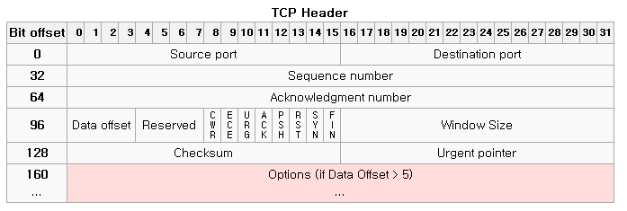
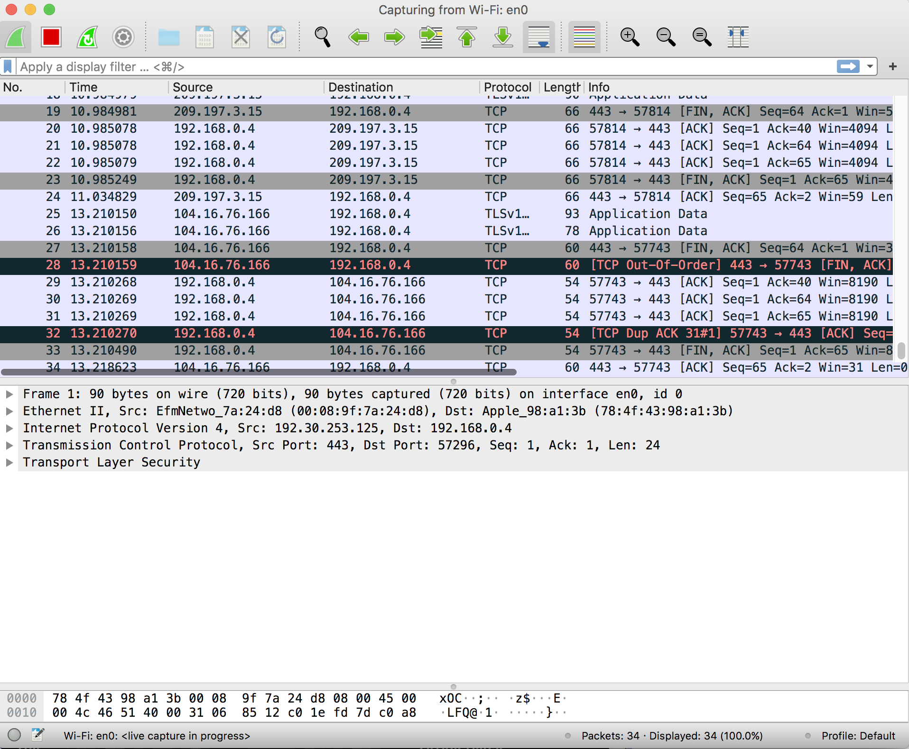
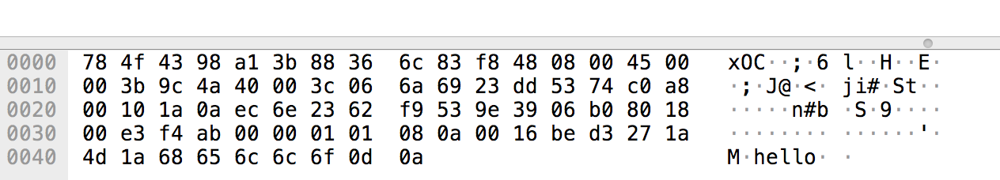
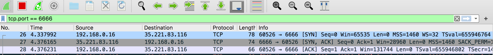
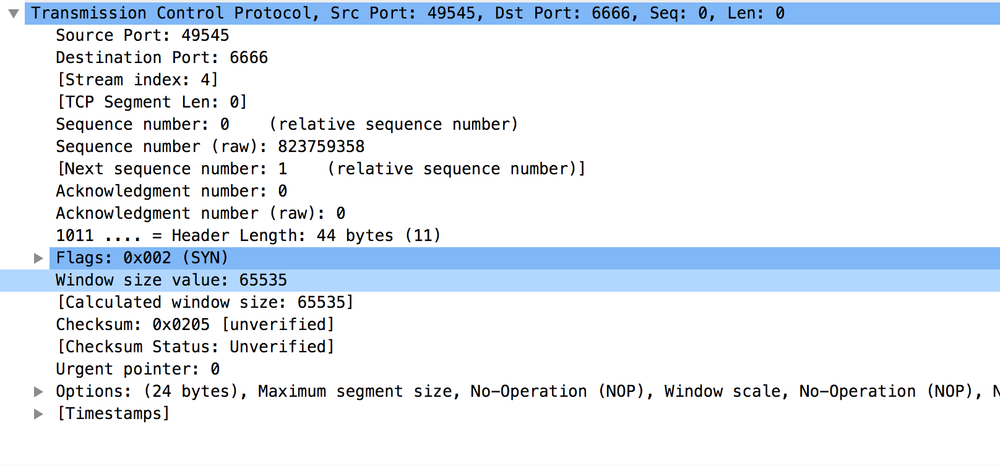
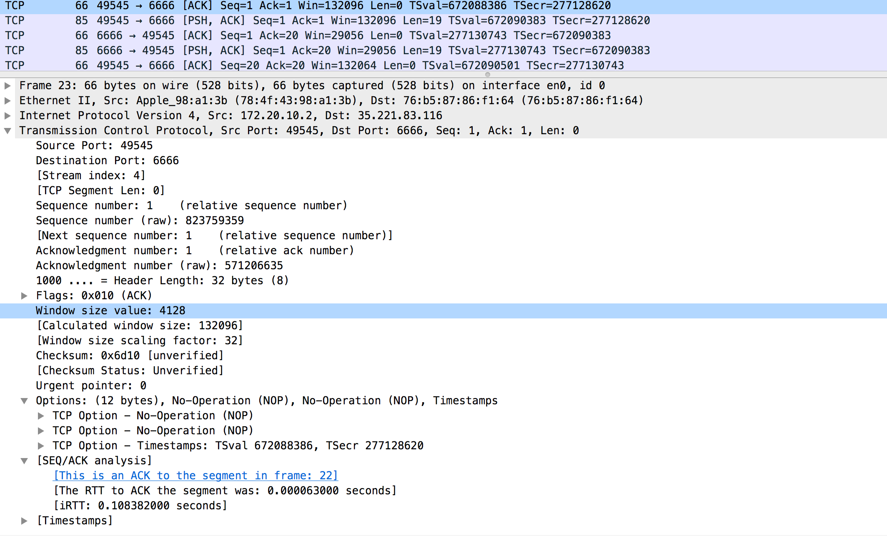
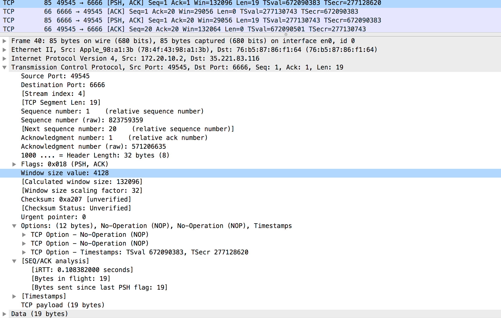
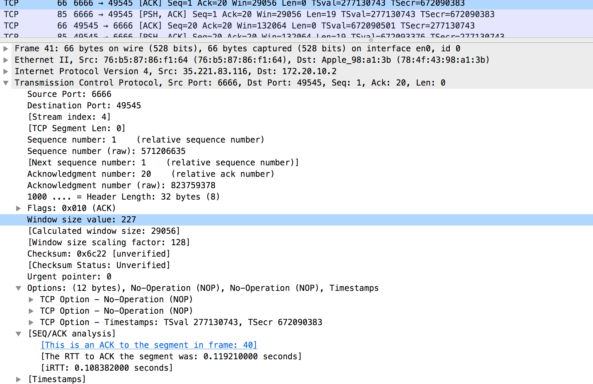

신기술이 많이 쏟아지는 시대이다. 빠르게 배우는 것도 좋지만 협업을 위해서는 서로의 sync를 맞추기위한 agreement가 존재해야하고 많은 기술들이 tcp를 근간으로 발전했기 때문에 tcp에 대한 지식은 agreement로 중요한 역할을 할 수 있다.

요즘은 quic이라고해서 udp기반의 서비스도 새로운 활로를 트는듯하지만 여러분이 사용하는 대부분의 서비스는 신뢰성 프로토콜인 tcp위에서 동작한다. 가장 흔한  http도 대부분이 tcp위에서 사용된다.

tcp를 로우 머신기준으로 엄청깊게 연구하는... sk_buff, 운영체제 이벤트큐 단위까지 까서 보는 이런글 (https://d2.naver.com/helloworld/47667) 보다 자세하진 않겠지만 내 나름의 방법으로 눈으로 확인해보는 시간을 가지고자한다.


##### 학습목표

tcp의 기본적인 echo서버를 만들어보고 client를 조작! 패킷을 분석해보자!

간단한 tcp에코 서버(golang)  
```
package main

import (
	"flag"
	"log"
	"net"
	"strconv"
)

func main() {
	port := flag.Int("port", 6666, "Port to accept connections on.")
	flag.Parse()

	l, err := net.Listen("tcp", ":" + strconv.Itoa(*port))
	if err != nil {
		log.Panicln(err)
	}
	log.Println("Listening to connections on port", strconv.Itoa(*port))
	defer l.Close()

	for {
		conn, err := l.Accept()
		if err != nil {
			log.Panicln(err)
		}

		go handleRequest(conn)
	}
}

func handleRequest(conn net.Conn) {
	log.Println("Accepted new connection.")
	defer conn.Close()
	defer log.Println("Closed connection.")

	for {
		buf := make([]byte, 1024)
		size, err := conn.Read(buf)
		if err != nil {
			return
		}
		data := buf[:size]
		log.Println("Read new data from connection", data)
		conn.Write(data)
	}
}
```
6666포트로 listen하고 들어온 패킷을 그대로 write해서 보내주는 에코서버이다.

빌드해보자:
```
env GOOS=linux GOARCH=amd64 go build
```

서버를 띄우고 데이터를 수신해보자:
```
baesang-ig-ui-MacBook-Pro:tcp-echo-server aidan$ ./tcp-echo-server
2019/12/29 12:36:51 Listening to connections on port 6666
2019/12/29 12:36:56 Accepted new connection.
2019/12/29 12:36:59 Read new data from connection [104 101 108 108 111 32 97 105 100 97 110 13 10]
```
hello aidan 이라는 data의 바이트 스트림이 찍히는 모습

로컬에서 서버 포트로 telnet연결:
```
baesang-ig-ui-MacBook-Pro:Documents aidan$ telnet 127.0.0.1 6666
Trying 127.0.0.1...
Connected to localhost.
Escape character is '^]'.
hello aidan
hello aidan //에코가 찍힌모습!
```


dockerize를 해봅니다~ (클라우드 서비스에 손쉽게 띄우기위해서)

```
FROM golang:1.13.4
MAINTAINER Aidan Bae <aidan@toss.im>

#RUN apt-get remove -y git ssh wget
#RUN rm -rf /usr/bin/scp
#RUN rm -rf /usr/bin/svn
#RUN rm -rf /usr/bin/ssh


RUN mkdir /build
WORKDIR /build
COPY . .
# COPY go.sum .

# Get dependancies - will also be cached if we won't change mod/sum
RUN go mod download

ENV GO111MODULE=on
RUN CGO_ENABLED=0 GOOS=linux GOARCH=amd64 go build -o tcp-echo-server


CMD ["/build/tcp-echo-server"]
```

docker hub에 이미지를 푸시하기 위해 로그인을 합니다.
```
baesang-ig-ui-MacBook-Pro:Documents aidan$ docker login
Login with your Docker ID to push and pull images from Docker Hub. If you don't have a Docker ID, head over to https://hub.docker.com to create one.
Username (aidankignas):
Password:
Login Succeeded
```
```
docker build -t aidankignas/tcp-echo-server:1 .

baesang-ig-ui-MacBook-Pro:tcp-echo-server aidan$ docker push aidankignas/tcp-echo-server:1
The push refers to repository [docker.io/aidankignas/tcp-echo-server]
```
공식 외부 도커 허브로 푸쉬되어요.


저는 요즘 GCP를 사용하고있어요.
```
sangik213@cloudshell:~ (sharp-science-231108)$ docker run -d -p 6666:6666 aidankignas/tcp-echo-server:1
734efd5160523748bec24650d559ace8bfe3743be5b85760f4f72c3d3afdd7f6
sangik213@cloudshell:~ (sharp-science-231108)$ docker ps
CONTAINER ID        IMAGE                           COMMAND                  CREATED             STATUS              PORTS                    NAMES
734efd516052        aidankignas/tcp-echo-server:1   "/build/tcp-echo-ser…"   3 seconds ago       Up 1 second         0.0.0.0:6666->6666/tcp   suspicious_goldberg
```
해당머신의 6666포트를 열어둡니다. (방화벽 설정 ㅠㅠ 조심)


```
baesang-ig-ui-MacBook-Pro:Documents aidan$ telnet 35.221.83.116 6666
Trying 35.221.83.116...
Connected to 116.83.221.35.bc.googleusercontent.com.
Escape character is '^]'.
kkkkkk
kkkkkk
```


#### wireshark를 이용해 패킷분석



아마도 서버개발자라면 한번 쯤 보았을 법한 그림이다. 바로 TCP헤더이다.

이 패킷을 wireshark라는 오픈소스를 이용해 실제로 눈으로보고 분석해보자.


와이어 샤크를 기본 랜카드에 연결하면 요런 화면이 나온다.
수많은 패킷들이 내가 모르는 사이에 내 맥북을 찌르고 오고가는 중이다.

특정 패킷을 보니 hello가 찍혀져있는 패킷이 보인다ㅎㅎ

필터링을 해보자, tcp.port == 6666


내가 텔넷으로 연결해둔 GCP서버 주소 35.221.83.116(임시 퍼블릭 ip)가 나온다. 그림에서 보이는데로 SYN, SYN,ACK, ACK 그 유명한 3-way-handshake 과정을 눈으로 확인할 수있다.


요런식으로 펼쳐볼수 있음
출발지 포트와 목적지 포트 등 기본적인 tcp 세그먼트에 대한 정보가 나온다.
SYN패킷 Seq 와 ack는 이렇게 00으로 스타트.
Flag는 SYN 악수요청임. 클라이언트의 악수
Window size value는 65535
MSS maximum segment size 1460 바이트라는 것
TSval과 Tsecr는 타임스템프와 관련된 지표.

뭐 디테일한 정보가 적혀져있구나 정도로 알고가면 될듯하다. 너무 깊게 알려하다가 흥미가 떨어지지 않도록! 스무스하게 넘어가자.


ack 패킷 디테일이다. 그러그러하다. Seq 1 Ack 1 Win 132096 가 눈에 띈다.

로컬에서 [PSH, ACK] `ping from aidan-mac` 패킷 발송

Window size value는 4028  
C ws는 132096  
Len은 19라고 찍혀있네요. TCP Segment Len 19로 나옴  
다음 seq number는 20이되네요  
1 + 19 = 20  


서버로부터 잘받았다는 ACK패킷이 내려옴.  
seq은 여전히 1 ack는 20이 됨.  
Widow size value 227  
C ws는 29056이됨  

이로서 기본적인 3웨이와 tcp통신간 패킷을 눈으로 확인하게되었다.

우리가 주로 관심있게 보면 좋은 것은 연결이 종료될 때 패킷과
tcp.analysis.retransmission tcp 재전송된 패킷

tcp.analysis.retransmission은 packet loss나 timeout에 의해 재전송이 발생했다면  Retransmission packet 이 나타난다.

발생 가능성

TCP는 수신자의 윈도우 크기에 따라서 다수의 TCP 패킷의 데이터를 전송하므로써 시작되며 그 후 수신자의 ACK로 인지되는 버퍼 크기(윈도우 크기)가 허용되는 비율만큼 계속 전송


만약, TCP 세그먼트가 ACK를 보지 못하고 패킷이 유실되면 송신자는 반드시 어떤 순차적인 세그먼트를 다시 보내야 합니다. 하나의 TCP 패킷 재전송에 대해 오직 하나의 패킷에 대한 재전송으로 생각하지는 말아야합니다.

retransmission 발생하는 case들

- 전송되는 TCP 세그먼트 혹은 되돌아 오는 ACK가 스위치나 라우터에 의해서 유실(dropped)되는 경우
- 패킷의 TCP 데이터 부분이 스위치나 라우터에 의해서 손상될때 (TCP 체크섬 에러)
- 수신자가 패킷을 버퍼에 저장할 수 없을 때
- TCP 세그먼트가 fragment되고 fragment가 손상되거나 유실 될 때
- ACK가 너무 늦게 돌아오고 송신자가 하나 혹은  그 이상의 세그먼트를 재전송 할때


뭔가... 두서없지만 나중에 더 깔끔히 정리하는 걸로
