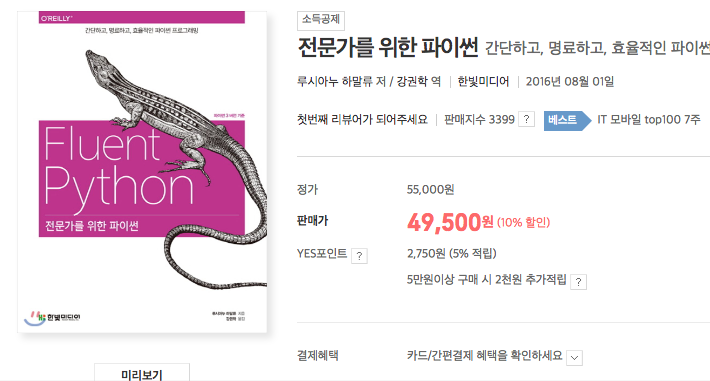

#### Intro

Top of Tower GameServer(이하 tot)를 Python + Django 스택으로 구현하면서  
가을과 겨울 사이에 Mason과 같이 공부한 Fluent Python을 프로젝트에 녹여볼려고 했다.  


_파이썬을 파볼 생각이라면 강력 추천_

Mason과 Fluent Python(전문가를 위한 파이썬) 스터디를 진행하면서 Chapter13에서 `연산자 오버로딩`을 만났다.
사실 우리는 연산자를 숫자연산에만 사용하는 경향이 있다. 연산자는 논리표현 중 하나고 우리는 논리 표현으로서
더 새롭게 정의할 수 있다.
행렬의 곱이 숫자의 곱과 방식이 조금 다르듯, **게임 캐릭터에 써보는게 좋겠다는 이야기가 나왔다.**

tot라는 게임은 캐릭터를 조합하고 더 강하게 키워서 타워의 몬스터들을 때려 눕히는 게임이다. (아직 런칭되지 않아 보안상 말을 줄이겠다.) 두개의 캐릭터를 합쳐서 도박(?)성으로 더 강한 캐릭터를 만들 수 있다. 이와 관련해서 `캐릭터 + 캐릭터`라는 연산자오버로딩을 활용해보는 쪽으로 설계해보았다.

---
##### 캐릭터 설계

간단하게 블로그 포스트용으로 축약해보았다.  

##### assume
```
캐릭터 데이터는 4가지 속성을 가진다. (물, 불, 바람, 흙)
캐릭터 데이터는 성을 가진다. (1성에서 5성까지)
캐릭터 데이터는 레벨을 가진다.
```
Django 클래스 코드를 보자:

```python
class Character(models.Model):
    id = models.AutoField(primary_key=True)
    water = models.IntegerField(default=10, verbose_name='물 속성 공격력')
    fire = models.IntegerField(default=0, verbose_name='불 속성 공격력')
    wind = models.IntegerField(default=0, verbose_name='바람 속성 공격력 ')
    earth = models.IntegerField(default=0, verbose_name='흙 속성 공격력')
    star = models.IntegerField(default=1, verbose_name='성')
    level = models.IntegerField(default=1, verbose_name='캐릭터 레벨')

    def get_property_dict(self):
        return {
            WATER: self.water,
            FIRE: self.fire,
            WIND: self.wind,
            EARTH: self.earth
        }

```
두가지 캐릭터를 조합, 합성하는 기능을 구현하려고한다.
character + character는 논리적으로도 이해하기 쉬운 코드이다.
우린 특별메서드 `__add__()`를 이용해 이를 간단하고도 멋지게 구현할 수 있다.


```python
  ...
  def __add__(self, other):
         properties_1 = self.get_property_dict()
         properties_2 = other.get_property_dict()

         result_prop = get_dominant_properties(properties_1, properties_2)
         max_item = max(result_prop.items(), key=operator.itemgetter(1))

         percent = self.level * 0.5 + other.level * 0.5
         rand_int = randint(1, 100)
         next_star = self.star

         if rand_int < percent:
             next_star = next_star + 1
             new_character = Character.objects.create(cls=max_item[0], star=next_star, state=READY)
             set_character_properties(new_character, result_prop)
             return new_character
         else:
             new_character = Character.objects.create(cls=max_item[0], star=next_star, state=READY)
             set_character_properties(new_character, result_prop)
             return new_character
```

어려워 보이지만 사실 천천히보면 간단한 코드이다. 살펴보자.

- `__add__()`라는 연산자 특별 메서드를 오버로딩했다.
  - a + b라는 연산을 할때 self 는 a, other는 b가 된다.
- 각각의 프로퍼티(속성)객체를 가져온다. get_property_dict()
- 좀더 높은 속성들을 추려주는 get_dominant_properties()를 통해 result_prop을 반환받는다.
- 기타 레벨등의 수치와 랜덤 수치를 통해 합성결과가 될 레벨, 성을 정해 새로운 캐릭터 데이터를 반환해준다.

주의사항:  
**결코 피연산자를 변경하면 안되며 새로운 객체를 생성해서 결과를 반환해야한다.**

이젠 합성 요청이 들어오는 메서드에서 사용해보자:

```python
def synthesize(request, player_id):
       ...
       new_character = char1 + char2 // 두 캐릭터를 합성하고 새로운 캐릭터를 받아옵니다.
       player.characters.add(new_character) // 플레이어에게 새로운 캐릭터 데이터를 추가합니다.
       player.characters.remove(char1) // 합성에 사용된 캐릭터 제거
       player.characters.remove(char2) // 합성에 사용된 캐릭터 제거!
```

#### 마무리

 `__add__()` 메서드를 객체에 오버로딩해서 중위연산자를 커스터마이징해보았다.


 예제코드는 좀더 이해하기 쉬운 설명을 위해 심플 코딩으로 구현한 것이고 단단하게 코딩하고자한다면 피연산자들의 타입검증과 같은 TypeError부분이 이 추가되어야한다.
isinstace()를 활용하는 것도 좋은 방법이다.

너무 남용할 경우, 프로젝트의 확장성을 헤칠수 있으니 조심히 주의하여 사용하기 바란다


---
