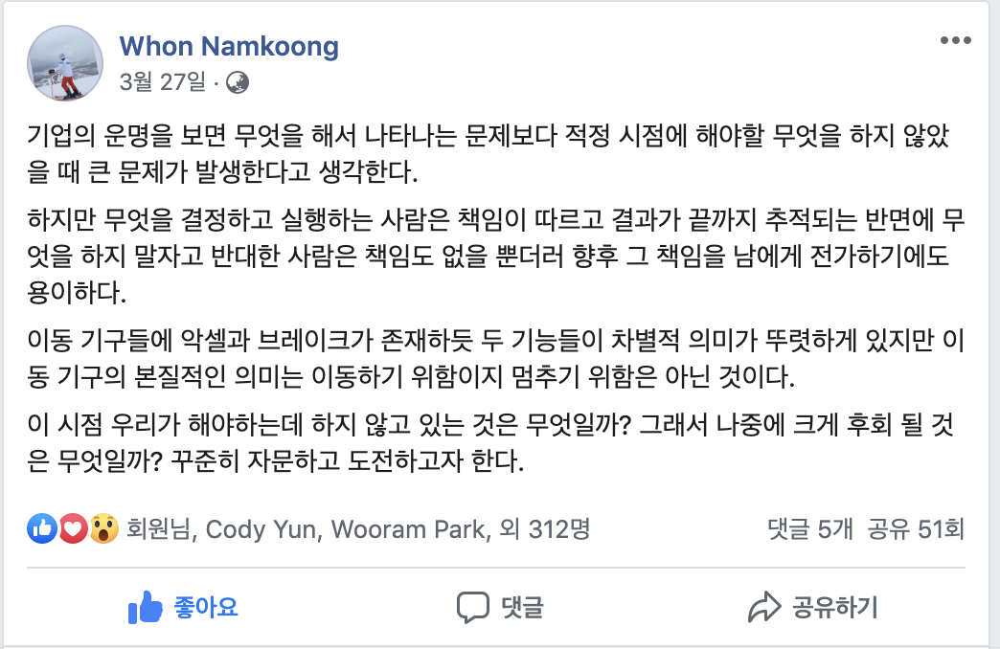
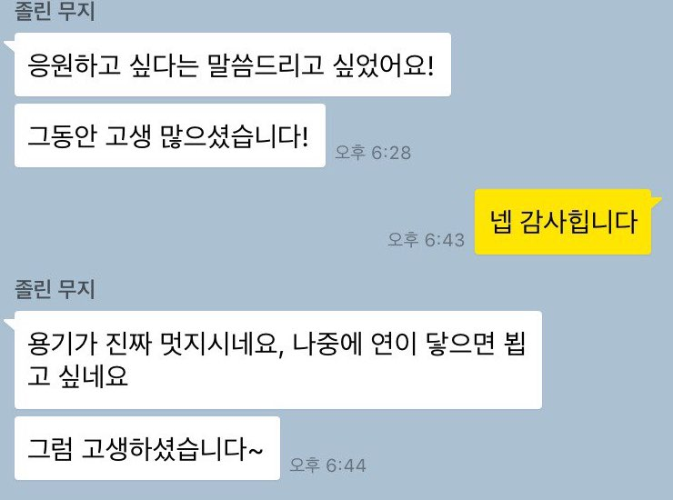
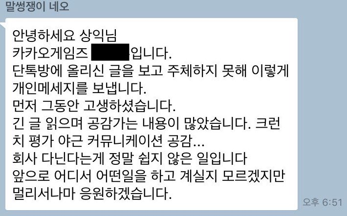

#### 정확히 한달 전 

인턴기간을 포함하면 약 2년 9개월을 다닌 나의 첫직장
카카오게임즈를 퇴사하게되었다. (2016.8.4 ~ 2019.3.28) 정직원 계약때는 카카오에 입사해 겸직을 하며 꿈의 기업문화도 맛보고 
좋은 사람들을 많이 만났다. 지금까지 회사에서 만났던 사람들 한명 한명 모두, 어른이든 동생이든 어떤 부분에서 나보다 몇 발자국 앞의 인생을 살고 있었다. 그렇게 자극도 받고 반성도 하고 기뻐하고 참 많은 감정을 누렸던 회사다.  

내가 생각하는 좋은 조직과는 거리가 먼쪽으로 발전해가기에  
이 문화에 일조하는 것이 심적으로 불편해서 빠르게 퇴사를 결정했다.  
사실 좀더 버티면서 이직준비를 했을 수도 있는데 그러고싶지 않았다.  
그리고 정말 오랜만에 글을 준비했다.

다음은 마무리 글이다.

---

#### 퇴사하며

안녕하세요. 카카오게임즈 퀸스튜디오의 배상익입니다.  
대표님이 자주 조직의 목표와 비전에 대해 이야기했기 때문에  
이번에 저는 다른 부분을 이야기해볼까 합니다.

많은 사람들이 조직을 떠나면서 감사의 표현을 합니다.  
얼마나 복잡한 마음을 뒤로 숨긴 채 떠났을까요.  
건강한 조직이란 게 기대에 부푼 열정이 들어오고  
상처 받아 차가워진 개인이 떠나는 것일까요  
이 적막한 단톡방에 약 3년간 함께했던 일원으로서  
퇴사를 하며 다소 긴 글을 남기고자 합니다.  

카카오게임즈 퀸스튜디오는 저의 첫 직장으로  
시작부터 성장을 함께하며 스낵게임 10여종을 개발 런칭했고  
작년엔 서버로 전직한 뒤 7개월 차에 클래시로얄프렌즈를 장애없이 서비스했습니다.  
제 목표는 나의 성장과 함께 일하는 동료들이 행복했으면 하는 것이었고,  
그들의 노력을 장애없이 서비스하는데에 있었습니다.  
실력이 부족했기에 야근을 했고 수면실도 애용했습니다.  
서버는 혼자여서 외로운 것도 있었지만  
배울 것이 많다며 스스로 동기부여를 하고 즐겁게 임했습니다.  

우리 팀은 야근이 잦습니다. 저는 야근을 나쁘게 생각하진 않지만  
계획 자체가 야근의 원인이 되면 안 된다고 생각하죠.  
매 인턴십때마다 조심스럽게 천천히 갈 것을 말씀드렸습니다.  
후배 개발자들에게 내가 좋은 조직문화를 만들어 선물하고 있는가  
내가 좋은 동료인가를 스스로 물었을 때 쉽게 동의할 수 없었습니다.  
문화는 중요합니다. 미래와 연결된 현재이기 때문입니다.  

카카오라는 이름에 저처럼 많이 설레서 왔을 인턴과 주니어들,  
성장해야 한다는 사명감으로 그리고 프로젝트 욕심으로 야근을 합니다.  
낮은 연봉에도 택시비만으로 감사히 생각하죠.  
저도 그땐 Yes만을 외쳤습니다.  

이젠 제가 그 문화를 만들었음에 회의감을 느낍니다.  
야근이 당연해졌고 야근을 하지 않는 정시퇴근은 열정을 잃은 것입니다  
나를 증명하기 위해 퍼포먼스를 뿜어냈던 고생, 개발기간은  
인턴, 주니어에게 새로운 기준이 되었습니다. 계속 이어지겠죠.  

팀에 변화가 생긴지 얼마 되지않아 또 생존의 위기라 합니다.  
연초 1개월 동안 2명에게 20개의 하이퍼캐쥬얼게임 개발 목표가 상정되었습니다.  
연말 연초에 조직에 쓴소리를 했습니다.  
정확히 말하면 상사가 듣기 싫은 목소리를 냈습니다.  
이런 문화가 건강한 것인가에 대해서 이야기하자고 말이죠.  

조직의 감정적인 반응에 일이 복잡하게 꼬였고  
목표치 하향조정과 함께 불이익이 없을 거라는 사과를 받았습니다.  
하지만 이야기가 어떻게 흘러갔는지 평가에 안 좋게 반영되었습니다.  
'연말연초의 일 때문이냐, 객관적인 평가냐'라는 저의 질문에  
'없다고 할 수 없다, 주관적인 평가'라는 답변을 받았습니다.  
많이 속상했습니다.  

어떤 이는 저와 연봉협상 때 빼고 대화해본 적이 없음에도  
저의 모든 것을 안다는 듯이 이야기합니다.  
작년 중순부터 마음이 딴 곳에 가있다고 합니다.   
회사 곳곳에서 감시하고 있었다고 합니다.  
제가 작년 한해 동안 수면실에서 잠든게 몇일인지도 감시했는지 궁금하네요.  
저는 바로 옆사람의 마음을 알기도 힘든데 참 엄청난 능력입니다.  

2019년 카카오게임즈가 정규직을 내보내는 방법!  
저는 야근일정 때문에 분노하는게 아닙니다.  
회사 어른들의 소통하는 방식에 대해 분노합니다.  
게임업계를 만들어가는 사람이 게임업계라는 단어 뒤에 숨는 모습에 분노합니다.  
상처주고 떠나게하는 방식에 분노합니다.  

결과적으로 모두가 계획을 논하는 연초에 프로토타입을 내놨으니  
위에서는 좋아했겠지요.  
그리고 그것을 성공이라 이야기합니다.  
위에서부터 모두가 함께 그 모습을 만들었습니다.  
눈에 보이는 것만 보고 말이죠.  

자유민주주의, 현대 기업문화는 인류가 발전시킨 자산입니다.  
우리는 역행하는 기업 문화에 대해 말할 수 있어야 합니다.  
또 현행하는 문화에 부당한 부분이 있다면 개선해나가야 합니다.  
조직은 시장의 흐름을 파악하려고 노력하는 만큼이나  
복지, 조직문화도 시대의 흐름을 파악해야 합니다.  

나이는 어리지만 꼰대 같은 소리를 좀 하겠습니다.  

교양 없는 리더는 신뢰를 잃습니다.  
욕 들으며 일하는 직원에게 왜 열정을 잃었냐고 묻기 전에  
자신이 어떤 실수를 했는지 진심으로 반성해보고  
말뿐인 사과를 하지 말아야 합니다.  
누구나 실수는 할 수 있습니다.  
저 역시 누군가에게 상처를 줬었고 상처를 준 사람에게 미성숙한 사과를 한 적도 있습니다.  
진심으로 반성한다면 행동으로 사과해야 하며 똑같은 실수를 반복해선 안됩니다.  
조금 감정적이어도 누구나 사람은 단점을 가지고 있다며 강점을 보자고  
사과라도 하는 리더가 많지 않다며 이해하려 노력해왔습니다.  
불만 가득한 리더에게 용기내어 먼저 다가가 대화하려했습니다.  
그리고 저는 이제 더이상 믿지 않습니다.  

커뮤니케이션의 기본은 친절입니다.  
모두가 방어적으로 임한다면 회사는 삭막해질 수밖에 없습니다.  
회사는 학교나 동호회가 아니라는 것도 잘 알고 있습니다.  
실적을 내기 위한 목표 조직이라는 것,  
그래도 저는 "회사니까" 보다 "회사도 사람 사는 곳이다"를 이야기하고 싶습니다.  
작은 소모임, 스터디를 운영해봐도 원리 원칙이 필요한 때를 느낄 수 있습니다.  
상황에 따라 친절함보다 일관된 원칙이 강조될 수 있지만  
그렇다고 친절함이라는 기본을 버리지 않았으면 합니다.  
존중 없는 신뢰는 생겨날 수 없기 때문입니다.  
권위와 독단적인 목표만으로 그 신뢰를 세우고 싶다면 한비자의 법치국가 시대로 후퇴하셔야 합니다.  

무엇이 널 변하게 만들었냐며 불만의 숙주를 찾아 묻던 날이 생각납니다.  
어제의 나와 오늘의 내가 다른 것은 저에겐 성장이며 기쁨입니다.  
불만이 가득한 것도 큰 문제지만 불만이 아예 없는 것도 문제입니다.  
자기 자신을 사랑하는 사람이라면 어느 정도의 불만을 가지고  
자신이 성장할 수 있는 환경을 만들고자 노력하는 것은 당연합니다.  

좋은 리더가 되고 싶다면 자신의 꿈과 비전을 응원해주는 팀원들에게  
원하는 팀의 방향이 무엇인지 꾸준히 물어야 합니다.  
상대방의 관점에서 볼 수 없는 리더는 고독해질 수밖에 없습니다.  
고독한 길을 걷는 것을 자랑인 양 이야기하지 마십시오.  
본인의 인격에 대한 반증일 뿐입니다.  

알고 있는 사실을 묵인하는 어른들이 참 많습니다.  

현재의 소중함을 안다면 함께하는 동료에게  
지금 당장 어떻게 친절을 베풀지 고민해보길 바랍니다.  
그리고 미래로 이어지는 문화에 대해 깊게 고민해보시기 바랍니다.  
암묵적으로 불의에 고개를 숙일 때, 문화는 만들어지고 있습니다.  
지위를 앞세워 속 시원한 분노를 내뱉을 때, 문화는 만들어지고 있습니다.  

젊은 시기가 소중하다는 것을 알면서 젊은 사람들의 밤을 손쉽게 얻으려 합니다.  
본인이 살아온 인생이 정답이 아닐 수 있습니다.  
'나도 그랬으니 너도 그래야 해'는 구시대적인 주장입니다.  
포괄임금제의 뒷면과 주니어, 인턴이라는 이유로  
프로젝트에 대한 정당한 보상을 받지 못하는  
사각지대의 구성원들을 응원합니다.  

순서를 착각하는 어른들이 많습니다.  

목적을 이루기위해 수단에 집착하다 쉽게 목적을 잊어버립니다.  
'팀을 위해'라는 명분으로 독단적인 목표를 상정하고 팀원들은 고생합니다.  
'팀을 위해' 팀 바깥 사람들에게 감정조절을 하면서 팀원들에게 더 쉽게 감정풀이를 합니다.  
팀을 위한게 확실합니까?  
돈을 벌어서 행복한게 아닙니다.   
당신과 주변사람이 행복하기 위해 돈을 버는 겁니다.  
수단을 목적으로 착각하며 살다보면 언젠가 큰 문제를 만나게 됩니다.  

적어도 카카오게임즈에서 일하는 구성원이라면 성장에 대한 욕심이 있습니다.  
조직은 이부분을 함께 고민함으로서 더 큰 효율성을 이끌어낼 수 있습니다.  
본인이 생각하는 성장의 방향을 강요하지말고  
좋은 조직이라면 조직원들의 꿈을 묻고 함께 이야기해볼 수 있습니다.  
조직의 목표와 함께 할 수 있도록 팀의 방향성을 함께 고민할 수 있습니다.  
그 과정이 있다면 개인은 조직과 자신을 위해 더 오래 헌신할 수 있음을 확신합니다.  

저는 변화하는 카카오게임즈를 응원하며  
제가 겪은 카카오게임즈의 문화를 응원하지 않습니다.  
더 이상 저처럼 no라는 소리를 냈다고 불이익을 받는 사람이 없었으면 합니다.  
저 이외에도 사각지대에서 슬퍼하는 개인을 응원하며  
성과는 조금 더디더라도  
조직의 목표와 팀원들의 성장 그 방향성을 조율하기 위해  
의식적으로 노력하는 중간관리자분들을 응원합니다.  
또 소중한 사람, 지켜야 할 것이 있어 무리하고 있는 개인을 응원합니다.  
그리고 이미 바뀔 수 없는 어른이 된 사람들에게 연민을 느낍니다.  

가치관이 다른 것은 이해할 수 있지만  
함께 하는 사람에게 상처주는 가치관이 옳다고 생각하진 않습니다.  
상처 주는 모든 것들을 용서하고 사랑하라 배웠지만  
아직은 성숙하지 못해 권위주의와 불의는 사랑하기 힘드네요.  

저의 퇴사소식을 듣고 인사과에서 좋게좋게 마무리하라는 조언을 들었습니다.  
업계가 좁으니 제 인생에도 그게 좋다면서 걱정의 말을 해주십니다.  
제가 직업으로 개발자를 선택한 이유 중 하나는  
생산성을 갖추고 침묵이 아닌 행동하는 지성이되는 것입니다.  
또한 인생의 목표가 취직이 아니기때문에 괜찮습니다.  
낮은 생활 수준을 유지한 덕에 저는 이제 자유롭습니다.  

탑다운 평가만 있어서 안타깝습니다.  
저도 주관적으로 평가해보고 싶습니다.  
카카오게임즈의 모든 부분을 알지는 못하지만  
제가 겪은 개발사로서의 3년짜리 평가는 oambn 중 n입니다.  

이번 피드백은 게임업계를 떠나며  
애사심에서 비롯한 마지막 헌신입니다.  
멀리 갈 수 있도록 악셀 뿐만아니라 브레이크도 소중히 관리하는  
카카오게임즈를 기대하겠습니다.  

부족한 글 읽어주셔서 감사합니다.  
수고하세요.

---

##### 동기

변화를 망설이지 않는 사람에겐 조금이라도 맑은 시선으로 팀원을 보는 계기가 되고  
권위라는 망토를 걸치고 벽을 두르는 사람들에게 경고가 되었으면 했다.   
권위주의라는 마약에 한껏 몸과 기분을 맡기는 그들에게  
'정신차려' 하고 말해주고싶었다.  
나처럼 사각지대에 있는 개인에게 잠깐의 위로가 되었으면 했다.  
그리고 언젠가 나 역시 어떤 조직에서 힘을 가지게 될때 나를 돌아볼 수 있는 글이 되었으면 했다. 

 

##### 글을 쓰기까지 - 상황
 
그들에게 신뢰라는건 양방향이 아니었다.  
오롯이 아래에서 위로 항시 눈앞에 갔다 주어야하는 무언가였다.  

글을 준비하는 기간에 하필 네이버 면접이 잡혔다.  
네이버 면접 준비가 중요할까 이번 마무리의 글이 중요할까 고민했는데  
인생에 방관자가 아닌 적극적인 참여자로서 후자를 택하기로했다.  
취직과 면접은 언제든 다시 볼 수 있지만 마무리는 한번뿐이기때문이다.  
그리고 면접을 떨어지면 적절한 핑계거리가 생기기때문에 좌절하지 않을 수 있다  
이 글을 다듬는 것에 시간을 더 쓴 것에 후회는 전혀 없다.

며칠 후 조직장에게 톡이왔다 네이버에서 레퍼첵이왔었다고 좋게 써줬다는 내용이다.  
연애와 같다. 상처 받은 사람에게 좋은 마음을 보여봤자 상대에겐 그저 생색 그 이상 이하도 아니다.   
(근데 네이버 인사팀도 이상한게 현 직속 상사한테 지원사실을 알리네,,,)  
그새 전달되었는지 차상위 조직장은 마지막 면담에서  
‘네이버 지원했었다면서요 업계 참 좁죠, 상익님 이 업계는 평판이 중요해요’  
마지막 면담이기에 어떤 어른다운 마무리를 해주실까  
기대했지만 그런 부분은 아쉽게도 끝까지 만나지못했다.  
 
평판이라  

약해지는 마음을 다잡아 답글을 더 잘써야겠다는 마음을 먹은 날이었다.

 

##### 글을 쓰기까지 - 노력

이 글은 짜잘짜잘히 여러번의 퇴고를 거쳤다.  
그럼에도 지금 또 다시보니 비문이 참 많다;;...  
처음 쓴 글은 이 긴 글보다 훨씬더 길고 장황했다.  

구구절절함보다 담백한 글을 쓰기로 다짐했었지만  
이 글은 진실성을 보이기 위해 나의 상황을 자세히 설명해야했다.  
또 회사에서 내 포지션이 말단측에 속하기 때문에 설득력을 잃을 수 있어  
어린애 투정으로 보이지 않도록 다듬어갔다.

약 2년간 내가 에버노트에 정리해둔 가치관들을 종합해 구조화를 했다.  

공감포인트는 여러개를 준비했다.  
단톡방에 있는 회사원 400여명의 관심분야는 다르기때문이다.  
누군가는 일이 없어서 힘들고 누군가는 일이 많아서 힘들다.  
누군가는 힘이 있고 누군가는 힘이 없다.  
누군가는 동료가 마음에 안들고, 누군가는 어떻게 친절을 베풀지 고민한다.  

3번째 퇴고까지 글에 더 많은 주제가 있었는데 글이 너무 길어지면 루즈해질수있어
소유욕, 어린왕자이야기(어린왕자와 친구가 되지 못하는 행성의 어른들), 신뢰의 정의, 허영심 등은 아쉽게도 제외했다.

마지막 퇴고때는 법 쪽 친구의 도움을 받았다. (퇴사를 하면 가진게 없기 때문에 더 조심해야한다. 돈이 없을 수록 지식이 힘이다.)
글의 공익성을 분명히 하고 
명예훼손을 피하고 위법성 조각사유를 확실히 하기 위해 ‘조직장’ ‘차상위 조직장’ 같은 단어를 제하다보니
글이 많이 약해졌다. 
대신 감정적인 부분을 조금 더 강하게 적었다.

글의 마무리는 정말 중요한데
주관적인 평가는 꼭내리고싶었다. oambn중 n을 할것이냐 b를 할것이냐
n은 내가 군복무한 27사단 신병교육대대 정도인데,  
카겜은 복지가 그래도 신경써 나아지고있기 때문에 b를 할까하다가
b나 n이나 뭐가 중요하냐라는 친구의 조언으로 n으로 선정했다.

때마침 퇴사전 날 남궁훈대표의 페북에 Yes맨을 원한다는 내용의 글이 올라왔다.  

  
책임의 무게감에 대한 불안함 호소는 본인의 자기방어에서 나오는 것일뿐이다.  
현시대는 반대한 사람에게 대안을 가져올 것을 주문하고 책임을 함께 나누는 방식으로 발전해왔다.    
no라는 의견에 대해 적극적으로 긍정적으로 논의하지 않는 조직은 고인물이 되어 피폐해지는 것을  
수많은 역사들이 보여주었다. 
수백년간 우리는 얼마나 많이 보았는가. 독단적인 결정을 책임진다면서 무책임하게 자리를 피하는 사람들을  
평소에 한 마음을 유지하기위해 노력하는 조직에서  
모두가 함께 이야기를 나눠 책임을 분산하는 형태가 좀더 맑은 조직이다.  
조직리더는 방향성을 말하고 조직원들이 회사와 함께 꿈을 꾸도록 중점적으로 노력하면 된다.  

악셀과 브레이크 모두 이동을 위한 것. 마지막 질문에 대한 대답을 글로 쓰기로했다.  
책임전가는 혼자라 전가할 사람이없었고, 당해본적은 있는거같기도하고  
주니어들은 대부분 소위 윗사람들의 비전을 응원하고 협조할뿐 스낵게임의 실패에 대해 추궁한적이 없다.  
'브레이크가 많이 뻑뻑한 거 같아요.'

그렇게 나름의 펀치라인으로 퇴사의글을 마무리 할 수 있었다.

---

업무시간의 단톡방은 보통 무슨 이벤트 같은 것과 그에 대한 리액션 이모티콘으로 
도배되는 것이 부지기수였기 때문에 퇴사날 업무시간 이후를 기다렸다. 마침 대표의 3주년 기념 공지사항 카톡이 
올라온터라 안묻히겠지라는 안일한 생각으로 글을 남기고 회사단톡방을 나왔다. 후련했다.

##### 그렇게 글을 적고 난 뒤

약 400여명의 회사 단톡방.  
약 10분정도 정적이 흐른 후 우연히(?)도 그날 런칭한 프린세스이벤트와 수많은 이모티콘으로 글이 묻혔다고 들었다.
그래도 그 짧은 10분 동안, 글을 읽어준 많은 분들이 응원의 메세지, 전화를 주셨다. 
연락을 주신 분들은 약 30여명정도 되었는데 
모르는 사람들에게 이렇게 많은 응원을 받아본 건 처음이다.    

경력이 꽤 있으신 분들부터 같은 주니어 직원분들  
긴 장문부터, '고생했다'는 간단한 카톡까지 수많은 아름다운 말들로 내 택한 길을 응원해주셨다.  

부족한 내 글이 누군가에겐 '나보다 억울한 사람이 있었네'가 될 수 있고,  
누군가에겐 자기 생각만 늘어놨네 정도로 스쳐갔을지 모른다.  
그래도 내가 생각하는 정답을 떳떳하게 표현했음에 만족한다.    
표현하지 않으면 내 생각에 대해 피드백을 받을 수 있는 기회조차 없다.  

블라인드는 카카오 겸직해제 이후 별 관심을 가지지 않았는데 카카오게임즈 라운지에 내 글을 응원해주는 글이 올라왔다고 해서 동료로부터 캡쳐본을 받아 볼 수 있었다.
(더 신기했던건 네이버웹툰에서 인턴을 하고있는 승욱이한테 연락이와서 참 사람사는 곳 좁다는 걸 느꼈다.)  
내가 할일은 다했고 이제 어떻게 풀어갈지는 남은 사람들의 몫이다.  

퇴사 후엔 행크(카겜 CTO)가 밥을 사주신다고 연락이 왔다.  
내 입사 면접관이기도 하셨고, 스튜디오 TD모임에서도 종종 뵈었기때문에 어렵게 느껴지진 않았다.  
과거에 대한 이야기를 별로 하고싶진 않았는데 어른스럽게 2가지 주제로 나를 안아주셨다.  
- 사람을 미워할 필요는 없다.  
- 나의 미래에 대한 이야기     
그리고 정답은 없다라는 말로 내 인생을 기대한다는 피드백을 주셨다. 후배 개발자를 대하는 것과 강단있게 말하는 것을 보면서 나중에 행크같은 CTO가 되어야겠다고 생각했다.

그렇게 따뜻한 봄을 맞이 할 수 있었다.

---

#### 첫 직장의 의미

이럼에도 불구하고 내 첫직장 카카오게임즈가 내 인생에 큰 영향을 끼친 것은 확실하다.  
0에서 1을 만드는 조직이 가치를 어떻게 키워가는지 놀라운 경험을 옆에서 함께했다.  
그리고 시장의 반응성 속에 갈팡질팡하며 어떻게 후퇴하는지도 지켜보았다.   

20대 한번뿐인 시기에 내 목표는 꿈꾸는 사람을 따르는 것이었다.  
마무리는 아쉽게 되었지만  
그의 꿈, 비전을 응원하며 성장해온 것을 크게 후회하진 않는다.

##### 기술적 성장  

현대 게임엔진 렌더링 방식, 생명주기의 이해  
뭐든 만들 수 있다는 자신감(3년차의 자신감이랄까)  
현대 IT서비스들의 구조(클라우드, IDC) 이해  
TCP/IP, 트래픽, Network IO에 대한 이해    
좋은 코드에 대한 주관    
창업하는데 필요한 지식을 넌지시 다 배웠다  
물론 아직 부족하기에 늘 미래의 모습이 궁금하고 즐겁다.

##### 삶의 가치관
그것보다 중요한 삶의 중요한 가치관 정리  
본받을 점이 있는 동료들에게 강점을 배우려하고  
단점은 타산지석으로 삼으려 노력했다.  
그리고 당장 내일 죽을수도 있으니  
누군가에게 부담이 될 수 있다는 생각을 하기보다 이젠    
칭찬할 것이 있다면 적극적으로 칭찬하고  
사과할 것이 있다면 적극적으로 사과했다.  
그렇게 죽어있는 삶을 지워보려한것같다.

사회성, 조직심리, 기회주의, 성악설, 공감, 인생목표, 사회생활 등 인생의 굵직한 주제들  
돈에 대한 내 가치관  
사랑에 대한 내 가치관  
성장에 대한 내 가치관  
소통에 대한 내 가치관  
경쟁과 조화에 대한 가치관  
내가 정의하는 적당한 허영심의 max    
후배 개발자들의 교육 방향성  
논쟁에서 나의 태도 

이런 것들을 정비할 수 있었다.  
이제는 2년 전에 비해 어느정도 강단있게 내 생각을 말할 수 있다.

##### 감정
잘몰랐던 나의 감정들의 정리  
후회, 기쁨, 분노, 사랑, 환희, 절망 등 여러 감정  
내가 싫어하는 것들에 대해 확실한 각인  

##### 인격

철든 사람이 정말 있을까?  
때로는 자신감에 넘치고, 쉽게 상대방도 나와 같은 마음이라는 착각을 한다.  
워낙 유쾌한걸 좋아하다보니  
가끔 정신을 놓으면 말이 가벼워 마음에도 없는 말로 상대방을 괴롭히기도 했다.   
아마 상대방들은 대부분 천천히 지쳐갔을 듯 하다.  
말하기도 애매한 사소한 것들이니 말이다.   
20대 마지막인 지금도 자주 혼난다.  
짧고 굵은 반성으로 계속 변화해야겠다.   

---

##### NextStep   

생각은 언제나 바뀌기 마련이다.
20대 대부분의 시간동안 맞다고 생각했던 모든 것들이 뒤집혀가는 것을 보았다.  
그렇다고 글 쓰는 걸 피하고싶지 않다. 어떻게 내생각이 변화했는지도 사진만큼 참 중요한 기록인것 같다.  
이번 Action도 인생의 수많은 길을 지난 뒤 보면 정말 작은 일일수도 있고  
또 그때가서는 이 생각이 틀렸다고 생각할 수도 있다.  
정답은 없다.

많은 분들이 취직은 어찌할 거냐고 나보다 더 열심히 고민해주셨다.  
작년부터 꾸준히 러브콜을 보내준 메이슨과 TO가 있다며 지원해보라고 말해주는 레베카  
영어를 좀 공부해야한다고 벤쿠버쪽 아마존을 추천해주신다는 행크  
IBM 서버개발자 포지션을 추천해준다며 SOPT 영호, 일이 노잼이라는 준성이  
버즈니에 막 취직한 섭이까지 
모두다 내 불안함을 줄여주고 응원해주셔서 감사하다.

거기에 집이나 차를 샀던게 아니라 고정지출이 크진 않고 스스로에 대해 믿음이 있어 마음이 편하다. 
심지어 미리 대출 받아둔 돈도 있고 퇴직금도 있다.
퇴사사유를 조직장과의 가치관 차이라고 적었고 부당한 대우를 받은 것이 어느정도 있어 여차하면 실업수당을 받으면 된다.  

한동안 취직할 생각이 없다.   
회사일하느라 못읽었던 책들과 스터디를 좀더 챙기고 사랑하는 사람과 여행을 다니면서   
다음 스텝을 깊게 고민하고 선택하려한다.  
내 강점들과 시대 흐름을 같이 고민해보는 시간이 부족하긴 했다.  
그리고 모아둔 돈을 좀 퐉퐉 쓸 예정이다. 

  

  

