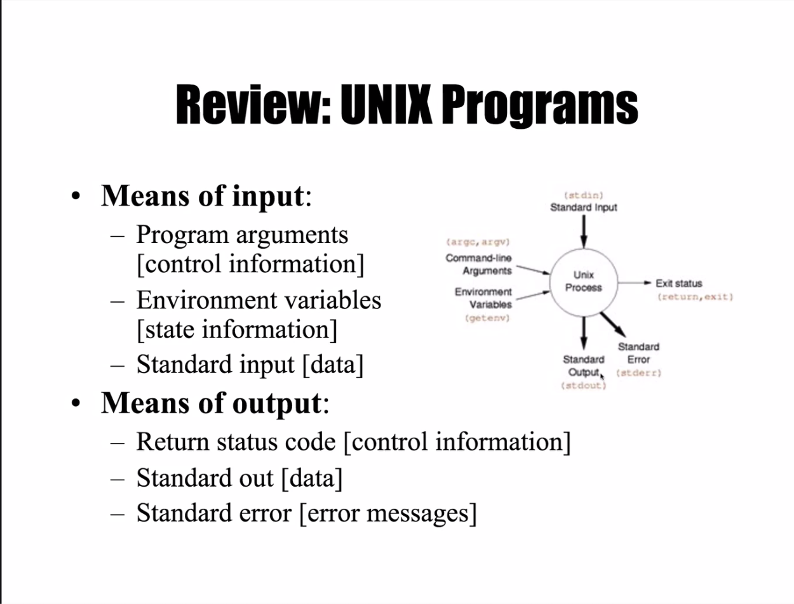

Linux에서 로그파일을 다루거나 민감한 정보를 다루다보면
IO Redirection을 사용할 일이 종종 생긴다. 이번 기회에 개념을 확실히 정리하자.

#### 학습목표

이 명령어의 의미를 해석할 수 있으면 된다.
```
$ head -n1 < linux.txt > one.txt
```

#### 추가 - input에 대한 이야기


<br>

#### 종합 핵심 정리

 `>>` 꺽쇄 두개는 추가가 된다. 덮어쓰기가 아니라 뒤에 추가하는것


`<<` 꺽쇄 두개는 input에 대한 제한 명령어.
```bash
// mail이라는 프로그램에게 인자를 보내는데 
// eot라는 input이 나올때까지 standard input을 받음
 $ mail egoing@gmail.com <<eot
 > hi
 > my
 > name
 > is
 > egoing
 > eot
```
`/dev/null`은 리눅스에서 쓰레기통으로 쓰인다.

```bash
// 쓰레기통으로 보내기
$ ls -al > /dev/null
```


- standard output 처리 `1>` (1생략 `>`)  
- standard error 처리 `2>`

```bash
// rename2.txt를 remove하는 명령어를 실행하는데 
// stdout이 있으면 result.txt에 
// stderr가 있으면 error.log에 쓴다.
$ rm rename2.txt 1> result.txt 2> error.log 
```

#### 마무리 
좋은 강의 내용에 나의 불친절한 정리!