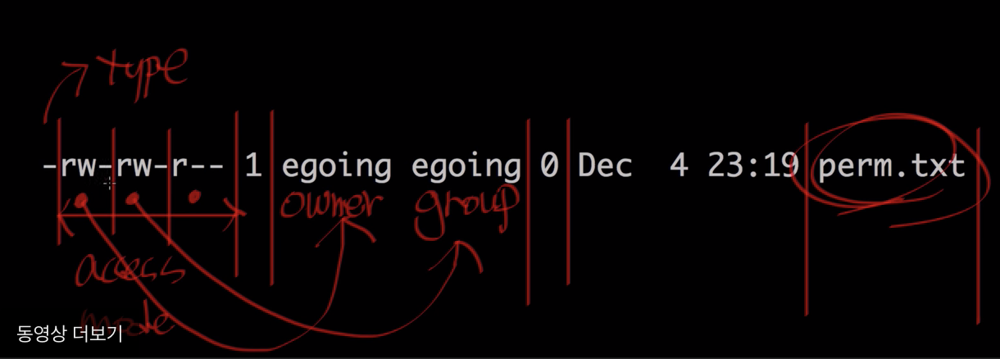

생활코딩 강의의 전달력은 최고수준

#### 학습목표 
리눅스 시스템 운영을 하다보면 permission은 굉장히 중요하면서 골치아픈녀석이다.  
이 중요한 부분을 같이 정확히 공부해 리눅스 기본, 기초를 탄탄히 하고 넘어가자

#### 핵심정리

```
$ ls -al
```
파일 정보를 조회하다보면 자주 보았던 테이블이다. 이제 부분별로 정확한 의미를 알고가자.



제일 앞부분 - 은 type을 나타낸다. directory라면 d가 적혀져있을 것이다.
그 뒤에 9개의 공간은 access mode를 나타낸다.
이 access mode는 또 3부분으로 쪼개지는데 아래와 같다.
 
- owner : 소유자
- group : 그룹에 속한 자
- other : 그 외 모든 녀석들

r: read 권한(파일을 읽을 수 있는 권한)  
w: write 권한(파일을 쓸 수 있는 권한)  
x: execute 권한 (파일을 실행할 수 있는 권한)  


```
[sangik213@aidan ~]$ ls -al
total 16
drwx------. 3 sangik213 sangik213   95 Feb  8 08:57 .
drwxr-xr-x. 3 root      root        23 Feb  8 08:51 ..
-rw-------. 1 sangik213 sangik213 2608 May  6 01:11 .bash_history
-rw-r--r--. 1 sangik213 sangik213   18 Oct 30  2018 .bash_logout
-rw-r--r--. 1 sangik213 sangik213  193 Oct 30  2018 .bash_profile
-rw-r--r--. 1 sangik213 sangik213  231 Oct 30  2018 .bashrc
drwx------. 2 sangik213 sangik213   29 May  6 22:45 .ssh
```
위는 내 gcp 리눅스 인스턴스이다. 파일을 제외한 디렉토리 폴더는 d로 시작하는 것을 확인 할 수 있다.  
각종 배쉬파일들은 소유자를 제외하고는 다른 사람들에게 write권한이 없다.

##### 2강 chmod

<br>
#### 핵심정리

chmod : change mode의 약어 명령어

Dockerfile로 게임서버를 빌드할때 `chmod g+x server`를 자주사용했었다. 정확한 옵션명을 몰랐는데 이기회에 정확하게 알게되었다. 해당 명령어는 group에 실행권한을 준다는 의미.
```
//other그룹에 read권한을 추가한다.
$ chmod o+r perm.txt


//other그룹에 read권한을 제거한다.
$ chmod o-r perm.txt

//other 그룹에 write권한을 추가한다.
chmod o+w perm.txt

wow...

//소유자의 read권한 제거!
$ chmod u-r perm.txt
```

잘몰라서 안되면`chmod 777`로 모든걸 해결했던 어리석었던 나에게 좋은 공부가되었다.

<br>

##### 3강 실행권한


<br>
처음알게된거..

```
[sangik213@aidan ~]$ /bin/bash hi_machine.sh 
hihihihi
```

##### 5강 chmod 옵션 더 깊게


<br>

#### 핵심정리

위키 chmod (https://ko.wikipedia.org/wiki/Chmod)

#### 마무리

적당히 알고 있던걸 확실히 알아가는 시간

**참고자료**  

- 생활코딩 (https://opentutorials.org/course/2598/14290)
- 위키 chmod (https://ko.wikipedia.org/wiki/Chmod)