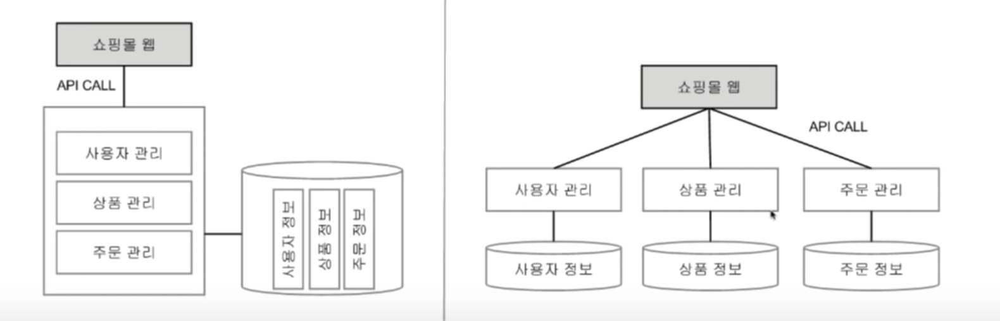

2016년 12월 발표자료이긴한데  
MSA에 대한 이해가 한번에 되는 발표영상이다.  
요즘 MSA에 대해 물어보는 동생들이 있어서 바로 추천해주는 영상!

##### 인상적이었던 부분

인상적이었던 부분은 MSA와 팀모델에 대해 설명하는 부분이다.
  
> 컨웨이의 법칙  
“소프트웨어의 구조는 그 소프트웨어를 만드는 팀의 구조와 일치한다.”

'팀의 구조??'  
조대협님 왈: 개발 설계 백날 잘해봐야 소용없음
        제대로된 팀 구조를 만드는 것이 설계
        그다음은 알아서 됨
        
정말 크게 와닿는다. 게임즈에서는 서버팀이 혼자였기때문에 설계를 모노리틱하게 설계한 것도 있음.  
하지만 서버팀이 인원이 늘었을 때도 모노리틱한 구조로 1인1프로젝트가 굉장히 불편했던 것은 맞다.  
내가 역량/경력이 부족해 이렇게 서비스별로 개발을 리딩하지 못해 아쉬움이 있다. 진작 이 영상을 봤다면 좀 달랐을 것 같기도하다.

조대협님: “팀의 구조가 참 중요하다”
      테크놀로지 설계보다 팀설계가 더 중요하다

---

##### 핵심요약

이전 아키텍쳐 : 모노리틱 아키텍쳐 (통서버/ 좌측)

- 실제로 내 서버도 매칭, 인게임, 로깅 모든 기능이 하나의 서버에 있었음
- 서버팀이 혼자였기 때문에 오히려 잘 어울리는 모델이었던것 같기도함
- 역할 조직의 특성상 모든 부분에 장애가 없도록 모든부분을 신경써야됨
    - 코드, 매칭기능, 인게임, 방처리, 뮤텍스롹, 자원회수, 모니터링, 테스트, 빌드, 배포, 운영

마이크로 서비스 아키텍쳐 (분산 거버넌스/ 우측)

- 역할중심보다 기능중심
- 팀도 나누어 좀더 프로덕트 질을 높일 수 있음 (기술스택의 고도화)

팀 간의 커뮤니케이션이 좀 어렵다.  
프로그램 메니져 팀간일정조율 중요  
치프 아키택트의 서비스간 흐름 정의, 표준 정의, 에러 추적/처리 방법정의

MSA를 구성해서 레벨이 높아지면  
API 게이트웨이 - api의 single end point  
어중간한 내공가지고 건드렸다가는 박살난다.  
잘쓰면 정말 좋음!  

나머지는 쿠버네티스 기본 설명  
라벨이라는 기능 너무좋다.  
라벨을 이용해서 그룹별 타게팅으로 명령을 내릴수있다.  
멀티플 라벨링이 가능합니다.  

p.s. 포켓몬고가 쿠버네티스로 도는 중이다. 몇만 vm으로 돈다

##### 마무리

DevOps에 집중할 기회가 최근에 생겼는데  
자료구조를 공부해 처음 큐를 배웠을 때처럼  
이번 영상을 통해 사고레벨이 확장된 느낌이다.

